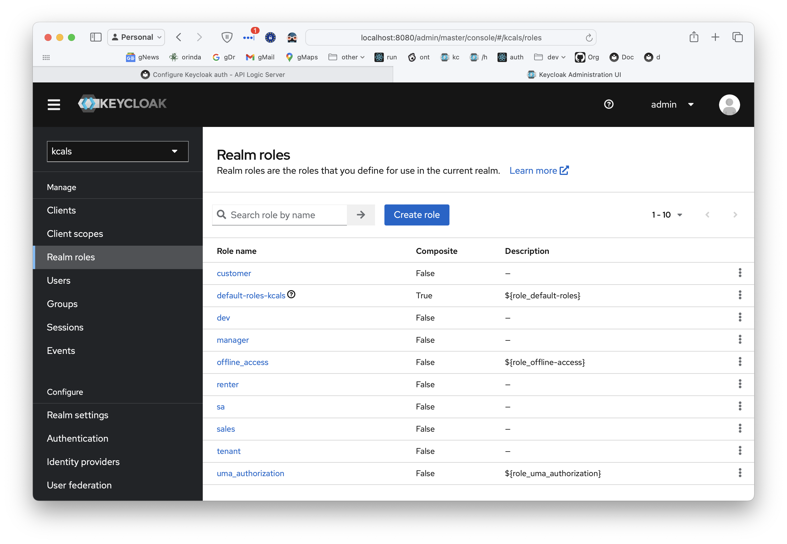

!!! pied-piper ":bulb: TL;DR - Authorize using Keycloak"

    You can use Keycloak for authentication.  You can configure your own keycloak, or use the procedure below to **install Keycloak:**
    
    1. Install keycloak using a Docker container: `cd devops/keycloak; docker compose up`

    2. Activate: `als add-auth --provider-type=keycloak --db-url=localhost`

    In addition, this page describes how to **administer User/Roles in your Keycloak**, and export these settings into your project for source control and team development.

    This page is ***under construction***.  

&nbsp;

## Keycloak: `local` config

Projects are pre-created with scripts start Keycloak under Docker.  Use this procedure to install and configure a local version of keycloak, running under Docker.

&nbsp;

### Install Keycloak under Docker

Install Keycloak with Docker (imports settings from `devops/keycloak/data/import`):

```bash title='Start [install] Keycloak'
cd devops/keycloak; docker compose up
```


You may see: `Failed to load jwks_uri http://localhost:8080/realms/kcals/protocol/openid-connect/certs`.

* coming soon.  please contact support.

&nbsp;

### Configure Project for Keycloak

Execute the following.  Optionally, observe the settings in `config/config.py`:

```bash title='Configure Keycloak - local'
als add-auth --provider-type=keycloak --db-url=localhost
```

The above uses the `localhost` abbreviation for the server location.  To use a non-default, be sure to speccify your port:

```bash title='Configure Keycloak - local (not default location)'
als add-auth --provider-type=keycloak --db-url=http://10.0.0.77:8080
```


<details markdown>

<summary>Internals - verify Configuration in running Admin App </summary>

The config settings for the admin app are set in `ui/admin/admin_loader.py`.  This reduces the number of settings to change when altering your configuration.  You can verify them as shown below:


</details>


&nbsp;

### Verify With the Admin App

You should now be able to run the admin app:

1. login as **s1/p** -- note the login screen indicates *kcals*:


2. Verify there is only 1 customer

3. Logout and login as **admin/p**, and there should be more customers

&nbsp;

## Keycloak Admin

You can use the [Keycloak admin console](http://localhost:8080/){:target="_blank" rel="noopener"} to define Users and their Roles / Attributes.

&nbsp;

### User Administration

To define Users and their Roles / Attributes:

1. Note the selected realm (`kcals`)


### User Roles

Define Roles for your realm:



&nbsp;

And assign them to users:


### User Attributes

#### Valid Attributes

First, define attributes types:


#### Link Attributes to Scopes


#### Assign User Attribute Values


> **Warning:** do not specify None or Null for attribute values; these lead to unpredictable results.

&nbsp;

### Export Auth Data

After defining your users, attributes and roles, you will want to save this keycloak auth data into your project, for source control and sharing.

Export your revised auth data:

1. In the terminal window of your project:

```bash title='Export the revised auth data'
% docker exec -it keycloak bash

$ cd /opt/keycloak
$ bin/kc.sh export --help
$ bin/kc.sh export --dir export
$ exit
```

This creates a directory *in the keycloak docker:* `keycloak:/opt/keycloak/export`.  We can import this back into our project, as described next.

&nbsp;

### Use Exported Auth Data in Project

You can make this saved auth data part of your project (and saved to `git` for your team), as follows:

1. In the terminal window of your project

```bash title='Use Exported Auth Data in Project'
mv devops/keycloak/import-save devops/keycloak/import-backup
docker cp keycloak:/opt/keycloak/export devops/keycloak/import
```


# Appendix

## Browser Cache

Keycloak caches security data (e.g., for single sign-on).  This may required you to [clear your Browser cache](Troubleshooting.md#browser-cache){:target="_blank" rel="noopener"}.

## Internals

Authentication and the keycloak provider interact as shown below:


## Inspecting Access Tokens

You can use jwt.io:


