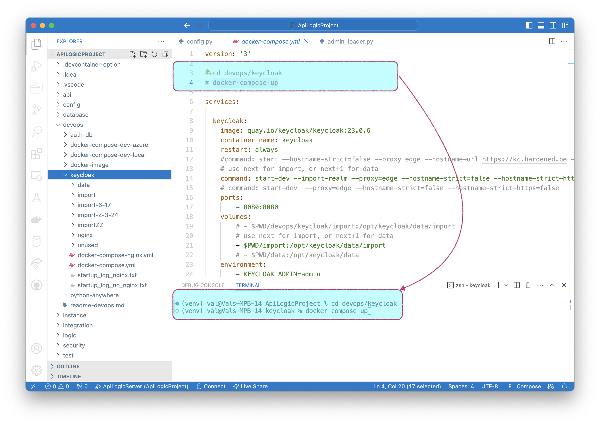

!!! pied-piper ":bulb: TL;DR - Authorize using Keycloak"

    You can use Keycloak for authentication.  You can configure your own keycloak, or use either of the pre-supplied options:

    1. local, using Docker
    2. hardened, a web-accessible site
        * This does not support adding auth data (Users, Roles, User Attributes etc) - it is intended to confirm operation with minimal setup to explore keycloak usage

    This page is ***under construction***.  

&nbsp;

# Keycloak: `hardened`

The hardened site is available at [https://kc.hardened.be]{https://kc.hardened.be}

&nbsp;

### Configure

There is nothing to install; configure as follows:

```bash title='Configure Keycloak - hardened'
als add-auth --provider-type=keycloak --db-url=hardened
```


<details markdown>

<summary>Internals - verify admin Configuration </summary>

The config settings for the admin app are set in `ui/admin/admin_loader.py`.  This reduces the number of settings to change when altering your configuration.  You can verify them as shown below:


</details>

&nbsp;

### Verify

You should now be able to run the admin app:

1. login as **s1/p** -- note the login screen indicates *kcals*:


2. Verify there is only 1 customer

3. Logout and login as **admin/p**, and there should be more customers

&nbsp;

# Keycloak: `local`

&nbsp;

### Install and Configure

To activate keycloak running locally:

1. Install Keycloak with Docker (imports settings from `devops/keycloak/data/import`):



2. Configure your project

```bash title='Configure Keycloak - local'
als add-auth --provider-type=keycloak --db-url=localhost
```


&nbsp;

### Verify (as above)

As described above.

&nbsp;

### User Administration

You can use the [Keycloak admin console](http://localhost:8080/){:target="_blank" rel="noopener"} to define Users and their Roles / Attributes:

1. Note the selected realm (`kcals`)


### User Attributes


&nbsp;

### Export Settings

TBD