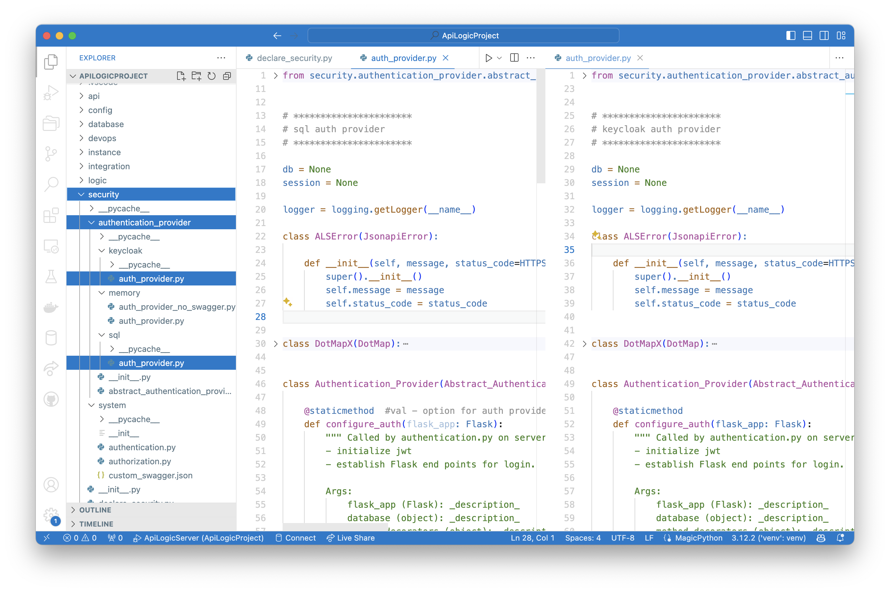

!!! pied-piper ":bulb: TL;DR - Row Level Security with Grant Permissions on User Roles"

    Declarative security enables you to `Grant` row filters to user roles, providing **row level security:** users see only the rows to which they are authorized.  
    
    Grants declarations reference not only roles, but also user properties (e.g., their organization).  A common usage is to enforce **multi-tenant** access.

    Define users and roles with:
    
    * a SQL database using an Admin app,
    * [Keycloak](https://www.keycloak.org){:target="_blank" rel="noopener"}, or,
    * supply a **provider** to attach to existing corporate security (AD, LDAP, etc).

&nbsp;

## Key Concepts

Security consists of many aspects (http headers, cookie settings, etc.); here, we focus on the following key concepts.

&nbsp;

### Authentication - system access

A login function that confirms a user has access, usually by posting credentials and obtaining a JWT token identifying the users' roles.

&nbsp;

### Authorization - data access

Controls access to row/columns based on assigned roles.

&nbsp;

### Users

Authorized users have a list of roles, and optionally a set of attributes.

&nbsp;

#### User Roles

Users are assigned one or many roles (e.g, `sales`).  Rather than dealing with thousands of users, security adminstrators focus on authorization Roles to access data.

&nbsp;

#### User Attributes

Each user may also have a set of site-specific attributes, such as their `region`, or their (multi-tenant) `client_id`.

&nbsp;

### Auth-Providers

Organizations will utilize a wide variety of techniques to maintain authorization data: databases, keycloak, LDAP, AD etc.  This means an open "interface" approach is required. 

Authentication Providers are called by the system during login.  They are passed the id/password, and return a user row and list of roles.  They hide how the user/role information is actually stored.

The system provides **default providers** for sql and keycloak.  In addition, you can **create your own provider** to interface with your authentication system (LDAP, AD etc)

Multiple systems will share the same authentication data, so, even if you are using sql, this "auth" database/schema will be separate from each application database/schema.

&nbsp;

#### Pre-supplied Auth Providers

It is common to use the system-supplied auth providers for keycloak and sql:



#### Custom Auth Providers

If you define your own auth provider, you must ensure it can be called by the system.  To ensure that Authentication-Providers implement the expected api, you should **inherit from this class**.

&nbsp;

### Grant Role Filters

Security Administrators declaring Grant filters, which filter retrieval based on roles and user properties.  This provides authorization down to the row level.  For example, we might want to filter "small" customers so the sales team can focus on high revenue accounts:

```python title='Focus Sales on high-revenue customers'
Grant(  on_entity = models.Customer,
        to_role = Roles.sales,
        filter = lambda : models.Customer.CreditLimit > 300)
```

&nbsp;

### Global Filters

Global filters apply to all roles.  For example, you might enforce multi-tenant access with:

```python title='Global Filters apply to all roles'
GlobalFilter(   global_filter_attribute_name = "Client_id", 
                roles_not_filtered = ["sa"],
                filter = '{entity_class}.Client_id == Security.current_user().client_id')
```

&nbsp;

## Process Overview

The overall flow is described below, identifying:

1. What Developers must do
2. What the system does

&nbsp;

### Developers Configure Security

Developers are responsible for providing (or using system defaults) the following:

&nbsp;

#### Authentication-Provider

This class, given a user/password, returns the list of authorized roles (on None).  It is invoked by the system when client apps log in.

Developers must:

* Provide this class (or use the system-supplied providers for `sql` and `keycloak`)

* Identify this as the `--provider-type` in the `add-auth` command

&nbsp;

#### Authentication Data

Developers must determine the data required to authenticate users.  This can be a SQL Database, LDAP, AD, etc.  It is separate from user databases so it can be shared between systems.  The Authentication-Provider uses it to authenticate a user/password, and return their roles.

&nbsp;

#### `declare_security`

Add code to the pre-created (empty) Python module that defines table/role filters.  The system merges these into each retrieval.  These declarations are processed on system startup as described below.

&nbsp;

### System Processing

System processing is summarized below.

&nbsp;

#### Startup: `declare_security`

When you start the server, the system (`api_logic_server_run.py`) imports `declare_security`.  This:

1. Imports `from security.system.security_manager import Grant, Security`, which sets up SQLAlchemy listeners for all database access calls

2. Creates `Grant` objects, internally maintained for subsequent use on API calls (SQLAlchemy read events).

&nbsp;

#### Login: Call Auth-Provider

When users log in, the app `POST`s their id/password to the system, which invokes the Authentication-Provider to autthenticate and return a set of roles.  These are tokenized and returned to the client, and passed in the header of subsequent requests.

&nbsp;

#### API: Security Manager

This provides:

* __The `Grant` function__, to save the filters for each table/role

* __Filtering,__ by registering for and processing the SQLAlchemy `receive_do_orm_execute` event to enforce filters.

&nbsp;

#### Server: User State

The server provides the functions for login (using the Authentication-Provider).  This returns the JWT which users supply in the header of subsequent requests.

As the server processes requests, it validates JWT presence, and provides `current_user_from_JWT()` to return this data for the Security Manager.

&nbsp;

## Use Cases

### Data Security

Security enables you to hide certain rows from designated roles, such as a list of HR actions.

&nbsp;

### Multi-Tenant

Some systems require the data to be split between multiple customers.  One approach here is to 'stamp' each row with a client_id, associate client_id with each customers, and then add the client_id to each search.  The sample illustrates how this can be achieved with [authorization](Security-Authorization.md){:target="_blank" rel="noopener"}:

```python
Grant(  on_entity = models.Category,
        to_role = Roles.tenant,
        filter = models.Category.Client_id == Security.current_user().client_id)  # User table attributes
```

&nbsp;

## Appendix: Resources

The Security Manager and sqlite Authentication-Provider are built into created projects from the [system's prototype project](https://github.com/valhuber/ApiLogicServer/tree/main/api_logic_server_cli/project_prototype) -- see the `security` directory.
