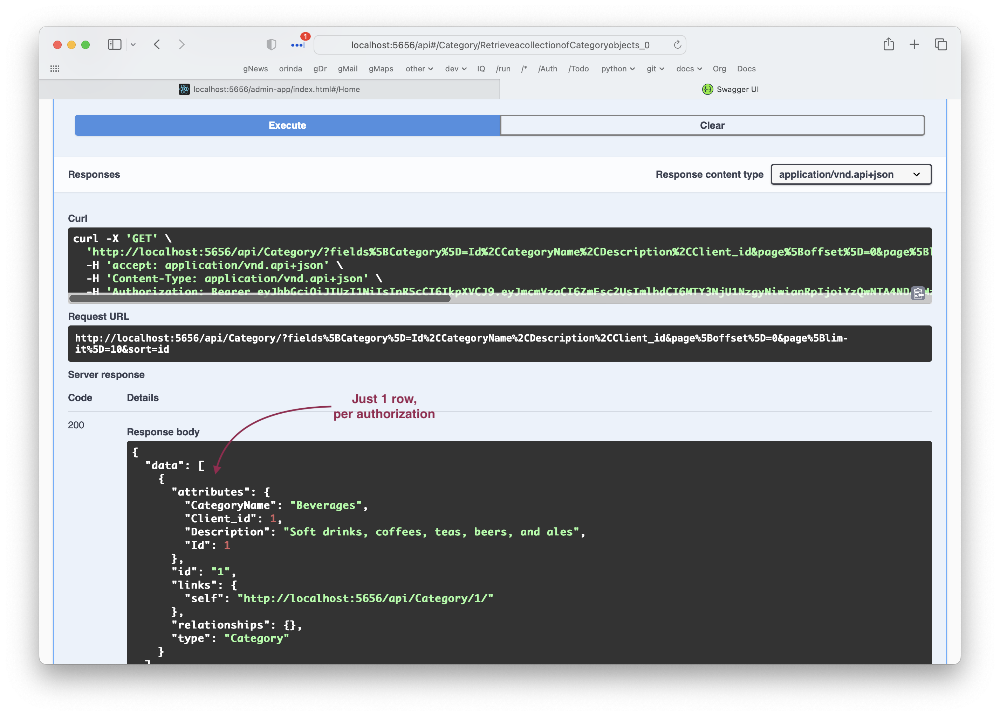

Swagger accesses the API in the same manner as any other client.  So, if security is activated, an authorization header is required.

You must therefore authorize to use Swagger, as follows:

&nbsp;

**Get `access_token`:**

* Click the `auth/Post` endpoint (at the end of the swagger)
* Click **Try it out**
* Click **Execute** (you'll need to scroll down a bit)
* Copy the `access_token` to your clipboard

{ align=left }

&nbsp;

**Authenticate with your `access_token`**

* Scroll up to the top of the swagger, and click **Authorize**
* Enter **Bearer**, add a space, **paste** your `access_token`, click **Authorize**, and **Close** the dialog 

{ align=left }

You can then verify this using Category:

{ align=left }

