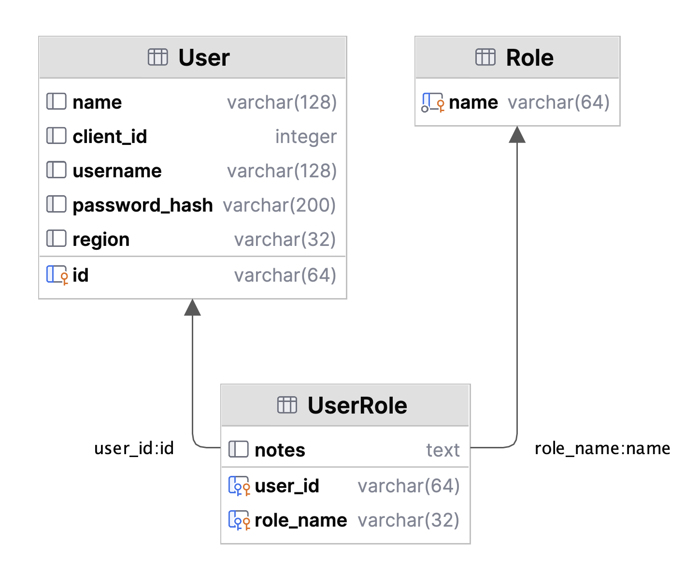
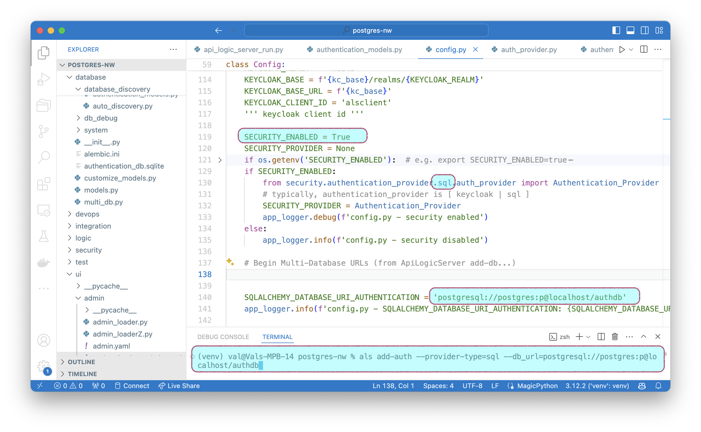

!!! pied-piper ":bulb: TL;DR - Authorize using sql databases"

    You can store the user / roles information in a sql database, and use it for authentication.
    
    The database can be sqlite, or your own authdb.  The sqlite apparatus is pre-installed and pre-configured into each project, so it's a good place to start.

    In most cases, the database/schema is *separate* from your project's database/schema, so the auth information can be shared over multiple projects.

    It's extensible: you can add additional attributes to the `Users` table, and reference these in `Grant` statements.


&nbsp;

## Security Database Structure

Auth databases must be a superset of the following:

{:height="500px" width="500px"}

Note this database includes:

* Users
* Roles (`Role` and `UserRole`)

&nbsp;

## sqlite Authentication DB

Projects are pre-configured with sqlite database security, initially disabled.  This simplifes getting started with security.  The database file is `security/authentication_provider/sql/authentication_db.sqlite`.

> Exception: Security is **enabled** for the [sample nw+ project](Sample-Database.md#northwind-with-logic){:target="_blank" rel="noopener"}.

In addition to `Users`, `Roles` and `UserRole`, this database includes:

* User.client_id, to illustrate multi-tenant (use the test user: **aneu**).

It's structure:

{:height="500px" width="500px"}

&nbsp;

## Using your own `authdb`

In most cases, you will create your own `authdb`:

1. To use the same kind of DBMS you are using for your data

2. To introduce additional properties for use in `Grants` -- see the first section below

&nbsp;

### Configuring your authdb

Configure with a command like:

```bash title='Configure postgres auth db'
als add-auth --provider-type=sql --db_url=postgresql://postgres:p@localhost/authdb
```



&nbsp;

### Add `User` properties for `Grants`

For example, the `nw` security example has the following mulit-tenant example:

```python
Grant(  on_entity = models.Category,    # illustrate multi-tenant - u1 shows only row 1
        to_role = Roles.tenant,
        filter = lambda : models.Category.Client_id == Security.current_user().client_id)  # User table attributes
```

Here, our custom `authdb` has added the `client_id` column to the `User` table, and we are using that to restrict _tenants_ to their own companies' data.


### Pre-created `authdb` scripts

Your project contains some example sql to create the auth db:


> Prior release 08.00.05, those files were not created in new projects.  For earlier versions, create these files in devops/docker with [this Dockerfile](https://github.com/valhuber/ApiLogicServer/tree/main/api_logic_server_cli/project_prototype/devops/docker).

&nbsp;

### Pre-created in Docker Samples

A sample security database is pre-created in the MySQL and Postgres [Sample Docker Databases](Database-Docker.md){:target="_blank" rel="noopener"}.

&nbsp;

### Accessed via SQLAlchemy

Like your project database(s), authorization data is accessed internally via SQLAlchemy, and externally using JSON:API. As such, it requires database model files. 

These are pre-created for the sqlite database, and are created during `add-auth` for non-sqlite auth databases. 

Note this uses [Multi-DB Support](Data-Model-Multi.md){:target="_blank" rel="noopener"}.  

&nbsp;

### Administer via Admin App

The system creates `ui/admin/authentication_admin.yaml` which you can use to manage users and their roles.  It's an admin app - access it at [http://localhost:5656/admin/authentication_admin/](http://localhost:5656/admin/authentication_admin/){:target="_blank" rel="noopener"}.

This auth admin app is...

* pre-created for the sqlite auth database, and 
* created during `add-auth` for non-sqlite auth databases
