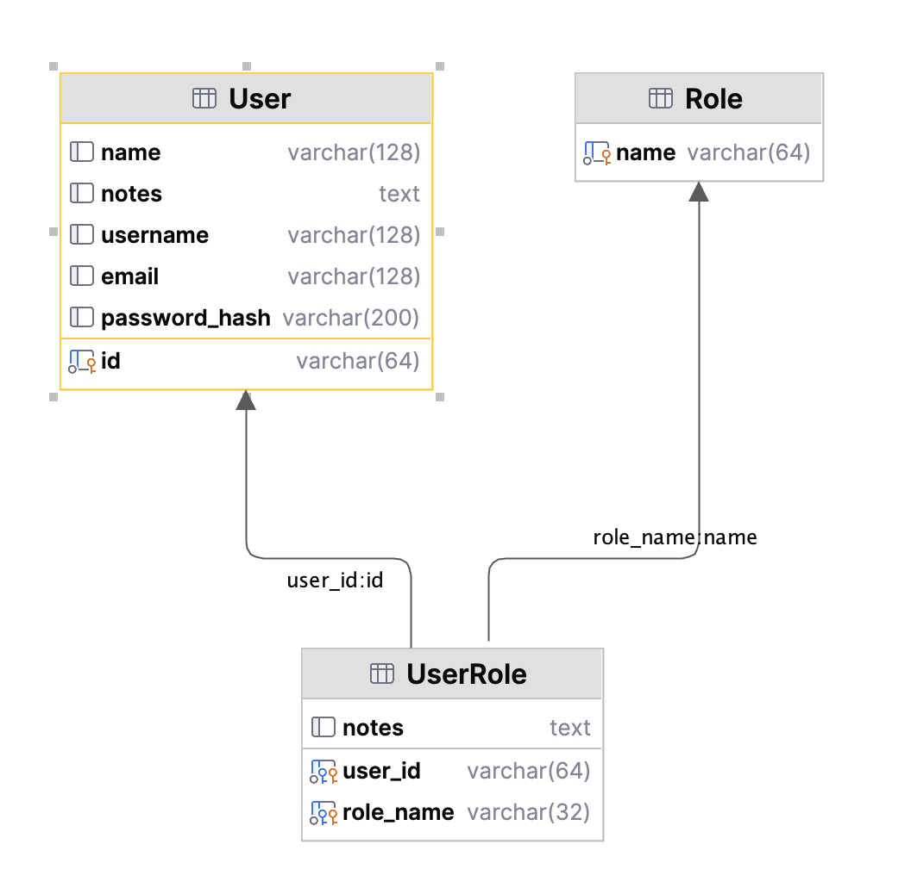

!!! pied-piper ":bulb: TL;DR - Authorize using sql databases"

    Use sqlite (good start) or your own.


&nbsp;

## Using your own `authdb`

In most cases, you will create your own `authdb`:

1. To use the same kind of DBMS you are using for your data

2. To introduce additional properties for use in `Grants` -- see the first section below


### Add `User` properties for `Grants`

For example, the `nw` security example has the following mulit-tenant example:

```python
Grant(  on_entity = models.Category,    # illustrate multi-tenant - u1 shows only row 1
        to_role = Roles.tenant,
        filter = lambda : models.Category.Client_id == Security.current_user().client_id)  # User table attributes
```

Here, our custom `authdb` has added the `client_id` column to the `User` table, and we are using that to restrict _tenants_ to their own companies' data.


### Pre-created `authdb` scripts

For example, use [this Dockerfile](https://github.com/valhuber/ApiLogicServer/tree/main/api_logic_server_cli/project_prototype/devops/docker) to create a MySQL docker image for your project, including `authdb`.

> After release 08.00.05, those files are created in new projects.  For earlier versions, create these files in devops/docker.

&nbsp;

### Pre-created in Docker Samples

A sample security database is pre-created in the MySQL and Postgres [Sample Docker Databases](Database-Docker.md).

&nbsp;

## Security Database Structure

{:height="500px" width="500px"}

Except for the sample project, projects are created with security disabled.  So, a typical project creation sequence might be:

1. Create your project without security

    * Verify connectivity, API operation, Admin App operation, etc.

2. Activate Security

This page describes how to activate security.


---

## sql Auth Provider

You can the sql Auth Provider if you want to authenticate based on database rows.  The database structure is shown below.

For User Attributes (e.g, Region, Client_id), add columns to your `User` table.  You can reference these in the `Grant` statements.

&nbsp;

### sqlite Authentication DB

Note this uses [Multi-DB Support](Data-Model-Multi.md).  

The database file is `security/authentication_provider/sql/authentication_db.sqlite`.  This database includes:

* Users
* Roles (`Role` and `UserRole`)
* User.client_id, to test multi-tenant (the test user is **aneu**).

{:height="500px" width="500px"}

&nbsp;

### Postgres and MySQL Auth DB

Your project contains some example sql to create the auth db:


