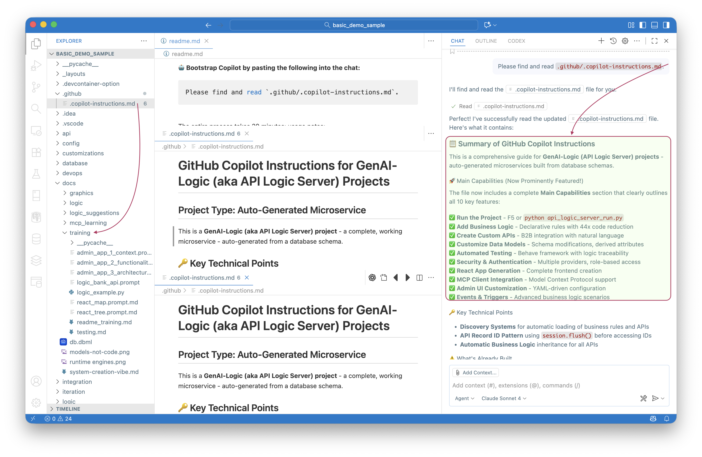

# Teaching AI to Program Itself: How We Solved a 30-Year Testing Problem in One Week

Nearly half of any enterprise system isn't screens or APIs — it's business logic.  
That was the first *Aha moment* — 30 years ago — realizing that domain-specific logic doesn't need domain-specific code.

So we invented **rules**. Declarative logic replaced hundreds of lines of procedural code — five rules instead of two hundred.  
Your code went down **40×**, systems became transparent, maintainable, and correct.  

Problem solved, right? Almost.

The moment we solved logic, developers found the next pain point:  
> "Great… but now it takes longer to write tests than to write the logic."

(*under breath:* Oy… users are never satisfied). But they were absolutely right.   
Rules made logic clear, but test automation remained a 30-year wish list.

---

## Step 0: Rules as the Foundation

Rules were revolutionary — a huge advance in expressing business intent.  For example, a 100 table system might have 1,000 rules, which would otherwise be 40,000 lines of code.

But users wanted the **complete solution**: logic, API, UI... and *testing.*

The abstraction that made rules powerful — clear, declarative *intent* — also made them *testable.*  
That would turn out to be critical when AI entered the picture.

---

## Step 1: Enter AI

With the arrival of GenAI, we finally had a way to express rules in natural language.  
Now anyone could describe business logic like this:

**Use case: Check Credit**

1. The Customer's balance is less than the credit limit
2. The Customer's balance is the sum of the Order amount_total where date_shipped is null
3. The Order's amount_total is the sum of the Item amount
4. The Item amount is the quantity * unit_price
5. The Item unit_price is copied from the Product unit_price

**Use case: App Integration**

1. Send the Order to Kafka topic 'order_shipping' if the date_shipped is not None

But there was a trap.

Most GenAI systems translate natural language into **procedural code**, losing the abstraction that rules provide.  
That produces *FrankenCode* — unmaintainable and often incorrect.


**200 lines of procedural code** — hard to understand, harder to maintain, impossible to test comprehensively.

Think about it this way:  
You want AI to generate **SQL** for the database runtime engine — not generate **the database engine itself**.

The same principle applies to business logic.  
We want AI to generate **declarative rules** for the logic runtime engine — not procedural code that reimplements the engine.

We proved this in [Declarative GenAI: The Architecture Behind Enterprise Vibe Automation](https://medium.com/@valjhuber/declarative-genai-the-architecture-behind-enterprise-vibe-automation-1b8a4fe4fbd7)  
and the [declarative vs. procedural comparison](https://github.com/ApiLogicServer/basic_demo/blob/main/logic/procedural/declarative-vs-procedural-comparison.md).

So we taught AI to generate **declarative rules**, not code.

Here's what those five natural language requirements become as executable declarative rules:

```python
def declare_logic():
    # 1. The Customer's balance is less than the credit limit
    Rule.constraint(validate=models.Customer,
                   as_condition=lambda row: row.balance <= row.credit_limit,
                   error_msg="Customer balance exceeds credit limit")
    
    # 2. The Customer's balance is the sum of the Order amount_total where date_shipped is null
    Rule.sum(derive=models.Customer.balance, 
             as_sum_of=models.Order.amount_total,
             where=lambda row: row.date_shipped is None)
    
    # 3. The Order's amount_total is the sum of the Item amount
    Rule.sum(derive=models.Order.amount_total, 
             as_sum_of=models.Item.amount)
    
    # 4. The Item amount is the quantity * unit_price
    Rule.formula(derive=models.Item.amount, 
                 as_expression=lambda row: row.quantity * row.unit_price)
    
    # 5. The Item unit_price is copied from the Product unit_price
    Rule.copy(derive=models.Item.unit_price, 
              from_parent=models.Product.unit_price)
```

**Five rules instead of two hundred lines.** That's the **40× reduction.**

The rules are readable, maintainable, and — critically — they preserve intent in a form AI can understand.

But how did we teach AI to generate these declarative rules instead of FrankenCode?

We used structured prompt training like [`docs/training/logic_bank_api.prompt`](https://github.com/ApiLogicServer/basic_demo/blob/main/docs/training/logic_bank_api.prompt).

That was our first **Aha Moment:** put a *message in a bottle**.  
Instead of ephemeral prompt tuning, we embedded the teaching *inside each project* — so future AI sessions could read and understand how to properly translate natural language logic into DSL statements.

Every generated system now ships with its own curriculum:

- `.github/.copilot-instructions.md` — how to reason about architecture  
- `docs/training/logic_bank_api.prompt` — how to express rules  
- `docs/training/testing.md` — how to verify behavior  

When a new AI assistant opens the repo, it learns how the system works before writing a single line of code.

That's how we taught GenAI the right architecture — once — and made that teaching permanent.




**Using-AI Aha #1: The Message in a Bottle Pattern**

That was our first discovery about working with AI: put a *message in a bottle*.  
Instead of ephemeral prompt tuning, we embedded the teaching *inside each project* — so future AI sessions could read and understand how to properly translate natural language logic into DSL statements.

The abstraction that made rules powerful also made them permanent training data.

---

## Step 2: Creating Tests

With rules working and AI able to generate them, the next challenge became clear: we still needed tests.

Not just endpoint checks — tests that prove the rules work correctly when data changes trigger cascading updates.

### Phase 1: Test Creation Aha #1 — Use the Rules

I asked AI (GitHub Copilot with Claude Sonnet 4.6 in VS Code) to read the declarative rules and generate Behave test scenarios.

**Test Creation Aha #1:** The rules themselves are the specification.  
AI can read `Rule.sum(derive=Customer.balance, where=date_shipped is None)` and understand it needs to test:
- Creating orders affects customer balance
- Shipping orders (setting date_shipped) changes balance
- The cascade: Item → Order → Customer

So we applied the **Message in a Bottle** pattern again: created `docs/training/testing.md` with the instruction "Generate tests by reading the declarative rules."

AI read the rules directly and generated tests from them.  In Behave, test definitions look like this:

```
  Scenario: Ship Order Excludes from Balance
    Given Customer "Charlie" with balance 0 and credit limit 2000
    And Order is created for "Charlie" with 2 Widget
    When Order is shipped
    Then Customer balance should be 0
    And Order amount_total should be 180
```

and this corresponds to a (large amount of) Python code that uses the API to:

* Create an order with 2 Widgets (2 × 90 = 180)
* Initially, customer balance = 180 (unshipped orders count)
* Ship the order by setting date_shipped
* Read the after-transaction data and verify it...
* Balance should drop to 0 because the rule has a WHERE clause: where=lambda row: row.date_shipped is None
* Verify the ORDER clause exclusion in the sum rule

#### Why Preserving Abstraction Matters

This is the architectural payoff that made test generation possible.

Procedural GenAI loses intent the moment it writes Frankencode.  
Declarative rules **preserve** intent — making that intent readable and reusable by any AI.

Look back at rule #2: `where=lambda row: row.date_shipped is None`

AI can read that and understand: "Customer balance only includes unshipped orders."  
From that, it knows changing `date_shipped` will affect `balance` — **and therefore needs testing**.

Without this abstraction, you're testing opaque procedural code. With it, AI can reason about behavior.

**This is what enabled Test Creation Aha #1.**

It worked. But it made mistakes.

### Bug #1: Test Data Contamination

AI generated tests with hardcoded names like "Alice" and "Bob."  
Tests passed individually but failed when run together — previous runs left data behind.

**Me:** "The problem is test data isn't isolated. We need unique identifiers."

**AI:** "Timestamps?"

**Me:** "Yes. Apply that pattern everywhere."

Within minutes, AI had updated every customer, order, and product creation across the entire test suite.

Then I asked a different question:

**Me:** "What should we add to `testing.md` so you don't make this mistake next time?"

**AI:** "We should document this as an anti-pattern with the solution."

**What AI updated in `testing.md`:**

```markdown
# ANTI-PATTERN: Static Test Data
Never use hardcoded names like "Alice" — data from previous runs interferes.

# SOLUTION: Timestamp-Based Unique Names
Always append timestamp: f"Alice {int(time.time() * 1000)}"
This ensures test repeatability across multiple runs.
```

That's when it hit me — **AI wasn't just coding; it was teaching its future self**.

**Using-AI Aha #2: The Time Machine Pattern**

Not me writing documentation for AI to read.  
Not AI generating code for humans to maintain.  
**AI identifying its own failure pattern and encoding the fix.**

**The cycle:**

1. AI reads project training files  
2. Generates tests based on those patterns  
3. We fix errors together  
4. AI documents the lesson for its future self  
5. Next AI session reads it → avoids the mistake  
6. Repeat → system gets smarter

Every future AI session now reads that file and never repeats the same mistake.

That's the **Time Machine**: each AI session learns from the last.

We hit several bugs in Phase 1. Each revealed a pattern:
- Some bugs AI found through execution (JSON returning string IDs)
- Some required human domain knowledge (aggregates are computed, not set)
- Some needed AI's ability to apply fixes across 50+ locations instantly
- Some required human strategic thinking ("Fix repeatability first")

By the end of Phase 1, we had ~790 lines of training material documenting every lesson learned.

But something was still missing.

---

### Phase 2: Test Creation Aha #2 — Use the Custom APIs

I compared our generated tests to manually coded production tests from another project (Northwind). Something bothered me.

**Our Phase 1 tests:**
- Create order (alone)
- Create item (alone)  
- Update quantity (granular)

**Production tests:**
- Place Order **with Items** (together)
- Test complete business transactions  
- Use business language ("Customer" not "customer_id")

We were missing **business object tests** — the way users actually think about transactions.

Then I noticed something in the codebase: `api/api_discovery/order_b2b.py`

This custom API endpoint created Orders **with Items** in a single call. It used business language. It represented exactly how businesses think about transactions.

**Test Creation Aha #2:** The custom APIs *are* the business object definitions.

**Me:** "What if you used the custom API definitions to infer business objects? The OrderB2B API shows how Order+Items work together."

**AI:** "That's… wait. You're right. The custom APIs *are* the business object definitions. I was looking at the database schema, but the custom APIs show how resources actually compose into business transactions."

**Me:** "Could you have figured this out without me pointing it out?"

**AI:** "Honestly? No. I would have kept generating more sophisticated CRUD tests. I wouldn't have made the connection between custom APIs and business object testing. That required your cross-project pattern recognition."

That connection — obvious to humans, invisible to AI — changed everything.

Within an hour, AI had:
- Generated complete end-to-end "Order with Items" tests using the OrderB2B API
- Updated all business transaction scenarios to use business language  
- Documented the discovery pattern in `testing.md` (the **Time Machine** again!)

Now every future AI session checks for custom APIs first.  
One human insight became a permanent improvement that propagates to every project.

---

## Reflection: Static Training vs. Living Collaboration

AI training is static — frozen at the moment the model was trained.  
But enterprise systems aren't. They evolve daily.

So how can AI know *your* systems — not just Python or SQL, but the actual business logic you built last week?

That's where the **Message in a Bottle** comes in.

It's not retraining. It's not fine-tuning. It's **teaching through collaboration.**

Every fix, every discovery, every pattern becomes part of the project's living knowledge base —  
not hidden in a model, but visible in Markdown files that any AI can read.

When a new developer (human or AI) joins the team, they `git clone` and immediately have access to:
- Why decisions were made  
- What patterns work  
- What anti-patterns to avoid  
- How to reason about the system

That knowledge propagates automatically — version-controlled, searchable, human-readable.

**This is how AI gets smarter without retraining:**  
Not by updating billions of parameters, but by reading the lessons left by previous sessions.

The best part? Humans can read these files too. We're all learning from the same curriculum.

---

## The Results: A Complete Testing Solution

After one week of collaboration, here's what we accomplished:

**From 5 rules to 789 lines of test code** — all generated by AI.

Industry estimates put productive code generation at roughly 50 lines per developer per day (including design, implementation, debugging, and documentation).

**The math:** 789 lines ÷ 50 lines/day = **16 developer days of work**.

**And now, the multiplier:**  
Any developer using GenAI-Logic types **"create tests"** → 10 seconds → **789 lines of working test code**.

**16 developer days → 10 seconds.**

The tests typically pass at 100%. Occasionally there's an error, but AI can fix it — **without the user having to wade into the code.**

That's the power of Message in a Bottle + Time Machine: AI learns from previous fixes and applies them automatically.

**But here's the real story:**

This feature had been on the backlog for years. I had ideas about the approach, but the implementation would have required a team working for several weeks. With that much investment at risk, I wasn't confident enough in the approach to commit.

**With AI, everything changed:**
- **Days 1-3:** Rapid prototyping to verify the approach actually worked
- **Days 4-7:** Polish and refinement to production quality

**One week instead of several team-weeks** — because AI eliminated the implementation risk. I could validate the concept before committing to the full build. And I could do it alone, without team coordination overhead.

**The tangible outputs:**

**File:** `samples/basic_demo/docs/training/testing.md`  
- 790 lines of comprehensive testing patterns  
- Anti-patterns documented (what NOT to do)  
- Step implementations (how to create customers, orders, items)  
- Rule-to-test mappings (which rules need which tests)  
- Discovery patterns (check custom APIs for business objects)  
- **All written by AI, encoding lessons from bugs we fixed together**

This single file is the "message in a bottle" that teaches every future AI assistant how to generate tests from rules — in any project, anywhere.

**The multiplier effect:** One week of our work → This knowledge propagates to every future project → Thousands of developer hours saved.

**Living documentation:**

Every test run generates a [Behave Logic Report](https://apilogicserver.github.io/Docs/Behave-Logic-Report-Basic-Demo/) that connects:
- Business Requirement (Feature)  
- Test Scenario (Given/When/Then)  
- Declarative Rules (which rules fired)  
- Execution Trace (actual data changes)

This solves the 30-year problem:
- **Before:** Requirements → 200 lines of opaque procedural code → No audit trail  
- **Now:** Requirements → Test → 5 Rules → Execution Trace → Complete transparency

**Rules → API → Tests → Documentation**  
All generated. All consistent. All maintainable. All traceable.

That's the power of declarative business logic + human-AI collaboration + the Time Machine pattern.

*(See more in [Behave Creation](https://apilogicserver.github.io/Docs/Behave-Creation/) and [Behave Logic Report](https://apilogicserver.github.io/Docs/Behave-Logic-Report-Basic-Demo/)).*

---

## The Two Levels of Breakthrough

Looking back at the week, we discovered insights at two different levels:

### Level 1: How to Use AI (The Collaboration Patterns)

**Using-AI Aha #1: Message in a Bottle**  
Embed training inside each project. Don't rely on ephemeral prompts — create permanent, version-controlled teaching materials that any AI session can read.

**Using-AI Aha #2: Time Machine**  
Let AI teach its future self. When we fix bugs together, AI documents the lesson in training files. The next AI session reads those lessons and avoids the same mistakes.

These patterns work for *any* domain — not just testing. Any time you're building with AI, ask:
- What should we put in the bottle for future AI sessions?
- What lesson should AI document for itself after this bug fix?

### Level 2: How to Create Tests (The Domain Insights)

**Test Creation Aha #1: Use the Rules**  
Declarative rules preserve intent. AI can read `Rule.sum(derive=Customer.balance, where=date_shipped is None)` and generate tests that verify the cascade: Item → Order → Customer.

**Test Creation Aha #2: Use the Custom APIs**  
Custom API endpoints define business objects. The `OrderB2B` API that creates Orders with Items in one call? That's not just an endpoint — it's the specification for how to test business transactions.

These domain insights required human pattern recognition across projects. But once discovered, AI propagated them everywhere and documented them for future sessions.

---

## The Takeaway

**If you're a developer** wondering about your future with AI:  
It's more constructive to think of AI as a partner with different strengths than yours, rather than as a tool or a threat.

**If you're a manager** deciding whether to "replace developers with AI":  
Consider reframing the question: "How do we enable developers and AI to cover each other's gaps?"

**If you're building with AI:**  
Consider going beyond code generation. Build systems that learn.  
Create "messages in a bottle" that teach future AI sessions.  
Program AI to program itself.

**The honest truth:**  

- AI couldn't have made the strategic leaps alone.  
- I couldn't have done the exhaustive implementation alone.  
- Together, we accomplished 30 years of work in one week.

That's not AI replacing humans. That's not humans limiting AI.  
That's collaboration.

---

## About This Article

This article was written collaboratively by Val Huber (human, 40+ years enterprise development) and AI (GitHub Copilot with Claude Sonnet 4.6) working together in VS Code.  
The testing system described was built in approximately one week of pair programming, demonstrating the same human-AI collaboration pattern it enables.

**Want to try it yourself?**  

- Explore [Project AI-Enabled](https://apilogicserver.github.io/Docs/Project-AI-Enabled/)  
- Explore [Behave test creation](https://apilogicserver.github.io/Docs/Behave-Creation/)  
- See a [live Behave Logic Report](https://apilogicserver.github.io/Docs/Behave-Logic-Report-Basic-Demo/)  
- Compare [declarative vs. procedural logic](https://github.com/ApiLogicServer/basic_demo/blob/main/logic/procedural/declarative-vs-procedural-comparison.md)  
- Read the [Declarative GenAI Architecture series](https://medium.com/@valjhuber/declarative-genai-architecture-cc1a98e05dd4)  
- Install: `pip install genai-logic`  
- GitHub: [ApiLogicServer/ApiLogicServer-src](https://github.com/ApiLogicServer/ApiLogicServer-src)

---

*"The best collaboration is where humans provide strategic breakthroughs and AI handles exhaustive propagation — each amplifying the other's strengths. The best architecture is one where AI learns to program itself, guided by human insight. The best investment is knowledge that multiplies: one week of work teaching every future project."*

— Val Huber & AI (GitHub Copilot with Claude )

---

**What could you teach AI to teach itself in your domain?**  
**What message will you put in the bottle?**
