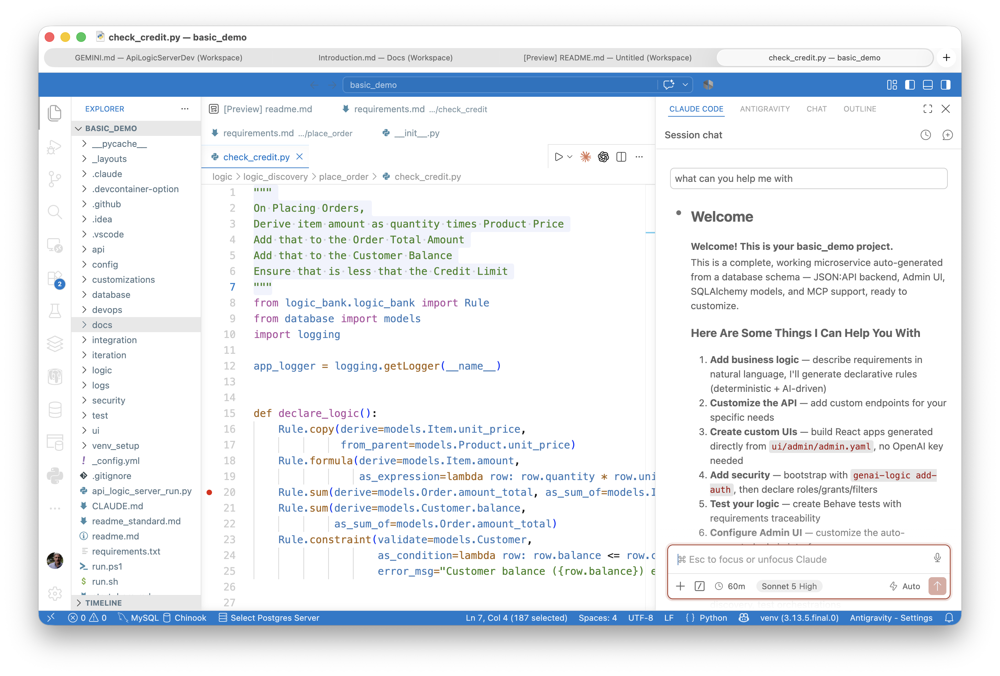
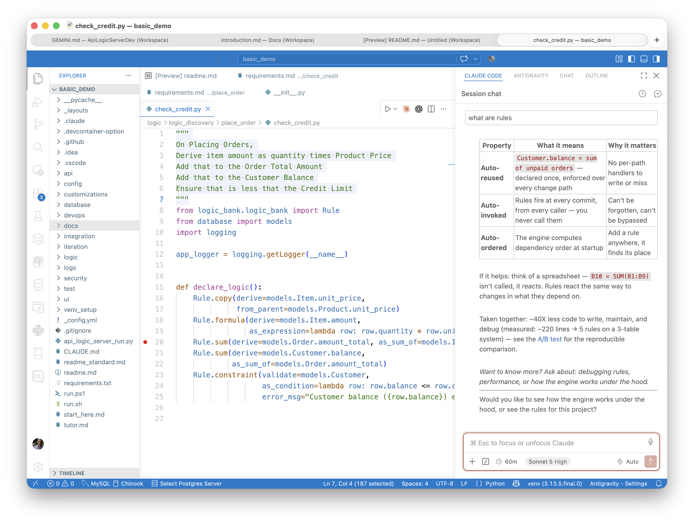
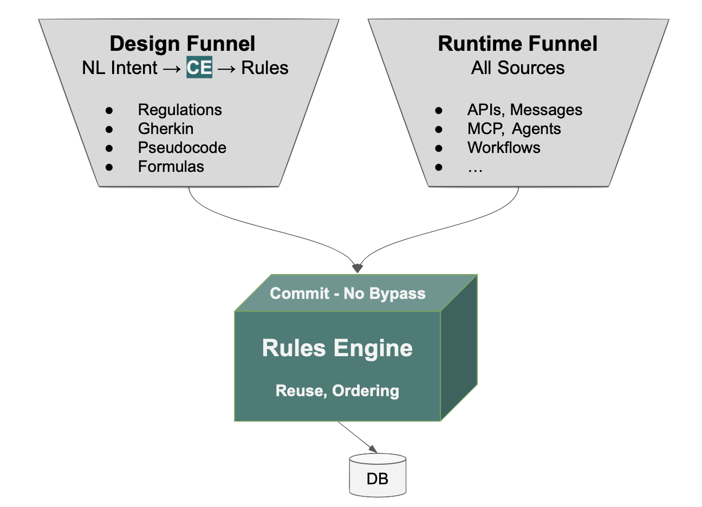

# AI, You're in Control — With Just Enough Guidance

## Two Old Answers to "Where Do I Start?"

Low-code studios solved onboarding with walls — a fixed palette, a proprietary format, a canvas you couldn't step outside of. That wasn't a design failure. Before AI, it was the only way to get a data model, rules, and UI captured as one coherent system: encode the knowledge in the tool itself, because there was no other way to make it legible to both the system and the person building it. Versata, and its peers, had to do this. The cost was real too — non-standard tools, logic trapped in a format your git diff can't read — but it bought something no alternative at the time could match.

AI removed the walls, and for a while that felt like the whole story. Point a general coding assistant at a domain and describe what you want — no palette, no canvas, no format to submit to. Just say it.

But a clean sheet of paper has a cost nobody prices in up front: **where do I start, and what's next?** Ask a frontier model to build something nontrivial with zero guidance and you'll get *an* answer — fast, plausible-looking, confident. Whether it's the answer that fits your actual domain is a separate question, one the blank page never forces anyone to ask.

We've written elsewhere about one sharp version of this cost: handed a typical, natural-language spec with no guidance toward rules, AI defaults to procedural, one-path code — the insert works, the update and delete silently don't ([the experiment](Tech-Standard-Reqs.md){:target="_blank" rel="noopener"}). That's not a one-off bug. It's what "no guidance" looks like when it meets a real requirement.

&nbsp;

## Two Kinds of Knowledge, Conflated

Put the studio and the blank page side by side and a pattern shows up: both are trying to hold two different kinds of knowledge in one place, and both pay for it.

There's **system knowledge** — the generic part. How a rule should cascade through dependent tables. What a foreign key lookup should look like. The shape of an admin UI for a typical entity. None of this is specific to your business; it's the same for almost every project.

And there's **domain knowledge** — your requirements. Your entities, your rules, your policy. The part only you know.

The studio bundled both into the tool, walls and all — which is exactly why it worked before AI could read code, and exactly why it chafed once you wanted to specify domain knowledge on your own terms. The blank page went the other way: it throws out the walls, but throws out the system knowledge with them, leaving a general model to reconstruct it fresh, from scratch, every time — with no guarantee it lands the same way twice.

&nbsp;

## Guidance, Without the Walls

Context Engineering is what happens once you stop conflating the two. Factor the system knowledge out, ship it *with* every project as training material — plain Python and markdown, not bolted onto a vendor's runtime — and hand the rest back to you. It doesn't restrict what you can build. It moves the starting line: the AI already knows a rule should cascade, already knows a lookup wants an integer foreign key, already knows a constant belongs in SysConfig, before you've typed a word. What's left for your prompt to supply is exactly the part that was always yours — the domain.

The guidance travels with the project, too. Open it in six months, hand it to a new hire, point a different AI assistant at it — the knowledge is still there, because it was never locked in a studio's format to begin with.

Two real sessions, same basic_demo project, show what this looks like from the inside:

Just enough guidance — a menu of real next steps, not a forced curriculum

 

Ask "what can you help me with" and you get a menu grounded in *this* project — not a generic capabilities list. Nothing is off the menu. Nothing is forced either.

Product depth on tap — a real answer, not a canned one-liner, with follow-up discussion

 

Ask "what are rules" mid-session and the AI doesn't deflect to a doc link. It explains, in the vocabulary of the project you're actually looking at, with room to keep asking.

Compare that to a studio's help system: a fixed set of screens, the same for every user, blind to what you're actually working on. And compare it to asking a generic assistant the same question with no project context: a textbook answer about "business rules" in the abstract, disconnected from the code in front of you.

&nbsp;

## Why This Doesn't Become Its Own Wall

The obvious objection: isn't "training material embedded in the project" just a studio with extra steps? A softer wall is still a wall.

The difference is what happens when the guidance doesn't fit. A studio's constraint is mechanical — the palette simply doesn't have the field you need; you're stuck until the vendor ships it. Context Engineering's guidance is something the AI *reasons over*, not a gate it checks against. It steers toward rules by default because rules are usually right — but "usually" isn't "always," and when a requirement is a genuine judgment call, the AI flags it and asks, or writes the deviation down for your review (`ad-libs.md`) rather than silently picking one path. You can always still open the file and write procedural code by hand if that's genuinely the right call. Nothing mechanically prevents it. The guidance is a strong prior, not a lock.

That's the structural difference: a wall fails by refusing you. Guidance fails, when it fails, by being wrong out loud — and it's still just Python, still just markdown, still yours to override.

&nbsp;

## Where the Knowledge Actually Lives

{: style="width:450px"; align=right }

This is the same design-time funnel that turns varied requirement formats into the same governed rules ([Governance Across the Portfolio](Introduction.md#governance-across-the-portfolio){:target="_blank" rel="noopener"}) — it's also what's answering you when you ask "what can you help me with." One mechanism, two payoffs: consistent output, and a guide that actually knows the project.

Design time: Context Engineering steers generation toward rules and flags judgment calls for review.

Conversation time: the same material answers your questions, in the project's own vocabulary, whenever you ask.

Runtime: the rule engine enforces what got built, on every commit, regardless of source.

Three moments, one source of guidance — not three different tools you have to reconcile.

&nbsp;

## The Actual Claim

Not "AI is easier now." Something narrower and more useful: the tradeoff the industry has been treating as fundamental — walls *or* freedom — isn't fundamental. It's an artifact of where the knowledge was allowed to live. Put it in the project instead of the tool, and you keep the freedom of a blank page with the guidance of a studio, and lose the downside of both.

*See also: [Introduction](Introduction.md){:target="_blank" rel="noopener"} for the full pipeline this fits into, and [the native-AI experiment](Tech-Standard-Reqs.md){:target="_blank" rel="noopener"} for what happens without this guidance at all.*
