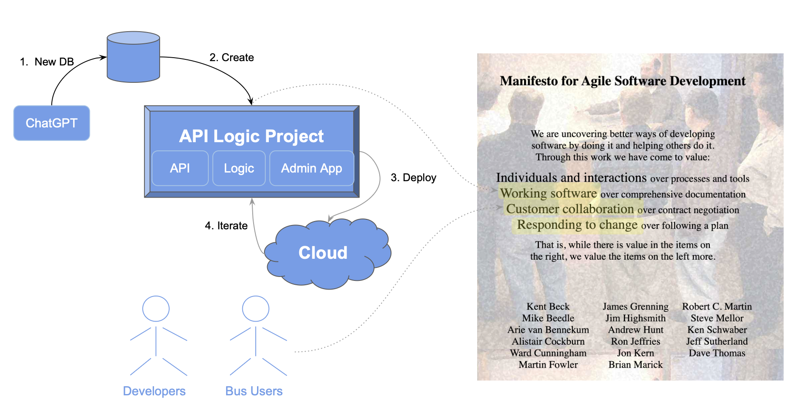

## The Problem: Late, and Wrong

{: style="height:300px;width:450px"; align=right }

We've all lived the unpleasant reality depicted here:

The harsh truth is that **working screens communicate best** - not docs, diagrams, etc.

But working screens are based on projects that are complex and time-consuming.  So, misunderstandings are discovered late in the project, with significant loss of time and effort.

## Agile Vision: Working Software Drives Collaboration and Iteration

Agile wisely advises getting **Working Software as fast as possible, to facilitate Business User Collaboration and Iteration**.  That’s not happening by coding to a framework… 

> **So, How do we get Working Software, Now?**

## Our Approach: AI-Driven Automation Delivers the Agile Vision



This article illustrates how create working software in hours instead of weeks/months, like this:

1. **Create Database With ChatGPT**
2. **Create Working Software *Now* with API Logic Server:**
    * Creates executable, customizable projects from databases
    * Declare logic logic and security with spreadsheet-like rules using your IDE
3. **Deploy for *Collaboration* with API Logic Server:** e.g. to the Azure Cloud
4. **Iterate:** add additional rules, with Python as required

This process **leverages your existing IT infrastructure:** your IDE, GitHub, the cloud, your database… open source

Let's see how.

&nbsp;

## TL;DR - in a Nutshell

Here’s the basic process (details explained in remainder of article):

**1. Use ChatGPT to input a description, and create the database**

* Input [the description below](#1-chatgpt-database-generation), and save the DDL into: `ai_customer_orders.sql`.  Edit the sql:
    * Append the insert statements (as required)
*  Create the database:
```bash
$ sqlite3  ai_customer_orders.sqlite < ai_customer_orders.sql
```

&nbsp;

**2. Create an executable API Logic Project**

2a. Create the Project
```bash
$ ApiLogicServer create \
--project_name=ai_customer_orders \
--db_url=sqlite:///ai_customer_orders.sqlite
```
2b. Open the project in VSCode, create your virtual environment, and press F5 to run

2c. In the VSCode terminal window, add security:

```bash
$ ApiLogicServer add-auth --project_name=. --db_url=auth
```

2c. Add [5 rules](#declare-logic), using IDE code completion)

&nbsp;

**3. Deploy for Collaboration**

3a. Push the Project to Git (or use ours)

3b. Build the image
```bash
$ sh devops/docker-image/build_image.sh .
```

3c. Login to the Azure Portal, and

```bash
$ git clone https://github.com/ApiLogicServer/ai_customer_orders.git
$ cd ai_customer_orders
$ sh devops/docker-compose-dev-azure/azure-deploy.sh
```

&nbsp;

**4. Iterate with Logic (automatic  ordering), and Python as required**

&nbsp;

## 1. ChatGPT Database Generation

&nbsp;

### Obtain the sql

Use ChapGPT to generate SQL commands for database creation:

!!! pied-piper "Create database definitions from ChatGPT"

    Create a sqlite database for customers, orders, items and product, with autonum keys, allow nulls, Decimal types, and foreign keys.

    Create a few rows of customer and product data.

    Enforce the Check Credit requirement:

    1. Customer.Balance <= CreditLimit
    2. Customer.Balance = Sum(Order.AmountTotal where date shipped is null)
    3. Order.AmountTotal = Sum(Items.Amount)
    4. Items.Amount = Quantity * UnitPrice
    5. Store the Items.UnitPrice as a copy from Product.UnitPrice


Copy the generated SQL commands into a file, say, `ai_customer_orders.sql`:

```sql
-- Create the Customers table
CREATE TABLE Customers (
    CustomerID INTEGER PRIMARY KEY AUTOINCREMENT,
    Name TEXT NOT NULL,
    Balance DECIMAL(10, 2) NULL,
    CreditLimit DECIMAL(10, 2) NULL
);

-- Create the Products table
CREATE TABLE Products (
    ProductID INTEGER PRIMARY KEY AUTOINCREMENT,
    Name TEXT NOT NULL,
    UnitPrice DECIMAL(10, 2) NULL
);

-- Create the Orders table
CREATE TABLE Orders (
    OrderID INTEGER PRIMARY KEY AUTOINCREMENT,
    CustomerID INTEGER NULL,
    AmountTotal DECIMAL(10, 2) NULL,
    ShippedDate DATE NULL,
    FOREIGN KEY (CustomerID) REFERENCES Customers(CustomerID)
);

-- Create the Items table
CREATE TABLE Items (
    ItemID INTEGER PRIMARY KEY AUTOINCREMENT,
    OrderID INTEGER NULL,
    ProductID INTEGER NULL,
    Quantity INTEGER NULL,
    Amount DECIMAL(10, 2) NULL,
    UnitPrice DECIMAL(10, 2) NULL,
    FOREIGN KEY (OrderID) REFERENCES Orders(OrderID),
    FOREIGN KEY (ProductID) REFERENCES Products(ProductID)
);


-- Insert sample customers
INSERT INTO Customers (Name, Balance, CreditLimit) VALUES
    ('Customer 1', 1000.00, 2000.00),
    ('Customer 2', 1500.00, 3000.00);

-- Insert sample products
INSERT INTO Products (Name, UnitPrice) VALUES
    ('Product A', 10.00),
    ('Product B', 20.00),
    ('Product C', 8.50);
```

&nbsp;

### Create the database

Sqlite is already installed in ApiLogicServer, so we avoid database installs by using it as our target database:

```bash
sqlite3 ai_customer_orders.sqlite < ai_customer_orders.sql
```

> Note: if you **use the names above**, you can save time by using the docker image and git project that we've already created.

&nbsp;

## 2. Create Working Software

Given a database, API Logic Server can create an executable, customizable project:

```bash
$ ApiLogicServer create \
--project_name=ai_customer_orders \
--db_url=sqlite:///ai_customer_orders.sqlite
```

This creates a project you can open with VSCode.  Establish your `venv`, and run it via the first pre-built Run Configuration.  To establish your venv:

```bash
python -m venv venv; venv\Scripts\activate     # win
python3 -m venv venv; . venv/bin/activate      # mac/linux
pip install -r requirements.txt
```

&nbsp;

### Add Security

In a terminal window for your project:

```bash
ApiLogicServer add-auth --project_name=. --db_url=auth
```
&nbsp;

### Declare Logic

Rules are an executable design.  Use your IDE (code completion, etc), to replace 280 lines of code with the 5 spreadsheet-like rules below.  Note they map exactly to our natural language design:

```python
    ''' Declarative multi-table derivations and constraints, extensible with Python. 

    Brief background: see readme_declare_logic.md
    
    Use code completion (Rule.) to declare rules here:


    1. Customer.Balance <= CreditLimit

    2. Customer.Balance = Sum(Order.AmountTotal where unshipped)

    3. Order.AmountTotal = Sum(Items.Amount)

    4. Items.Amount = Quantity * UnitPrice

    5. Items.UnitPrice = copy from Product
    '''

    Rule.constraint(validate=models.Customer,       # logic design translates directly into rules
        as_condition=lambda row: row.Balance <= row.CreditLimit,
        error_msg="balance ({round(row.Balance, 2)}) exceeds credit ({round(row.CreditLimit, 2)})")

    Rule.sum(derive=models.Customer.Balance,        # adjust iff AmountTotal or ShippedDate or CustomerID changes
        as_sum_of=models.Order.AmountTotal,
        where=lambda row: row.ShippedDate is None)     # adjusts - *not* a sql select sum...

    Rule.sum(derive=models.Order.AmountTotal,       # adjust iff Amount or OrderID changes
        as_sum_of=models.Item.Amount)

    Rule.formula(derive=models.Item.Amount,    # compute price * qty
        as_expression=lambda row: row.UnitPrice * row.Quantity)

    Rule.copy(derive=models.Item.UnitPrice,    # get Product Price (e,g., on insert, or ProductId change)
        from_parent=models.Product.UnitPrice)
```

&nbsp;

#### Re-use and Optimization

We can contrast this to the (not shown) ChatGPT attempt at logic.  With declarative logic, you get:

1. ***Automatic* Reuse:** the logic above, perhaps conceived for Place order, applies automatically to all transactions: deleting an order, changing items, moving an order to a new customer, etc.

2. ***Automatic* Optimizations:** sql overhead is minimized by pruning, and by elimination of expensive aggregate queries.  These can result in orders of magnitude impact.

ChatGPT created triggers that missed many Use Cases, and were inefficient.  They were also not transparent; Business Users can read the rules and spot issues (*"hey, where's the tax?"*), certainly not triggers.

&nbsp;

## 3. Deploy for Collaboration

API Logic Server also creates scripts for deployment.

&nbsp;

**a. Containerize**

In a terminal window for your project:

```bash
sh devops/docker-image/build_image.sh .
```

&nbsp;

**b. Test your Image**

You can test the image in single container mode:

```bash
sh devops/docker-image/run_image.sh
```

&nbsp;

**c. Upload Image (optional)**

You would next upload the image to docker hub.  

> If you use the same names as here, skip that, and use our image: `apilogicserver/aicustomerorders`.

&nbsp;

**d. Push the project**

It's also a good time to push your project to git.  Again, if you've used the same names as here, you can [use our project](https://github.com/ApiLogicServer/ApiLogicServer-src).

&nbsp;

**e. Deploy to Azure Cloud**

Login to the azure portal, and:

```bash
git clone https://github.com/ApiLogicServer/ai_customer_orders.git
cd ai_customer_orders
sh devops/docker-compose-dev-azure/azure-deploy.sh
```

&nbsp;

## 4. Iterate with Logic

TBD - automatic ordering

```sql
alter table Products Add CarbonNeutral Boolean;
```

```bash
cd ..  project parent directory
ApiLogicServer rebuild-from-database --project_name=ai_customer_orders --db_url=sqlite:///ai_customer_orders/database/db.sqlite
```

&nbsp;

## Appendices

### Sqlite and persistence

For information on database and directory creation, [click here](../DevOps-Container-Configuration/#database-locations){:target="_blank" rel="noopener"}.  Since the database is stored and accessed in the container, cloud changes are not persisted over runs.  This is useful for demo systems where each run starts with fresh data.

An option for cloud sqlite persistence is under investigation.  Preliminary thoughts:

* Update the project to use [blob storage](https://pypi.org/project/azure-storage-blob/){:target="_blank" rel="noopener"}
* On Server start, **restore** the database from blob storage to the image
* On Server Exit, [use `atexit`](https://betterprogramming.pub/create-exit-handlers-for-your-python-appl-bc279e796b6b){:target="_blank" rel="noopener"} to **save** the database from the image to blob storage

There are also products that automate this, such as [LiteStream](https://litestream.io/guides/azure/){:target="_blank" rel="noopener"}.

Of course, you can use a database such as MySQL, Postgres, Oracle or SqlServer, as [described here](..DevOps-Containers-Deploy-Multi/){:target="_blank" rel="noopener"}.  Local databases can be migrated to Azure in a number of ways, such as [this example using MySqlWorkBench](https://www.youtube.com/watch?v=uxSDpZnFa18){:target="_blank" rel="noopener"}.