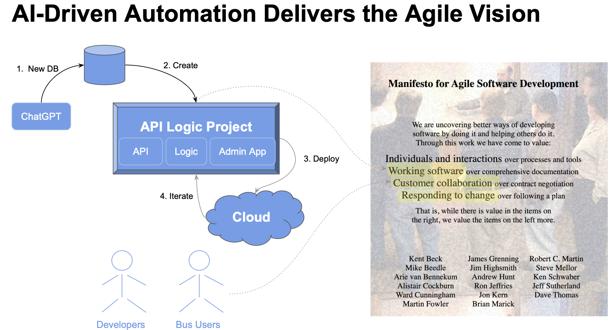
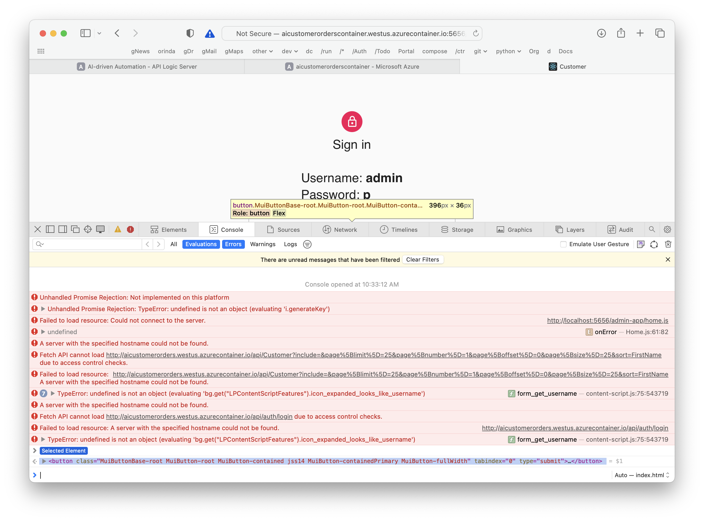

**Under Construction - Preview**

!!! pied-piper ":bulb: TL;DR - Working Software, Now"

      Agile correctly advises getting Working Software as fast as possible, to faciliate Business User Collaboration and Iteration.  Using AI and API Logic Server helps you achieve this:

      1. **Create Database With ChatGPT** 

      2. **Create *Working Software Now* with API Logic Server:**  creates an API, and Admin screens from your database

      3. **Deploy for *Collaboration* with API Logic Server:** automated cloud deployment enables collaboration:
      
         * Engage Business Users with running Admin screens - spot data model misunderstandings, and uncover logic requirements
         * Unblock UI Developers with the API

      4. **Declarative Logic Automates *Iteration:*** use [declarative rules](../Logic-Why) for logic and [security](../Security-Overview), extensible with Python as required.  Rules are a unique aspect of API Logic Server:
      
         * logic is 40X more concise, and 
         * automatically ordered per system-discovered dependencies, to facilite rapid iteration

      With API Logic Server, if you have a database, you can create and deploy for collaboration ***within hours***.



## 1. ChatGPT Database Generation

&nbsp;

### Obtain the sql

Use ChapGPT to generate SQL commands for database creation:

!!! pied-piper "Create database definitions from ChatGPT"

    Create a sqlite database for customers, orders, items and product, with autonum keys.  

    Create a few rows of customer and product data.

    Maintain the customer's balance as the sum of the unshipped orders amountotal, and ensure it does not exceed the credit limit.  Derive items price from the product unit price.


Copy the generated SQL commands into a file, say, `ai_customer_orders.sql`:

```sql
CREATE TABLE IF NOT EXISTS Customers (
    CustomerID INTEGER PRIMARY KEY AUTOINCREMENT,
    FirstName TEXT,
    LastName TEXT,
    Email TEXT,
    CreditLimit REAL,
    Balance REAL DEFAULT 0.0
);

CREATE TABLE IF NOT EXISTS Products (
    ProductID INTEGER PRIMARY KEY AUTOINCREMENT,
    ProductName TEXT,
    UnitPrice REAL
);

CREATE TABLE IF NOT EXISTS Orders (
    OrderID INTEGER PRIMARY KEY AUTOINCREMENT,
    CustomerID INTEGER,
    OrderDate DATE,
    ShipDate DATE,
    FOREIGN KEY (CustomerID) REFERENCES Customers(CustomerID)
);

CREATE TABLE IF NOT EXISTS OrderItems (
    OrderItemID INTEGER PRIMARY KEY AUTOINCREMENT,
    OrderID INTEGER,
    ProductID INTEGER,
    Quantity INTEGER,
    ItemPrice REAL,
    FOREIGN KEY (OrderID) REFERENCES Orders(OrderID),
    FOREIGN KEY (ProductID) REFERENCES Products(ProductID)
);

-- Insert customer data
INSERT INTO Customers (FirstName, LastName, Email, CreditLimit) VALUES
    ('John', 'Doe', 'john@example.com', 1000.00),
    ('Jane', 'Smith', 'jane@example.com', 1500.00);

-- Insert product data
INSERT INTO Products (ProductName, UnitPrice) VALUES
    ('Product A', 10.00),
    ('Product B', 15.00),
    ('Product C', 8.50);
```

&nbsp;

### Create the database

Sqlite is already installed in ApiLogicServer, so we avoid database installs by using it as our target database:

```bash
sqlite3 ai_customer_orders.sqlite < ai_customer_orders.sql
```

> Note: if you **use the names above**, you can save time by using the docker image and git project that we've already created.

&nbsp;

## 2. Create Working Software

Given a database, API Logic Server can create an executable, customizable project:

```bash
ApiLogicServer create --project_name=ai_customer_orders --db_url=sqlite:///ai_customer_orders.sqlite
```

This creates a project you can open with VSCode.  Establish your `venv`, and run it via the first pre-built Run Configuration.  To establish your venv:

```bash
python -m venv venv; venv\Scripts\activate     # win
python3 -m venv venv; . venv/bin/activate      # mac/linux
pip install -r requirements.txt
```

&nbsp;

## 3. Deploy for Collaboration

API Logic Server also creates scripts for deployment, as shown below:

&nbsp;

### Add Security

In a terminal window for your project:

```bash
ApiLogicServer add-auth
```

&nbsp;

### Create the image

In a terminal window for your project:

```bash
sh devops/docker-image/build_image.sh .
```
&nbsp;

#### Test

You can test the image in single container mode: `sh devops/docker-image/run_image.sh`.

You can also test the image with docker compose: `sh ./devops/docker-compose-dev-local/docker-compose.sh`.

&nbsp;

#### Upload Image (optional)

You would next upload the image to docker hub.  

> If you use the same names as here, skip that, and use our image: `apilogicserver/aicustomerorders`.

&nbsp;

### Push the project

It's also a good time to push your project to git.  Again, if you've used the same names as here, you can [use our project](https://github.com/ApiLogicServer/ApiLogicServer-src).

&nbsp;

### Deploy to Azure

> Note: This currently fails, and is under investigation.  See the Appendix below for more information.

Then, login to the azure portal, and:

```bash
git clone https://github.com/ApiLogicServer/ai_customer_orders.git
cd ai_customer_orders
sh devops/docker-compose-dev-azure/azure-deploy.sh
```

&nbsp;

## 4. Iterate with Logic

!!! pied-piper "Logic Design ('Cocktail Napkin Design')"

    Customer.Balance <= CreditLimit

    Customer.Balance = Sum(Order.AmountTotal where unshipped)

    Order.AmountTotal = Sum(OrderDetail.Amount)

    OrderDetail.Amount = Quantity * UnitPrice

    OrderDetail.UnitPrice = copy from Product


Rules are an executable design.  Use your IDE (code completion, etc), to replace 280 lines for code with these 5 rules:

> Note: the names below require correction:

```python
    Rule.constraint(validate=models.Customer,       # logic design translates directly into rules
        as_condition=lambda row: row.Balance <= row.CreditLimit,
        error_msg="balance ({round(row.Balance, 2)}) exceeds credit ({round(row.CreditLimit, 2)})")

    Rule.sum(derive=models.Customer.Balance,        # adjust iff AmountTotal or ShippedDate or CustomerID changes
        as_sum_of=models.Order.AmountTotal,
        where=lambda row: row.ShipDate is None)  # adjusts - *not* a sql select sum...

    Rule.sum(derive=models.Order.AmountTotal,       # adjust iff Amount or OrderID changes
        as_sum_of=models.OrderItem.Amount)

    Rule.formula(derive=models.OrderItem.Amount,  # compute price * qty
        as_expression=lambda row: row.ItemPrice * row.Quantity)

    Rule.copy(derive=models.OrderItem.ItemPrice,  # get Product Price (e,g., on insert, or ProductId change)
        from_parent=models.Product.UnitPrice)
```

# Appendix

## Azure Deployment

Following the first 2 steps above, I have created the git project and docker image note above.

Key facts about the application:

1. It uses flask and sqlite.  sqlite is an embedded database, so should not require a separate image.  However, azure refused to start a docker compose with just 1 service.

2. The sqlite database file is in `database/db.sqlite`

3. The generated docker compose moves this to `home/api_logic_project/database/db.sqlite`

4. You can run the container locally with:

```bash
docker run -it --name api_logic_project --rm --net dev-network -p 5656:5656 -p 5002:5002 apilogicserver/aicustomerorders
```

&nbsp;

### Multi-Container

Then, login to the Azure portal, and:

tl;dr:

```bash
git clone https://github.com/ApiLogicServer/ai_customer_orders.git
cd ai_customer_orders
sh devops/docker-compose-dev-azure/azure-deploy.sh  # a docker compose
```

That has failed inconsistently; sometimes with 500 errors, sometimes with complaints about the docker compose.

&nbsp;

### Single-Container

So, I tried just a single container:

```bash
az container create --resource-group aicustomerorders_rg --name aicustomerorderscontainer --image apilogicserver/aicustomerorders:latest --dns-name-label aicustomerorderscontainer --ports 5656 --environment-variables 'APILOGICPROJECT_VERBOSE'='True' 'APILOGICPROJECT_CLIENT_URI'='//aicustomerorders.westus.azurecontainer.io'
```

http://aicustomerorderscontainer.westus.azurecontainer.io:5656/admin-app/index.html#/Home

&nbsp;

#### Login fails

It starts (after a while!), with:

```yaml
about:
  date: September 18, 2023 14:07:54
  recent_changes: works with modified safrs-react-admin
  version: 0.0.0
api_root: //aicustomerorders.westus.azurecontainer.io/api
authentication:
  endpoint: //aicustomerorders.westus.azurecontainer.io/api/auth/login
info:
  number_relationships: 3
  number_tables: 4
```

It fails trying to login:



And here with this server log:

```log

API Logic Project (api_logic_project) Starting with CLI args: 
.. ./api_logic_server_run.py

Created September 18, 2023 12:47:42 at /home/api_logic_project


ENV args: 
.. flask_host: 0.0.0.0, port: 5656, 
.. swagger_host: localhost, swagger_port: 5656, 
.. client_uri: //aicustomerorders.westus.azurecontainer.io, 
.. http_scheme: http, api_prefix: /api, 
.. | verbose: True, create_and_run: False


sqlite_db_path validity check with db_uri: sqlite:///../database/db.sqlite
	.. Relative: /home/api_logic_project/database/db.sqlite
	.. sqlite_db_path is a valid file

Data Model Loaded, customizing...

Logic Bank 01.08.04 - 1 rules loaded
Declare   Logic complete - logic/declare_logic.py (rules + code) -- 4 tables loaded

Declare   API - api/expose_api_models, endpoint for each table on localhost:5656, customizing...

Authentication loaded -- api calls now require authorization header
..declare security - security/declare_security.py authentication tables loaded

API Logic Project loaded (not WSGI), version 09.03.03
.. startup message: force verbose, hardcode ip
 (running from docker container at flask_host: 0.0.0.0 - may require refresh)

API Logic Project (name: api_logic_project) starting:
..Explore data and API at http_scheme://swagger_host:port http://localhost:5656
.... with flask_host: 0.0.0.0
.... and  swagger_port: 5656


sys_info here

Environment Variables...
.. TERM = xterm
.. HOSTNAME = SandboxHost-638308204834900603
.. PATH = /usr/local/bin:/usr/local/sbin:/usr/local/bin:/usr/sbin:/usr/bin:/sbin:/bin
.. LANG = C.UTF-8
.. GPG_KEY = A035C8C19219BA821ECEA86B64E628F8D684696D
.. PYTHON_VERSION = 3.11.4
.. PYTHON_PIP_VERSION = 23.1.2
.. PYTHON_SETUPTOOLS_VERSION = 65.5.1
.. PYTHON_GET_PIP_URL = https://github.com/pypa/get-pip/raw/9af82b715db434abb94a0a6f3569f43e72157346/public/get-pip.py
.. PYTHON_GET_PIP_SHA256 = 45a2bb8bf2bb5eff16fdd00faef6f29731831c7c59bd9fc2bf1f3bed511ff1fe
.. APILOGICSERVER_RUNNING = DOCKER
.. APILOGICSERVER_FROM = python:3.11.4-slim-bullseye
.. APILOGICPROJECT_CLIENT_URI = //aicustomerorders.westus.azurecontainer.io
.. APILOGICPROJECT_VERBOSE = True
.. Fabric_ApplicationName = caas-74cf120365a345c48dd2a977c17812c5
.. Fabric_CodePackageName = aicustomerorderscontainer
.. Fabric_Id = 8f91bb7f-32c1-465a-a681-c6a12cafc3d2
.. Fabric_NET-0-[Other] = Other
.. Fabric_NetworkingMode = Other
.. Fabric_NodeIPOrFQDN = 10.92.0.23
.. Fabric_ServiceDnsName = service.caas-74cf120365a345c48dd2a977c17812c5
.. Fabric_ServiceName = service
.. HOME = /home/api_logic_server
.. SECRET_KEY = whatnothow
.. SQLALCHEMY_TRACK_MODIFICATIONS = False
.. SQLAlCHEMY_ECHO = false


flask_app.config: 
	
<Config {'DEBUG': None,
	'TESTING': False,
	'PROPAGATE_EXCEPTIONS': False,
	'SECRET_KEY': 'whatnothow',
	'PERMANENT_SESSION_LIFETIME': datetime.timedelta(days=31),
	'USE_X_SENDFILE': False,
	'SERVER_NAME': None,
	'APPLICATION_ROOT': '/',
	'SESSION_COOKIE_NAME': 'session',
	'SESSION_COOKIE_DOMAIN': None,
	'SESSION_COOKIE_PATH': None,
	'SESSION_COOKIE_HTTPONLY': True,
	'SESSION_COOKIE_SECURE': False,
	'SESSION_COOKIE_SAMESITE': None,
	'SESSION_REFRESH_EACH_REQUEST': True,
	'MAX_CONTENT_LENGTH': None,
	'SEND_FILE_MAX_AGE_DEFAULT': None,
	'TRAP_BAD_REQUEST_ERRORS': None,
	'TRAP_HTTP_EXCEPTIONS': False,
	'EXPLAIN_TEMPLATE_LOADING': False,
	'PREFERRED_URL_SCHEME': 'http',
	'TEMPLATES_AUTO_RELOAD': None,
	'MAX_COOKIE_SIZE': 4093,
	'API_PREFIX': '/api',
	'FLASK_HOST': '0.0.0.0',
	'SWAGGER_HOST': 'localhost',
	'PORT': '5656',
	'SWAGGER_PORT': '5656',
	'HTTP_SCHEME': 'http',
	'VERBOSE': 'True',
	'CREATE_AND_RUN': False,
	'CREATED_API_PREFIX': '/api',
	'CREATED_FLASK_HOST': '0.0.0.0',
	'CREATED_HTTP_SCHEME': 'http',
	'CREATED_PORT': '5656',
	'CREATED_SWAGGER_HOST': 'localhost',
	'CREATED_SWAGGER_PORT': '5656',
	'FLASK_APP': None,
	'FLASK_ENV': None,
	'OPT_LOCKING': 'optional',
	'SECURITY_ENABLED': True,
	'SECURITY_PROVIDER': <class 'security.authentication_provider.sql.auth_provider.Authentication_Provider'>,
	'SQLALCHEMY_DATABASE_URI': 'sqlite:///../database/db.sqlite',
	'SQLALCHEMY_DATABASE_URI_AUTHENTICATION': 'sqlite:///../database/authentication_db.sqlite',
	'SQLALCHEMY_TRACK_MODIFICATIONS': False,
	'CLIENT_URI': '//aicustomerorders.westus.azurecontainer.io'}>


PYTHONPATH..
../home/api_logic_project
../usr/local/lib/python311.zip
../usr/local/lib/python3.11
../usr/local/lib/python3.11/lib-dynload
../usr/local/lib/python3.11/site-packages
../home/api_logic_project
../home/api_logic_server

sys.prefix (venv): /usr/local


hostname=SandboxHost-638308204834900603 on local_ip=127.0.0.1, IPAddr=127.0.0.1


os.getcwd()=/home/api_logic_project


 * Serving Flask app 'API Logic Server'
WARNING: This is a development server. Do not use it in a production deployment. Use a production WSGI server instead.
 * Running on all addresses (0.0.0.0)
 * Running on http://127.0.0.1:5656
 * Running on http://192.168.0.231:5656
Press CTRL+C to quit
API Logic Server - Start Default App - redirect /admin-app/index.html
10.92.0.25 - - [20/Sep/2023 15:36:05] "GET / HTTP/1.1" 302 -
10.92.0.24 - - [20/Sep/2023 15:36:05] "GET /admin-app/index.html HTTP/1.1" 200 -
10.92.0.25 - - [20/Sep/2023 15:36:06] "GET /admin-app/manifest.json HTTP/1.1" 200 -
10.92.0.24 - - [20/Sep/2023 15:36:06] "GET /admin-app/static/js/main.1eb04138.js HTTP/1.1" 200 -
10.92.0.25 - - [20/Sep/2023 15:36:06] "GET /admin-app/static/css/main.a0c288b7.css HTTP/1.1" 200 -
10.92.0.25 - - [20/Sep/2023 15:36:06] "GET /admin-app/index.html HTTP/1.1" 200 -
10.92.0.25 - - [20/Sep/2023 15:36:06] "GET /admin-app/static/js/main.1eb04138.js HTTP/1.1" 304 -
10.92.0.24 - - [20/Sep/2023 15:36:06] "GET /admin-app/static/css/main.a0c288b7.css HTTP/1.1" 304 -
10.92.0.24 - - [20/Sep/2023 15:36:06] "GET /admin-app/manifest.json HTTP/1.1" 200 -
10.92.0.25 - - [20/Sep/2023 15:36:06] "GET /ui/admin/admin.yaml HTTP/1.1" 200 -
10.92.0.24 - - [20/Sep/2023 15:36:06] "GET /admin-app/favicon.ico HTTP/1.1" 200 -
10.92.0.25 - - [20/Sep/2023 15:36:06] "GET /ui/admin/admin.yaml HTTP/1.1" 200 -
10.92.0.24 - - [20/Sep/2023 15:36:06] "GET /admin-app/index.html HTTP/1.1" 200 -
10.92.0.25 - - [20/Sep/2023 15:36:06] "GET /admin-app/manifest.json HTTP/1.1" 200 -
10.92.0.25 - - [20/Sep/2023 15:36:06] "GET /admin-app/static/css/main.a0c288b7.css HTTP/1.1" 304 -
10.92.0.24 - - [20/Sep/2023 15:36:06] "GET /admin-app/static/js/main.1eb04138.js HTTP/1.1" 304 -
10.92.0.24 - - [20/Sep/2023 15:36:06] "GET /ui/admin/admin.yaml HTTP/1.1" 200 -
```

is the problem https?  Does the client_uri require the port?

&nbsp;

### Other alternatives

I also tried other alternatives:

admin:
```bash
api_root: //aicustomerorders.westus.azurecontainer.io/api:5656
authentication:
  endpoint: //aicustomerorders.westus.azurecontainer.io/api:5656/auth/login

```
Single container:

```bash
az container create --resource-group aicustomerorders_rg --name aicustomerorderscontainer --image apilogicserver/aicustomerorders:latest --dns-name-label aicustomerorderscontainer --ports 5656 --environment-variables 'APILOGICPROJECT_VERBOSE'='True' 'APILOGICPROJECT_CLIENT_URI'='//aicustomerorders.westus.azurecontainer.io'
```


```
az container create --resource-group myResourceGroup --name aicustomerorders_rg --image mcr.microsoft.com/azuredocs/aci-helloworld --dns-name-label aci-demo --ports 80

??
az webapp create --resource-group aicustomerorders_rg --plan myAppServicePlan --name aicustomerorders --image apilogicserver/aicustomerorders  

```

Run multi-container at [https://aicustomerorders.azurewebsites.net](https://aicustomerorders.azurewebsites.net).

Run single-container at [https://aicustomerorders.westus.azurecontainer.io:5656/api](https://aicustomerorders.westus.azurecontainer.io:5656/api).


https://aicustomerorderscontainer.westus.azurecontainer.io:5656/admin-app/index.html#/Home


## Azure IP address

These are not being returned as expected.  This means I need to manually supply this imformation in `ui/admin/admin.yml`.

The system is designed to replace these from the discovered IP (e.g, `http://localhost:5656/api`):

```yaml
api_root: '{http_type}://{swagger_host}:{port}/{api}'
info_toggle_checked: true
info:
  number_relationships: 13
  number_tables: 17
authentication:
  endpoint: '{http_type}://{swagger_host}:{port}/api/auth/login'
```

But, in the single container, I had to override them:

```yaml
api_root: https://aicustomerorders.westus.azurecontainer.io:5656/api
info_toggle_checked: true
info:
  number_relationships: 13
  number_tables: 17
authentication:
  endpoint: https://aicustomerorders.westus.azurecontainer.io:5656api/auth/login
```

## cURL

The API can be accessed by the admin app, or cURL:

```bash

curl -X 'GET' \
  'http://localhost:5656/api/Customer/?include=OrderList&fields%5BCustomer%5D=CustomerID%2CFirstName%2CLastName%2CEmail%2CCreditLimit%2CBalance%2C_check_sum_%2CS_CheckSum&page%5Boffset%5D=0&page%5Blimit%5D=10&sort=id' \
  -H 'accept: application/vnd.api+json' \
  -H 'Content-Type: application/vnd.api+json'

  curl -X 'GET' \
  'https://aicustomerorders.westus.azurecontainer.io:5656/api/Customer/?include=OrderList&fields%5BCustomer%5D=CustomerID%2CFirstName%2CLastName%2CEmail%2CCreditLimit%2CBalance%2C_check_sum_%2CS_CheckSum&page%5Boffset%5D=0&page%5Blimit%5D=10&sort=id' \
  -H 'accept: application/vnd.api+json' \
  -H 'Content-Type: application/vnd.api+json'

curl -X 'GET' \
  'https://aicustomerorders.westus.azurecontainer.io/api/Customer/?include=OrderList&fields%5BCustomer%5D=CustomerID%2CFirstName%2CLastName%2CEmail%2CCreditLimit%2CBalance%2C_check_sum_%2CS_CheckSum&page%5Boffset%5D=0&page%5Blimit%5D=10&sort=id' \
  -H 'accept: application/vnd.api+json' \
  -H 'Content-Type: application/vnd.api+json'

curl -X 'GET' \
    'http://aicustomerorders.westus.azurecontainer.io:5656/api/Customer/?include=OrderList&fields%5BCustomer%5D=CustomerID%2CFirstName%2CLastName%2CEmail%2CCreditLimit%2CBalance%2C_check_sum_%2CS_CheckSum&page%5Boffset%5D=0&page%5Blimit%5D=10&sort=id' \
  -H 'accept: application/vnd.api+json' \
  -H 'Content-Type: application/vnd.api+json'
```