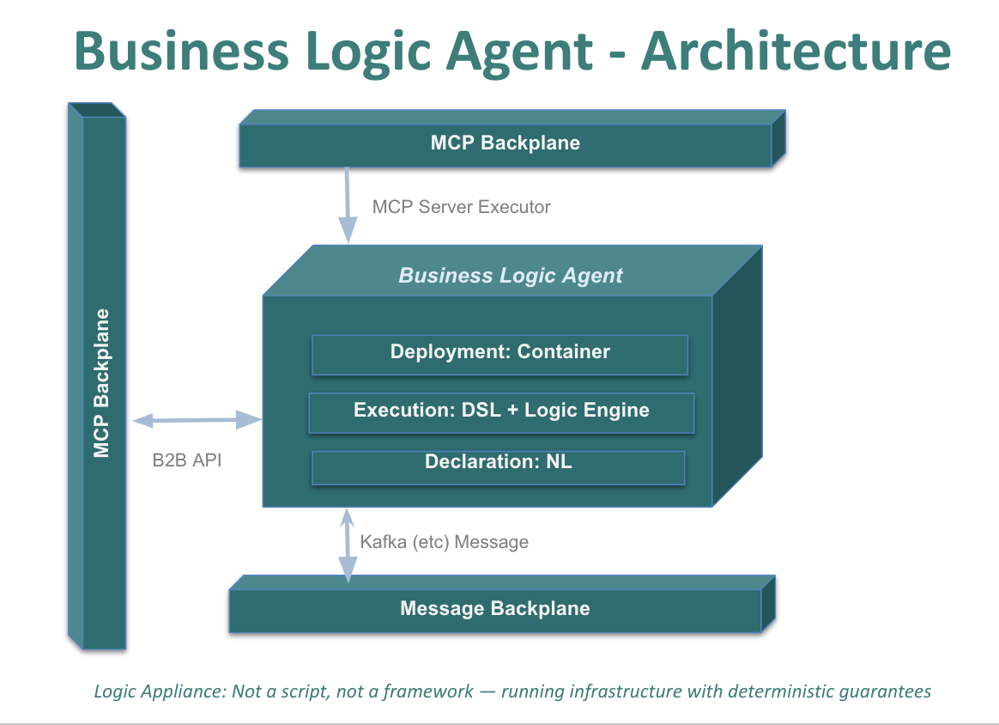

## Introduction

For decades, enterprise systems have depended on deterministic business logic — the rules that enforce policy such as credit limits, multi-table derivations, and data consistency.

These rules were traditionally **hand-coded**, buried in controllers and methods, and expensive to build, test, and maintain. In most systems, deterministic logic consumed nearly half the total development cost.

AI now changes both the cost model *and* the possibility space.

Natural language finally makes it practical to express deterministic rules directly — in a form that is already **declarative**, stating *what must be true* rather than *how to compute it*. This avoids procedural glue code, preserves business intent, and is **40× more concise** than the equivalent procedural implementation (for an AI-generated study, [click here](https://github.com/ApiLogicServer/ApiLogicServer-src/blob/main/api_logic_server_cli/prototypes/basic_demo/logic/procedural/declarative-vs-procedural-comparison.md){:target="_blank" rel="noopener"}; the procedural code is [here](https://github.com/ApiLogicServer/ApiLogicServer-src/blob/main/api_logic_server_cli/prototypes/basic_demo/logic/procedural/credit_service.py){:target="_blank" rel="noopener"}).

And beyond cost and time reduction, AI introduces something entirely new: **probabilistic logic** — reasoning, ranking, optimizing, and choosing the “best” option under uncertain conditions. This was never feasible to hand-code because it depends on natural language, context, world knowledge, and intelligent choice.

Both kinds of logic matter.  
Both are needed in modern systems.  
But they behave very differently.

This paper describes an architecture that unifies them — allowing a *single natural-language description* to produce:

- **Deterministic Logic (DL):** declarative, unambiguous business rules  
- **Probabilistic Logic (PL):** generated Python event handlers that call the LLM only where needed  

all governed by a deterministic rules engine that ensures correctness, safety, and explainability.

This is the **Business Logic Agent** — a unified NL-based approach that improves business agility, accommodates new kinds of intelligence, and provides the governance enterprises require.


## 2. How Does AI Fit In?

AI does not replace deterministic logic — it amplifies it.

Traditionally, business logic was **hand-coded in procedural form**.  
Even simple policies expanded into long sequences of steps: retrieve this, loop over that, compute values, manage complex dependencies, enforce constraints, call downstream services. A single business requirement often ballooned into **hundreds of lines of procedural code**.

Natural language changes this model completely.

The natural-language descriptions used here are **declarative**, not procedural.  
They state *what must be true*, not *how to compute it*.  
This is fundamentally different from pseudo-code or step-by-step instructions.

For example:

> “The Customer’s balance is the sum of the open Orders.”

This is already declarative.  
It expresses the **business intent**, not the mechanics.

Because the NL is declarative:

- it captures policy in a form business users can read  
- it avoids procedural glue code  
- it is dramatically more concise (often **40× smaller** than the procedural equivalent)  
- it can be optimized (e.g., the rule above is *not* translated to a 'select sum')
- and it forms a clean foundation for generation

Here is a concrete example of such a unified, declarative NL description:

```text title='Declarative NL Logic'
**Use case: Check Credit**
1. The Customer's balance is less than the credit limit  
2. The Customer's balance is the sum of the Order amount_total where date_shipped is null  
3. The Order's amount_total is the sum of the Item amount  
4. The Item amount is the quantity * unit_price  
5. The Price is copied from the Product   

**Use case: App Integration**

1. Send the Order to Kafka topic `order_shipping` if the `date_shipped` is not None.
```

These two use cases are expressed entirely in declarative natural language — including both deterministic rules (1–5), and the App Integration rule. 

> It's more like a spreadsheet than traditional procedural business logic.

---

## 3. Declarative Logic & DSL — NL → DSL → Engine

Natural language must ultimately produce something unambiguous and enforceable.  
That is why deterministic logic is expressed as a **declarative DSL**, not procedural code.

### Why DSL instead of codegen?

Very briefly:

- Procedural code scatters logic across handlers and methods.
- Regeneration overwrites fixes and breaks iterative development.
- Dependency bugs hide in the glue code — we saw this in A/B tests.
- AI struggles with ordering, before/after comparisons, and transitive dependencies.

A DSL keeps the *intent* clean and centralized.  
A deterministic runtime logic engine enforces:

- dependency managtement
- ordering  
- propagation (chaining) 
- constraint checking  
- pruning  
- debugging and traceability  

This is the **NL → DSL → Engine** model:  
AI captures policy, the DSL expresses it, the engine executes it *correctly*.  We'll illustrate an example below.

But declarative deterministic rules are **only half the story**.

Modern systems also require logic we never attempted to hand-code — logic that depends on reasoning, exploration, and world context.

This brings us to the second mode of logic AI enables: **probabilistic logic**.

---

## 4. AI Introduces a Second Mode of Logic: Probabilistic Logic

Alongside deterministic logic, AI brings something new: **probabilistic logic** — reasoning under uncertainty.

Examples include:

- Choosing the best supplier given cost, lead time, risk, or world conditions  
- Forecasting demand  
- Ranking alternatives  
- Classifying or recommending actions  
- Optimization under competing factors  

There is no single “correct” answer.  
AI explores possibilities and proposes *good* answers, not guaranteed ones.

This is fundamentally different from deterministic rules.

---

## 5. The Business Logic Agent (BLA)

A **Business Logic Agent** is a packaged, MCP-discoverable server created from natural-language declarations.  
It unifies:

1. **Natural-language business policy** (deterministic, probabilistic, and integration logic)  
2. **Generated logic** — deterministic rules (DL) and probabilistic handlers (PL)  
3. **A deterministic execution engine** that governs every operation and calls the LLM only where PL is declared  

The BLA provides a single, governed place for business logic — created from NL, executed deterministically, and exposed to AI assistants through MCP.

---

## 5.1 Definition — What a BLA Is

A Business Logic Agent consists of:

- **Unified NL declarations** describing business rules and reasoning  
- **Generated logic — deterministic logic expressed as DSL (DL), and probabilistic handlers (PL)** 
- **Deterministic execution** that ensures correctness and safety  
- **MCP exposure** so AI assistants can discover and act on system capabilities  

The BLA is not a framework; it is a **generated, governed logic component**.

---

## 5.2 Declaration & Generation (D1–D2) — How a BLA Is Created

The creation process begins with natural language.

### **D1 — Unified Natural-Language Input**  
Developers describe business policies — deterministic rules, probabilistic decisions, and integration triggers — in one incremental NL description.  

It adheres to iterative development: each new declaration extends the existing logic model (e.g., a Use Case at a time).

### **D2 — GenAI Generates Deterministic and Probabilistic Logic**  
GenAI calls the LLM to create:

- **Deterministic Logic (DL):** Python DSL rules  
  (formulas, sums, counts, constraints, events)  
- **Probabilistic Logic (PL):** Python event handlers containing structured LLM calls 
- **Integration Events:** Python calls to Kafka etc. 

These generated artifacts form the BLA’s internal logic.

---

## 5.3 Runtime Behavior (R1–R2) — How a BLA Executes

At runtime, the BLA provides governed, predictable execution.

### **R1 — Deterministic Execution**  
The rules engine evaluates all DL:

- multi-table propagation  
- derivations  
- constraints  
- before/after events  

No LLM is invoked during deterministic execution.

### **R2 — Probabilistic Execution (Only Where Declared)**  
If a rule requires reasoning or optimization, the generated PL handler fires.  
It calls the LLM, returns a value, and the deterministic engine **validates** the result before applying it.

This hybrid model gives AI the ability to reason — **within deterministic guardrails**.

---

## 5.4 MCP Packaging — How a BLA Is Exposed

The BLA creates a JSON:API, exposed as `/.well-known/mcp.json` according to the **Model Context Protocol (MCP)**.  
AI assistants acting as MCP clients can:

- discover schema and relationships  
- ask questions  
- issue validated API calls  
- receive constraint violations and deterministic messages  
- take safe action within governed rules  

All operations invoked by AI pass through the deterministic engine.

---

## 5.5 Creation Flow — Summary Diagram (D1 → D2 → R1 → R2)

This diagram summarizes how a Business Logic Agent is created and executed:

- **D1:** Unified NL declaration  
- **D2:** GenAI generates DSL + PL  
- **R1:** Deterministic rules execute  
- **R2:** Probabilistic calls occur only where declared  


---

## 5.6 Using the BLA in the Enterprise — Architecture Diagram

Once packaged via MCP, the BLA behaves like a **governed logic component** in the enterprise:

- AI assistants interact through MCP  
- Applications call its APIs  
- Downstream systems receive integration events  
- All actions remain fully validated and auditable  




---

## 6. Example — How the Model Works

Here’s a simplified pattern drawn from actual AI+MCP interaction:

```bash title='Declare Logic: Deterministic and Probabilistic NL (Natural Language)'
Use case: Check Credit:

1. The Customer's balance is less than the credit limit
2. The Customer's balance is the sum of the Order amount_total where date_shipped is null
3. The Order's amount_total is the sum of the Item amount
4. The Item amount is the quantity * unit_price
5. The Product count suppliers is the count of the Product Suppliers
6. Use AI to Set Item field unit_price by finding the optimal Product Supplier 
                                          based on cost, lead time, and world conditions

Use case: App Integration
1. Send the Order to Kafka topic 'order_shipping' if the date_shipped is not None.
```

The created DSL code is as short and clear as the NL:

```python title='Generated DSL Code'
    Rule.constraint(validate=models.Customer, as_condition=lambda row: row.balance <= row.credit_limit, error_msg="balance ({row.balance}) exceeds credit ({row.credit_limit})")
    Rule.sum(derive=models.Customer.balance, as_sum_of=models.Order.amount_total, where=lambda row: row.date_shipped is None)
    Rule.sum(derive=models.Order.amount_total, as_sum_of=models.Item.amount)  
    Rule.formula(derive=models.Item.amount, as_expression=lambda row: row.quantity * row.unit_price)
    Rule.count(derive=models.Product.count_suppliers, as_count_of=models.ProductSupplier)
    Rule.early_row_event(on_class=models.Item, calling=set_item_unit_price_from_supplier)
```

1. **AI interprets the user request and issues an API call via MCP.**  
   “Update Alice’s order to 100 units.”

2. **AI issues an API call** via the MCP-discovered schema.  
   The assistant knows the entity, fields, and relationships.

3. **Deterministic engine processes the update**

      - Invokes the LLM for PL to determine the supplier / price, e.g., avoiding usage of a blocked stait
      - Recalculates Item.amount  
      - Updates Order.amount_total  
      - Updates Customer.balance  
      - Applies the credit-limit constraint

4. **If the policy is violated**, the engine blocks the update.  
   AI interprets the response:  
   > “Business logic working correctly — update prevented.”

This is **probabilistic intent inside deterministic guardrails**.

---

## 7. Closing — A Modern, Unified Approach

Enterprise systems now operate with **two modes of reasoning**:

- deterministic rules that must always be correct  
- probabilistic reasoning that expands what systems can do  

By combining:

- natural-language expression  
- declarative DSL  
- deterministic execution  
- and AI-driven probabilistic logic  

we get something new: a governable, extensible hybrid model.

Think of it as a ***logic appliance*** — a packaged, governed MCP server that delivers business behavior safely to AI.

The Business Logic Agent is simply the architectural pattern that emerges when these elements are combined — a unified approach where AI provides intent and exploration, and deterministic logic ensures that everything remains correct, explainable, and safe.
