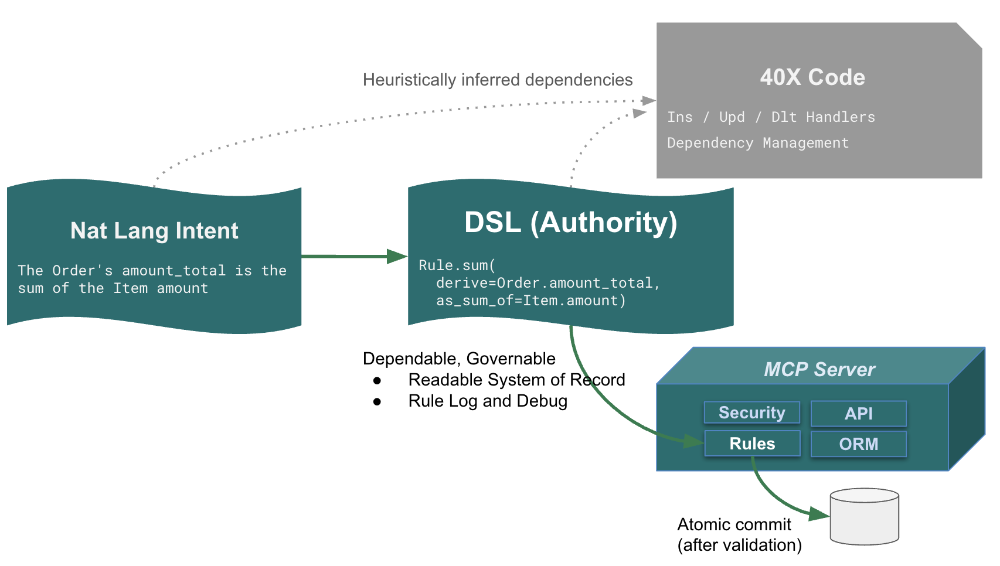

# Governed Agentic Business Logic (GABL)

💡 **Governed Agentic Business Logic** unifies deterministic and probabilistic logic in a single natural-language model, executed under deterministic governance and exposed as a containerized MCP-discoverable server.

A GABL / Business Logic Agent integrates:

* **Deterministic Logic:** declarative rules that must always be correct<br>
e.g., “Customer balance is the sum of unpaid Orders and must not exceed the credit limit.”

* **Probabilistic Logic:** AI-driven reasoning under uncertainty<br>
e.g., “Select the optimal supplier based on cost, lead time, and world conditions.”

* **Integration Logic:** declarative, event-driven actions<br>
e.g., “Publish Order to Kafka topic order_shipping when date_shipped is set.”

* **Deterministic Execution:** a deterministic execution engine that enforces correctness and governance<br>
e.g., dependency-ordered recomputation and constraint enforcement on every update.

* **MCP Discovery:** safe AI interaction with system capabilities<br>
e.g., an assistant discovers entities, rules, and actions via MCP and issues a validated update.

---

## 1. Introduction

For decades, enterprise systems have depended on deterministic business logic — rules that enforce policy such as credit limits, multi-table derivations, and data consistency.

These rules were traditionally hand-coded, buried in controllers and methods, and expensive to build, test, and maintain. In most systems, deterministic logic consumes nearly half the total development cost.

AI changes both the cost model and the possibility space.

Natural language makes it practical to express deterministic rules directly — in a naturally declarative, order-independent form, stating ***what* must be true** rather than ***how* to compute it**. This avoids procedural glue code, preserves business intent, enables automatic dependency management, and is *far* more concise than the equivalent procedural implementation.  

For an AI-generated comparison of declarative vs. procedural implementations — including AI-acknowledged errors in the procedural version and their correction, [click here](https://github.com/ApiLogicServer/ApiLogicServer-src/blob/main/api_logic_server_cli/prototypes/basic_demo/logic/procedural/declarative-vs-procedural-comparison.md){:target="_blank" rel="noopener"}; the procedural code is [here](https://github.com/ApiLogicServer/ApiLogicServer-src/blob/main/api_logic_server_cli/prototypes/basic_demo/logic/procedural/credit_service.py){:target="_blank" rel="noopener"}.  This mirrors a well-known boundary: code generation can produce plausible paths, but completeness across dependencies must be enforced deterministically.

Note: in that same comparison, five declarative rules replaced more than 200 lines of procedural code for the same business logic — a ~40× reduction. This reflects the collapse of procedural glue code once dependencies are made explicit, not an assumption about AI capability or project size.

Beyond cost and time reduction, AI introduces something entirely new: **probabilistic logic** — reasoning, ranking, optimizing, and choosing the “best” option under uncertain conditions. This was never feasible to hand-code because it depends on natural language, context, world knowledge, and intelligent choice.

Both kinds of logic matter.  
Both are needed in modern systems.  
But they behave very differently.

This paper describes an architecture that unifies them — allowing a **single natural-language description** to produce:

- **Deterministic Logic (DL):** declarative, unambiguous business rules  
- **Probabilistic Logic (PL):** generated Python handlers that call the LLM only where needed  

…all governed by a deterministic rules engine that ensures correctness, safety, and explainability.

This is **Governed Agentic Business Logic (GABL)** — a governed agent runtime that allows AI to take real actions over enterprise data, enforced by deterministic business logic and bounded probabilistic reasoning.

---

## 2. How does AI fit in?

AI does not replace deterministic logic — it **amplifies** it.

Traditionally, business logic was hand-coded in procedural form. Even simple policies expanded into long sequences of steps: retrieve this, loop over that, compute values, manage dependencies, enforce constraints, call downstream services. A single business requirement typically ballooned into hundreds of lines of procedural code.

Natural language changes this model completely.

The natural-language descriptions used here are **declarative**, not procedural:

- They capture policy in a form business users can read: how our data is validated, computed, and integrated. 
- They are assertions ***what* must be true after commit**, not *how* to enforce it.  
- They are dramatically more concise than procedural equivalents.  
- They provide a clean foundation for generation and governance.
- They avoid procedural glue code.  

For example:

> “The Customer’s balance is the sum of the open Orders.”

This is already declarative. It expresses the business intent, not the mechanics.

Here is a concrete example of a unified, declarative natural-language description:

### Declarative NL Logic

```bash title='Declarative NL Logic'
Use case: Check Credit Logic

1. The Customer's balance is less than the credit limit  
2. The Customer's balance is the sum of the Order amount_total where date_shipped is null  
3. The Order's amount_total is the sum of the Item amount  
4. The Item amount is the quantity * unit_price  
5. The Price is from the Product  

Use case: App Integration

1. Send the Order to Kafka topic `order_shipping` if `date_shipped` is not None.
```

The logic for our two use cases are expressed entirely in declarative natural language — including deterministic logic (1–5) and integration logic.  Importantly, note that the logic has a **dependencies.**  Correct results require **dependency management:** dependencies must be recognized, and executed in a proper order.

---

<br>

## 3. Make Logic Executable: Rules

The declarative natural-language logic above is a good formulation — but it must become **executable**, without collapsing back into procedural glue code or *guessing* at dependencies. The decision tree below summarizes the key alternatives:



### Introducing the Rules DSL (Domain Specific Language)

Our natural-language logic is concise and high-level, but it is not fully **rigorous**. For example: is `price` *copied* from the Product once, or *referenced* (so later Product price changes update Order totals)? That ambiguity makes **Alt-1** a poor choice.

So we translate the natural-language logic into a **Rules DSL** that preserves the high level of abstraction while making intent **unambiguous**. We teach this DSL to the LLM by defining a small set of **rule types** (sum, formula, constraint, copy, event, etc.), enabling the LLM to convert the logic above into:

```python title="Generated DSL Code from Declarative NL Logic (above)"
    # Check Credit
    Rule.constraint(validate=models.Customer, as_condition=lambda row: row.balance <= row.credit_limit, error_msg="Customer balance exceeds credit limit")                    
    Rule.sum(derive=models.Customer.balance, as_sum_of=models.Order.amount_total, where=lambda row: row.date_shipped is None)    
    Rule.sum(derive=models.Order.amount_total, as_sum_of=models.Item.amount)
    Rule.formula(derive=models.Item.amount, as_expression=lambda row: row.quantity * row.unit_price)
    Rule.copy(derive=models.Item.unit_price, from_parent=models.Product.unit_price)

    # App Integration
    Rule.after_flush_row_event(on_class=models.Order, calling=kafka_producer.send_row_to_kafka, 
                               if_condition=lambda row: row.date_shipped is not None, with_args={'topic': 'order_shipping'})
```

This avoids the issues around **(1)** in the diagram above: the logic must be disambiguated.

This DSL becomes the **system of record**: it is readable, reviewable, and can be checked into git.  

<br>

### CodeGen vs Runtime Engine

Next, how do we make the DSL executable? The decision tree outlines these alternatives:

- **2. LLM → code.** Use an LLM to translate DSL rules into procedural code. This is attractive, but it reintroduces the core risk: LLMs tend to manage dependencies by **heuristic pattern inference**, which can miss subtle (but real) dependencies and produce business logic bugs. We eliminated this option.

    - We tried this. We asked an LLM to translate rules into code; we found two serious dependency bugs; and the LLM itself summarized dependency management as pattern-based reasoning. To see the study, [click here](https://github.com/ApiLogicServer/ApiLogicServer-src/blob/main/api_logic_server_cli/prototypes/basic_demo/logic/procedural/declarative-vs-procedural-comparison.md){:target="_blank" rel="noopener"}.

- **4. purpose-built code generator.** Write a code generator that **knows each rule type** and can compute dependencies correctly from rule semantics. This is a viable approach.

- **5. direct execution.** Execute the DSL directly in a rules engine.

Both code generation and direct execution can be correct **provided dependencies are derived from rule semantics, not inferred heuristically**.

We chose **direct execution** because it preserves the highest level of abstraction — declarative rules — from definition through runtime. This avoids introducing a secondary procedural layer that obscures intent, complicates debugging, and fractures governance. The rules themselves remain the executable system of record, not an artifact derived from them.

<br>

### The Rules Engine

The LogicBank rules engine fulfills this role. It is designed explicitly for **transactional correctness and performance**:

- dependency-ordered recomputation,
- SQL-backed aggregation,
- constraint enforcement *before commit*,
- audit logging,
- and transactional commit boundaries.

It is **not** a RETE-style inference engine. Traditional RETE engines optimize forward-chaining inference but perform poorly for transactional business logic due to:

- state retention,
- non-deterministic propagation,
- control-flow assumptions,
- and difficulty with multi-table transactional updates.

This approach preserves not only readability, but **debuggability**, since we can log and debug at the **rule level** rather than the code level:


---

## 4. AI introduces a second mode of logic: Probabilistic Logic

Alongside deterministic logic, AI brings probabilistic logic — reasoning under uncertainty.

Examples include:

- choosing the best supplier given cost, lead time, risk, and world conditions  
- forecasting demand  
- ranking alternatives  
- classification and recommendation  
- optimization under competing factors  

There is no single “correct” answer. AI explores possibilities and proposes good answers, not guaranteed ones.

This is fundamentally different from deterministic rules.

### Example: PL to Choose Supplier

Here is prior example extended with probabilistic logic for choosing the best supplier

```python title='Declare Natural Language Logic with PL to Choose Supplier'
Use case: Check Credit
1. The Customer's balance is less than the credit limit  
2. The Customer's balance is the sum of the Order amount_total where date_shipped is null  
3. The Order's amount_total is the sum of the Item amount  
4. The Item amount is the quantity * unit_price  
5. The Product count suppliers is the count of the Product Suppliers  
6. Use AI to set Item field unit_price by finding the optimal Product Supplier based on cost, lead time, and world conditions  

Use case: App Integration
1. Send the Order to Kafka topic `order_shipping` if `date_shipped` is not None.
```

```python title='Generated DSL Code, including PL'
def declare_logic():
    """
    Declarative business rules for Check Credit use case.
    
    Combines deterministic rules (calculations, validations) with
    probabilistic logic (AI-driven supplier selection).
    """
    
    Rule.constraint(validate=models.Customer, as_condition=lambda row: row.balance is None or row.credit_limit is None or row.balance <= row.credit_limit, error_msg="Customer balance ({row.balance}) exceeds credit limit ({row.credit_limit})")
    Rule.sum(derive=models.Customer.balance, as_sum_of=models.Order.amount_total, where=lambda row: row.date_shipped is None)    
    Rule.sum(derive=models.Order.amount_total, as_sum_of=models.Item.amount)
    Rule.formula(derive=models.Item.amount, as_expression=lambda row: row.quantity * row.unit_price if row.quantity and row.unit_price else 0)
    Rule.count(derive=models.Product.count_suppliers, as_count_of=models.ProductSupplier)
    Rule.early_row_event(on_class=models.Item, calling=set_item_unit_price_from_supplier)


def set_item_unit_price_from_supplier(row: models.Item, old_row: models.Item, logic_row: LogicRow):
    """
    Early event: Sets unit_price using AI if suppliers exist, else uses fallback.
    
    Fires on insert AND when product_id changes (same semantics as copy rule).
    Implements probabilistic logic with graceful fallback.
    """
    from logic.logic_discovery.ai_requests.supplier_selection import get_supplier_selection_from_ai
    
    if logic_row.is_deleted():  # Skip on delete (old_row is None) - CRITICAL: Check this FIRST
        return
    
    if not (logic_row.is_inserted() or row.product_id != old_row.product_id):  # Process on insert OR when product_id changes
        return
    
    product = row.product
    
    if product.count_suppliers == 0:  # no supplied - use product price
        return row.unit_price = product.unit_price
    
    # Product has suppliers - call AI wrapper
    logic_row.log(f"Product {product.name} has {product.count_suppliers} suppliers, requesting AI selection")
    supplier_req = get_supplier_selection_from_ai(
        product_id=row.product_id,
        item_id=row.id,
        logic_row=logic_row
    )
    row.unit_price = supplier_req.chosen_unit_price # Extract AI-selected value(s)
```


### Automatic audit trail for governance

Because probabilistic logic introduces non-deterministic decision-making, the system automatically records a complete audit trail for every deterministic rule execution during transaction processing.

This audit trail captures which rules fired (and in what dependency order), what values changed at each step, which constraints were evaluated, and whether the transaction committed or rolled back — and why.

As a result, every AI-assisted operation is not only governed and validated, but fully explainable and forensically inspectable — a critical requirement for enterprise accountability and regulated environments.

---

## 5. The Business Logic Agent (BLA)

A **Business Logic Agent (BLA)** is the **deployable unit** produced by Governed Agentic Business Logic.

By this point, we have already introduced:

* declarative deterministic rules expressed in a DSL,
* probabilistic logic invoked only where explicitly declared,
* deterministic execution enforcing correctness, auditability, and transactional commit boundaries.

A BLA packages these elements into a single, governed runtime component.

A Business Logic Agent:

* contains the generated deterministic rules (DSL) and probabilistic handlers (PL),
* executes all updates through the deterministic engine, validating any AI-assisted decisions before commit,
* records a complete audit trail for every transaction,
* exposes its capabilities through MCP for safe interaction with AI assistants.

The BLA is **not a framework** and **not a long-running autonomous agent**.
It is a generated, transactional logic component that can be invoked by applications or AI assistants while remaining fully governed, explainable, and safe.

---

### 5.1 MCP packaging — how a BLA is exposed

Once generated, a BLA is packaged as a containerized service and exposed via the Model Context Protocol (MCP).

Through MCP, AI assistants can:

* discover available entities, relationships, and rules,
* ask questions about system state and constraints,
* issue validated API calls,
* receive deterministic constraint violations and explanations.

All actions — whether initiated by applications or AI assistants — pass through the deterministic execution engine.

---

### 5.2 Creation flow — summary (D1 → D2 → R1 → R2)

The lifecycle of a Business Logic Agent follows a clear, governed flow:

**D1 — Unified natural-language declaration**
Business policies are described incrementally in natural language, including deterministic rules, probabilistic decisions, and integration triggers.

**D2 — GenAI generation**
GenAI produces:

* deterministic DSL rules (formulas, sums, constraints, events),
* probabilistic handlers (PL) that invoke LLMs only where declared,
* integration logic (e.g., Kafka publishing).

**R1 — Deterministic execution**
All deterministic rules execute:

* dependency-ordered recomputation,
* constraint enforcement,
* audit logging.

No LLM is invoked during this phase.

**R2 — Probabilistic execution (only where declared)**
If probabilistic logic is required:

* the PL handler invokes the LLM,
* returns proposed values,
* the deterministic engine validates the result before commit.

This ensures probabilistic reasoning operates strictly inside deterministic guardrails.

---

### 5.3 Using the BLA in the enterprise — architecture

Once deployed, a Business Logic Agent behaves like a governed logic component in the enterprise:

* applications call its APIs,
* AI assistants interact through MCP,
* integration events publish to downstream systems,
* all state changes remain fully validated, auditable, and explainable.

The BLA provides a single, authoritative place for business logic — created from natural language, executed deterministically, and safely accessible to AI.


> *(Insert diagram: `Bus-Logic-Agent-Arch.png`)*

---

## 6. Example — how the model works

Here’s a simplified pattern drawn from actual AI + MCP interaction.


### Runtime behavior

1. AI interprets the user request and issues an API call via MCP (e.g., “Update Alice’s order to 100 units.”).  
2. The deterministic engine processes the update.  
3. If declared, the PL handler invokes the LLM to determine supplier/price (e.g., avoiding a blocked state).  
4. The engine recomputes dependent values deterministically:
   - recalculates `Item.amount`  
   - updates `Order.amount_total`  
   - updates `Customer.balance`  
5. The engine applies constraints (e.g., credit limit).  
6. If policy is violated, the engine blocks the update and returns an explanation.

This is probabilistic intent inside deterministic guardrails.

---

## 7. Closing — a unified approach

Enterprise systems now operate with two modes of reasoning:

- deterministic rules that must always be correct  
- probabilistic reasoning that expands what systems can do  

By combining:

- natural-language expression  
- declarative DSL  
- deterministic execution  
- AI-driven probabilistic logic  

…we get a governable, extensible hybrid model.

Think of it as a **logic appliance** — a packaged, governed MCP server that delivers business behavior safely to AI.

The Business Logic Agent is the architectural pattern that emerges when these elements are combined: AI provides intent and exploration, and deterministic logic ensures everything remains correct, explainable, and safe.

---

## Appendix — How GABL Meets Agentic System Criteria

This appendix maps **Governed Agentic Business Logic (GABL)** to commonly accepted characteristics of agentic systems, while highlighting how governance and determinism are preserved.

### 1. Goal-directed behavior
Agentic systems pursue objectives rather than executing fixed scripts.

**GABL support**
- Goals and policies are expressed declaratively in natural language.
- Deterministic rules define *what must be true*.
- Probabilistic logic enables optimization and choice under uncertainty.

The agent acts to satisfy goals while remaining within enforced constraints.

---

### 2. Autonomous decision-making
Agents make decisions without step-by-step procedural control.

**GABL support**
- Probabilistic Logic (PL) handlers invoke LLMs to reason, rank, or select outcomes.
- Decisions occur at runtime, not pre-scripted code paths.
- Deterministic execution validates decisions before committing state.

Autonomy exists, but is bounded by governance.

---

### 3. Environmental interaction
Agents perceive and act on external systems.

**GABL support**
- MCP exposure allows AI assistants to discover schema, actions, and constraints.
- Integration logic (e.g., Kafka events) enables side effects beyond the database.
- All interactions are mediated through validated APIs.

The agent is externally interactive, not isolated.

---

### 4. State awareness and continuity
Agentic systems reason over evolving state, not single prompts.

**GABL support**
- Deterministic logic maintains derived state across entities and transactions.
- Dependency-ordered recomputation ensures consistent state evolution.
- Constraints enforce invariants over time.

State is first-class, not implicit.

---

### 5. Planning and multi-step reasoning
Agents perform reasoning across multiple steps and conditions.

**GABL support**
- Probabilistic logic performs reasoning where uncertainty is declared.
- Deterministic execution propagates effects across dependent entities.
- Multi-step behavior emerges from rule chaining plus PL invocation.

Reasoning is hybrid: probabilistic exploration + deterministic execution.

---

### 6. Explainability and observability
Agentic systems must explain *why* actions occurred.

**GABL support**
- Deterministic rules are explicit and auditable.
- Rule execution is traceable across tables and state changes.
- Constraint violations return precise explanations.
- Developers can step through rule execution and generate tests from logic.

The system is inspectable, not a black box.

---

### 7. Safety and governance
Enterprise-grade agents must prevent unsafe actions.

**GABL support**
- All state changes pass through deterministic execution.
- Probabilistic outputs are validated before application.
- Constraints, ordering, and dependency checks are enforced on every update.
- AI cannot bypass governance through prompts or autonomy.

This provides a hard execution boundary.

---

### Summary

GABL satisfies the core criteria of agentic systems:

- goal-directed  
- autonomous  
- stateful  
- interactive  
- capable of reasoning and planning  

While adding something most agent architectures lack:

**deterministic governance at the point where AI touches real state.**

This enables agentic behavior that is deployable, explainable, and safe in enterprise systems.

<br>

---

## Appendix — What “Governable” Means

In Governed Agentic Business Logic (GABL), *governable* does not mean restrictive or static.
It means that AI-assisted behavior operates within a system whose correctness, dependencies, and outcomes are
**defined, enforced, and explainable by the runtime itself**.

This appendix clarifies what governable means in concrete architectural terms.

---

### 1. Authoritative Source of Truth

A governable system has a single, authoritative definition of behavior.

In GABL, that authority is the **declarative DSL** — not natural language and not generated procedural code.

- Natural language expresses intent.
- AI may propose logic or values.
- The DSL defines what the system actually enforces.

If behavior is not represented in the DSL, it is not authoritative and cannot affect system state.

---

### 2. Explicit Dependencies — Derived by Rule Semantics (Not Inferred)

Governable systems must compute dependencies **completely and correctly**.

In GABL, dependencies are *not* discovered by scanning text, control flow, or generated code.
Instead, dependencies are derived **semantically**, based on the **rule type** being declared.

Each DSL rule type (e.g., `sum`, `formula`, `constraint`, `copy`, `event`) has well-defined semantics.
The runtime knows, for each rule type:

- which attributes are read,
- which attributes are written,
- how foreign-key relationships participate,
- how changes propagate transitively across entities.

For example:
- A `sum` rule explicitly depends on the target attribute, the source attribute, and the foreign-key path connecting them.
- A `copy` rule depends on the parent relationship and the copied attribute.
- A `constraint` depends on all attributes referenced by its condition.

Because dependencies are computed from rule semantics — not guessed from code structure —
the system accounts for **all relevant dependencies**, including those implied by foreign keys.

This is exactly where procedural generation fails:
foreign-key dependencies are often implicit in control flow and are easy to miss,
leading to incorrect recomputation and subtle logic bugs.

---

### 3. Deterministic Execution

Governance requires deterministic execution.

In GABL:
- all state changes pass through a deterministic execution engine,
- derived values are recomputed in dependency order,
- constraint checks are enforced on every update.

Given the same inputs, the system produces the same outcomes —
independent of execution order, regeneration, or AI involvement.

---

### 4. Transactional Commit Boundary

Governable behavior requires a clear transactional boundary.

All deterministic rules, dependency propagation, and validations complete **before** any state is committed.
If validation fails, the transaction is rejected and no partial state is written.

This ensures:
- atomic updates,
- no inconsistent intermediate states,
- predictable and explainable behavior.

AI-assisted decisions never bypass this boundary.

---

### 5. Bounded Use of AI

AI is powerful, but non-deterministic.

In GABL:
- AI is used only where explicitly declared (probabilistic logic),
- AI proposes values or decisions,
- deterministic logic validates results before commit.

AI assists reasoning and selection,
but **never defines correctness or dependencies**.

---

### 6. Explainability and Auditability

A governable system must be explainable after the fact.

For every transaction, GABL records:
- which deterministic rules executed,
- the dependency order in which they executed,
- what values changed,
- which constraints were evaluated,
- whether the transaction committed or rolled back, and why.

This provides a complete audit trail for AI-assisted behavior —
critical for debugging, accountability, and regulated environments.

---

### 7. Resistance to Prompt or Agent Drift

Governable systems do not rely on prompt discipline or regeneration correctness.

Because dependencies, execution, and validation are enforced at runtime:
- prompts cannot bypass rules,
- regenerated code cannot silently alter behavior,
- agent autonomy cannot escape constraints.

Governance is enforced by the execution model itself, not by convention.

---

### Summary

In GABL, *governable* means:

- behavior is defined in one authoritative DSL,
- dependencies are derived from rule semantics, not inferred,
- execution is deterministic and transactional,
- AI operates within enforced boundaries,
- outcomes are explainable and auditable.

This is what makes agentic behavior safe, evolvable, and deployable in real enterprise systems.
