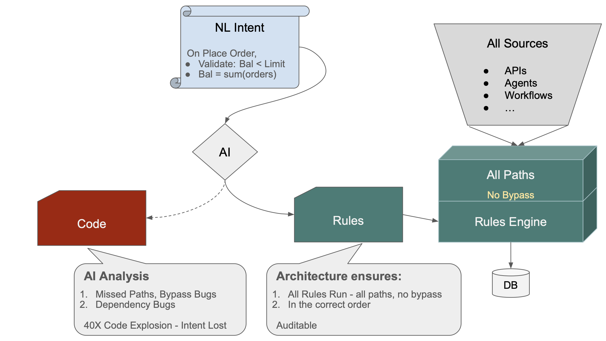
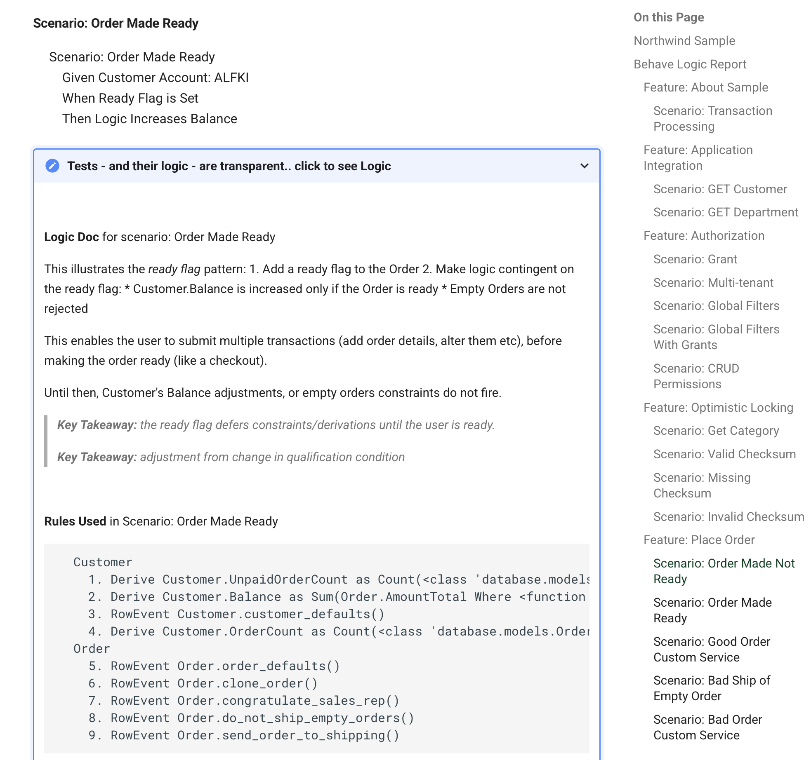

# AI Governance Isn't the Problem. It's the Symptom.

CIOs are carrying a heavier list than usual. AI governance just overtook cybersecurity as the #1 priority — ending a 12-year reign. Agentic AI is writing to production databases before anyone has agreed on the guardrails. Pilots that looked great in demos are failing quietly in production. Compliance teams are asking questions nobody can answer. Underneath all of it, a new category of technical debt is accumulating — AI-generated code that nobody fully owns.

These look like separate problems. They aren't.

---

## One Root Cause

Business intent is declarative by nature. "Customer balance must not exceed credit limit." "Order total is the sum of its items." These are statements about the underlying truth of the data — the *what*, not the *how*.

When that intent gets implemented as procedural code — by developers, or now by AI — it gets translated. And that translation is where governance breaks down. Logic gets scattered across endpoints. Ordering becomes implicit and fragile. There is no single control point — only paths, multiplying faster than you can audit them. Miss one and the data is silently wrong. Add a new agent next year, a new endpoint next month — neither inherits the rules. There are no rules. There is only code.

AI accelerates this mistake. NL → procedural code at scale is the code generator problem with a better UI. We learned that lesson in the 1990s. The output was unmaintainable then. It's unmaintainable now — just faster to produce.

---

## The Fix

Keep the intent declarative. Make it executable.

Rules live on data — not in execution paths. They fire at the one place every transaction must pass through: the commit point. Not because a developer remembered to call them. Because there is no other path.

Every source inherits the same governance automatically — APIs, agents, workflows, Vibe-generated apps. You don't govern paths. You govern commits. The rules don't erode as the system grows.

---

## AI's Proper Role

AI isn't the problem. We've given it the wrong job.

Relieved of procedural code generation, AI does what it's genuinely brilliant at: understanding intent and expressing it as declarations. Natural language is already declarative in spirit. "When an order is placed, check the credit limit" — that's not a path. That's a rule. AI can express it as one. Context Engineering directs AI to generate rules, not code — and a governed system follows.

---

## The Proof

A charge allocation system — real business logic, multi-table derivations, compliance requirements — previously took four developers two years to build. It never shipped. Rebuilt with declarative rules, it took a weekend. With GenAI-Logic directing AI to generate rules instead of code, the same system takes five minutes from a business prompt.

---

## What the Architecture Guarantees

Two things that procedural code cannot claim:

**All relevant rules run, in the correct order, on every transaction.** The rules engine computes dependency order from the rules themselves at startup — deterministically. The commit listener means there is no path that bypasses them. Not "we tested the paths we thought of." Guaranteed by construction.

**The system proves it.** Because rules are the requirements, the system generates its own tests from the rules, runs them, and produces a logic report linking scenario → rules used → execution results. Nobody writes the tests. Nobody writes the report. They are automatic consequences of having declared the rules.

You don't assert compliance. You produce the proof.

---

## Where This Exists Today

This architecture is available now, open source. If you're wrestling with governed agentic systems, AI-generated technical debt, or auditability at scale — it's worth an hour.

[genai-logic.com]

---
*Val Huber is co-founder of GenAI-Logic and former CTO of Versata.*
