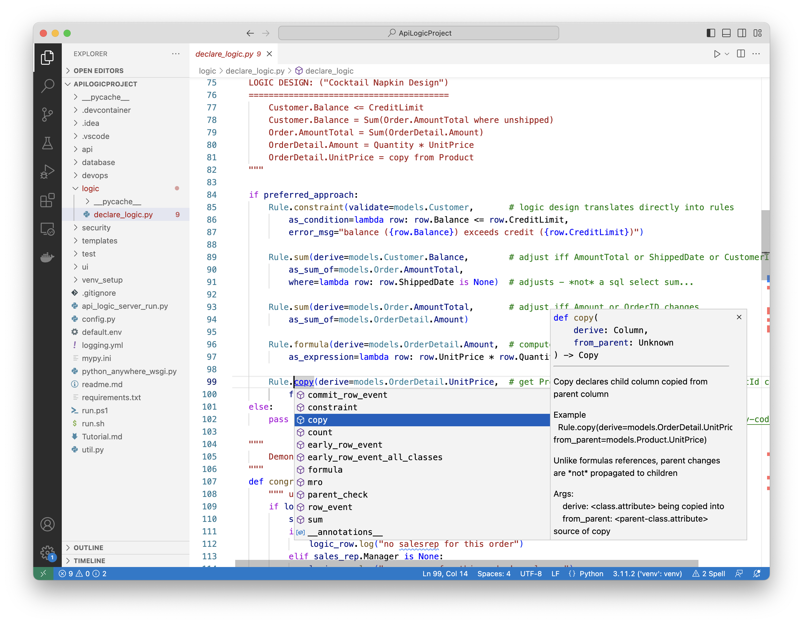

!!! pied-piper ":bulb: TL;DR - Use Python (code completion, named arguments) to declare behavior"

    Python works well at multiple levels:
    
    1. a **full OO language** for professional Developers

    2. a **scripting language** for Power Users
    
    3. a **Domain Specific Language (DSL)** for **capturing *declarative* logic and security specifications**, accessible to Business Users, providing:

        * Natural source control, code review etc.

        * Type Checking, based on IDE support for Python typing

        * Lookups, based on IDE support for Code Completion

Declarative is a powerful technology, designed to provide agility and transparency with high level definitions.  Such definitions comprise a DSL - a Domain Specific Language.  This page explores how such language elements can be captured and stored using Python as a 4GL.

&nbsp;

## API Logic Server is Declarative

API Logic Server provides declarative support for model-driven development:

* **API -** the `api/expose_api_models.py` file declares (lists) which tables are exposed in the [API](API.md).

* **Logic -** using spreadsheet-like rules - [see here for more information](Logic-Why.md).

* **User Interface -** using a yaml file  - [see here for more information](Admin-Customization.md).


&nbsp;

## Python as a DSL

There are some classic approach for capturing models in a user interface, as [described below](#appendix-ui-for-model-capture).

API Logic Server uses your IDE and Python.  This is ***Python as a DSL***.  So, for example, we can capture rules like this:



Consider the rule that defines the customer balance.  It looks like design spec, or pseudocode - except it's fully executable:

```python
        Rule.sum(derive=models.Customer.Balance,        # adjust iff...
            as_sum_of=models.Order.AmountTotal,
            where=lambda row: row.ShippedDate is None)  # adjusts...
```

The following subsections explore how a modern IDE provides virtually all of the advantages of a User Interface.

### Rule Type Discovery

Observe how **code completion** lists the possible rule types, with documentation on their meaning, examples, etc.

### Transparent

Python **named arguments** make the rules read very much like the design comments at the top of the screen shot.

### Code Completion

Code completion addresses not only rule types, but the *list of valid tables and columns*.  These are derived from the (system-generated) `database/models.py` file.

### Type Checking

Runtime services employ Python type checking for their arguments.  

> Special thanks to Mike Bayer (creator of SQLAlchemy) for a heads-up on this as I was learning Python.

### Consistent Persistence

Using Python files for rules eliminates the persistence question.  All the tools that work with source files operate on the DSL - editors, source control, diff, merge, etc.

### Debugging is natural

A huge advantage is that debugging is built into the same IDE used for editing.  No additional tools to learn and coordinate.

### Integrated, Consistent Environment

Well, that's what IDE means, isn't it?  Using Python as a DSL expands our notion of development from code, to include DSLs, all in one integrated environment.

&nbsp;

----

## Appendix: UI for Model Capture

A classic approach for model capture is to use a user interface.  We have discovered that:

* Python as a DSL provides most of the value of a UIThis affords some opportunities to make things simple, 
* And avoids some challenges on *persisting* the language elements (meta data).  These are described below.

### Type checking, Lookups

It's valuable to ensure that the language elements are properly typed - numbers are valid, etc.  Capturing these in a User Interface enables such checking.

Even more important, a User Interface can "teach" language elements to developers - provide a list of rules, a list of tables or columns for defining rules, and so forth.

### Persist in a database?

There must of course be provisions for persisting the language elements ("meta data") in a way they can be viewed and editing later.  They could be stored in a database, opening up attractive "eat your own dogfood" opportunities to use rules to validate rules.

This is attractive.  I've personally used this approach.  The drawback is that databases really don't provide source control at a low level of granularity.  Developers need to check in rules, back them out - all of these are very cumbersome in a database.  You can't just use GitHub.

### Persist as markup language?

Another approach, also one I've used, is to store language elements as markup files - xml, json, yaml etc.  This works well - the meta data is now files, and can be used with source control systems, can be diff'd, etc.

However, such files represent a transformation from what the developer supplied in the User Interface.  This adds some burden to developers - perhaps not onerous, but not natural.
