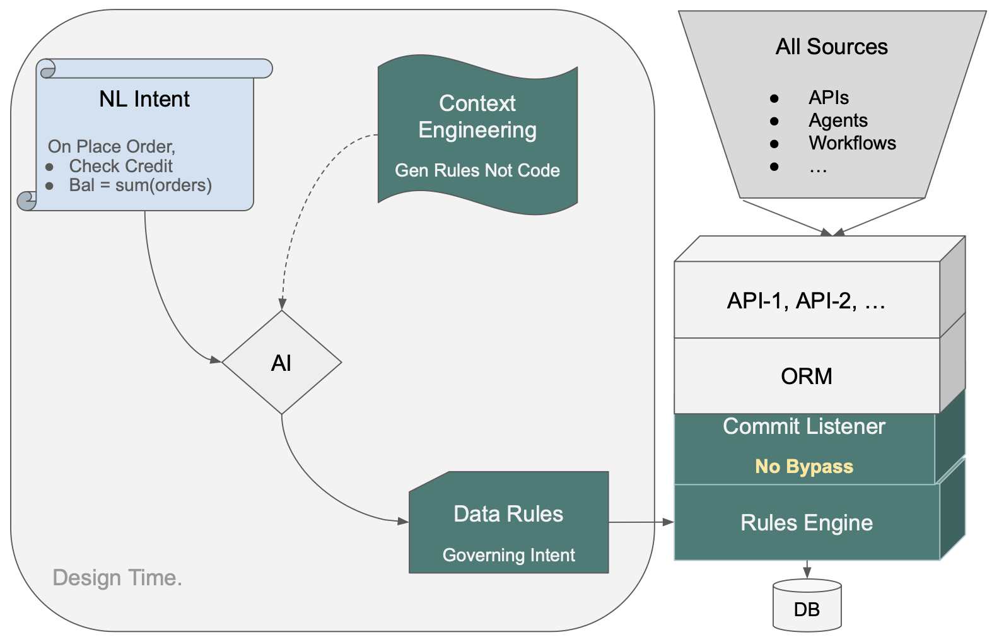

# Enterprise AI: The Missing Piece

*By W. Ries*

---

## The Quiet Failure

Large enterprises are investing heavily in AI. Most of that investment is at the infrastructure and model layer — training, fine-tuning, embeddings, retrieval pipelines. That work is real and necessary.

It is also, in my experience, not landing.

MIT's NANDA initiative puts the number at 95% — the share of enterprise generative AI pilots delivering no measurable P&L impact, from *The GenAI Divide: State of AI in Business 2025*, based on 300 public deployments and 150 executive interviews. Everyone I talk to recognizes the pattern, and almost nobody says out loud why it happens. The pilots don't fail because the AI is weak. The AI is remarkable. They fail because a demo is not a system — and nobody budgeted for the distance between the two.

A demo illustrates a few key paths. A system enforces what's required on all of them — customs regulations on every shipment, carrier SLAs on every booking, credit limits on every order — including the integration somebody adds three years from now. Provably, in a form an auditor can read, maintained by whoever inherits it.

That distance is not a model problem. No amount of model investment closes it. It is an infrastructure problem — and the infrastructure in question is one most enterprises don't know is missing, because until recently it didn't exist.

## What "Enterprise" Actually Requires

Strip away the technology and an enterprise system is a promise: *the core business policy will be enforced, every time, and we can prove it.*

Enterprises have spent decades getting serious about governing everything except business logic. Data governance, API security, access control, infrastructure compliance — all addressable, all invested in. Business logic — the rules that make a transaction correct — has always lived in code, unreadable, unverifiable, and trusted on faith.

That gap has existed for as long as enterprise software has existed. AI doesn't create it. AI makes it unaffordable.

Every agent, every generated service, every natural-language interface is another route to your data — and another path that won't inherit yesterday's rules unless someone remembers to wire them in. At enterprise scale, someone always forgets.

Which brings us back to why the promise is hard to keep. For decades, the accepted wisdom was simple: ***it's domain-specific logic, so it has to be domain-specific code.*** Nobody questioned it. It was just how software worked.

Business logic — the derivations, validations, and policies that express core business policy: regulatory compliance, customer SLAs, financial controls, customs obligations — has always lived in code paths. Procedural code, written by hand or generated by AI, scattered across services and endpoints. Three consequences follow from that assumption — and enterprises have been absorbing them ever since:

**You can't read it.** A five-line requirement becomes two hundred lines of code. The intent is in there somewhere, buried. Compliance can't review it. The next developer can't either. At one large organization I'm aware of, the answer to "what is our business policy?" required a full-time developer — whose job was to go read the code and report back.

**You can't guarantee it runs.** Logic in a code path governs that path. The new endpoint, the new agent, the new integration — none of them inherit it unless someone remembers. At enterprise scale, someone always forgets.

**You can't prove anything.** Auditing a system means reading the code and hoping. Auditors can only sample. Exposure hides in the gaps.

You can't audit what you can't read.

## What Unreadable Logic Costs

A major logistics company had a team working for months on a customs system — competent people, conventional architecture, business logic written as code, the way nearly every enterprise system is built.

A governed version of the same system — customs eligibility over a live shipment message pipeline, seven tables, 130-plus columns — was built in days, as a proof of concept. Not by better developers — by a different architecture. The requirements went in as plain-English documents the business team already owned. The logic came back as declarative rules: short, readable, attached to the data itself, enforced automatically on every transaction.

> The governed version caught an 8-figure compliance exposure that the months-long version had missed.

Nobody on the original team was careless. The exposure was invisible because the logic was unreadable — thousands of lines of procedural code that no human could fully audit. The moment the same logic existed as a page of readable rules, guaranteed to execute on every transaction, the gap was simply *visible*. Where the AI had to make a judgment call during generation, a report flagged it for human review — the system knew what it wasn't sure of.

The lesson is not "AI builds systems fast." The lesson is that the cost of ungoverned logic is not slow delivery. It is not knowing what your systems actually enforce.

## The Missing Piece

Enterprises already govern data, APIs, security, and infrastructure. The missing piece is governance for business logic itself — the rules that determine whether a transaction is actually correct.

We added a Business Logic Governance layer that sits alongside the database and the message broker. A running service, not a code generator, not a framework. The implementation in this case was GenAI-Logic, an open-source platform built around two ideas.

**Architecture Automation — automate the routine components.** A working system arrives on day one: API, admin application, role-based security, messaging integration, test scaffolding. Your teams don't build any of that. And it works with your existing database and your existing message infrastructure — it adds the governance layer that was always missing, without replacing anything you've already built.

The starting point is a running system. The only work left is declaring the business logic.

**Logic Automation — where the real shift happens.** Most people's mental model of AI-generated logic is code: a developer describes the requirement, AI writes the implementation, and the result is hundreds of lines that live somewhere in a service. That's the pattern that creates the three problems above.

Think about a spreadsheet instead. A formula — `Balance = Sum(Orders)` — is not code. It's intent, expressed directly. You don't call a developer to change it. You don't worry that it runs on some rows but not others. It just works, everywhere, always, and anyone can read it. You would never imagine coding it.

A rule works the same way. *The customer's balance is the sum of unpaid orders. The balance may not exceed the credit limit.* Expressed directly, executed automatically on every transaction. Five rules, not two hundred lines — distilled from the requirement, not exploded into code. Rules are executable, maintainable intent. Your developers can read it. And so can your auditors.

The missing piece is a governed transactional logic layer: infrastructure that turns business rules into executable, auditable, universally enforced policy.

## What Falls Out

Once logic is governed by architecture, several expensive problems stop being problems. None of these is a feature. They are consequences.

**Technical debt drops by an order of magnitude.** Across every project we've built, the entire codebase your team manages runs from under 100 lines for a pure logic system to under 500 for a complex integration with messaging. The rest is platform-managed. What your team owns isn't infrastructure to wade through — it's the business logic itself, standing alone, readable by anyone who needs to understand, change, or audit it.

**You can finally practice real agile.** The manifesto advised iteration on working software. In practice, most teams iterate on specs and mockups for months before anything runs. With GenAI-Logic, working software exists on day one — business users react to real screens, course-correct early, and the project stays aligned with what the business actually needs.

Iterations are fast and safe. Add a rule, change a rule, remove a rule — the engine determines execution order automatically. No impact analysis. No archaeology. No missed dependencies. What should be simple stays simple. Iterate twelve times, before lunch.

**Your team stops hand-building the same plumbing.** APIs, security, messaging, admin screens, test scaffolding — pre-solved and uniform across every project. That's where enormous amounts of skilled staff time currently go. Getting it back doesn't just save money; it moves your best people from rebuilding infrastructure to solving business problems.

**Every system looks the same underneath.** Same architecture, same patterns, whether it was built by team A this year or team C in three years. Maintenance and onboarding stop depending on archaeology.

**Compliance becomes tractable.** Rules are readable, traceable to the requirement, and provably executed — with generated artifacts: a logic diagram per requirement, a traceability report mapping transaction to rule to requirement, a health check scoring governance coverage across the portfolio. The audit collapses from "read everything and hope" to "verify the rules, confirm the architecture, spot-check the log."

## Why This Scales When Pilots Don't

Most enterprise technology that failed worked fine in the pilot. Scale is where it dies — because scale requires hundreds of developers across dozens of teams to adopt a new way of working, and they don't.

This architecture sidesteps that problem rather than fighting it. There is no new paradigm for your teams to learn. Requirements go in the form they already produce. The output is standard components — Python, a standard API, a stateless container — managed with tools they already use. Governance quality comes from the architecture, not the team roster. The hundredth system is as governed as the first, built by people who never attended a training session.

That's what separates a pilot from a platform.

## The Question to Ask

If you're an IT leader, the AI investment on your books is probably sound. The model layer matters. But it delivers capability, not results — and the results are what your business is waiting for.

So here is the question I'd put to your own organization: *pick any production system — can your teams show you, on one page, what business rules it actually enforces? And can they prove those rules run on every transaction?*

If the answer is no — and at nearly every enterprise, it is — then that gap is where your next eight-figure exposure is hiding, and no model will find it.

Enterprises have learned to govern data, APIs, security, and infrastructure. Business logic is the last ungoverned layer — and the one that determines whether your AI investment actually delivers what the business requires. The organizations that close that gap first will be the ones whose AI investments actually reach production.

What I'd fund next is the infrastructure that delivers it.

---

*W. Ries is a senior enterprise IT executive with a long career building and operating large-scale systems. The examples described are installable open-source samples — the 93 lines are there to read.*
