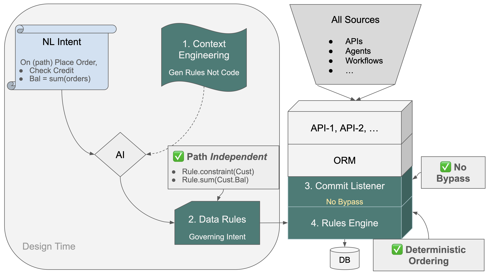
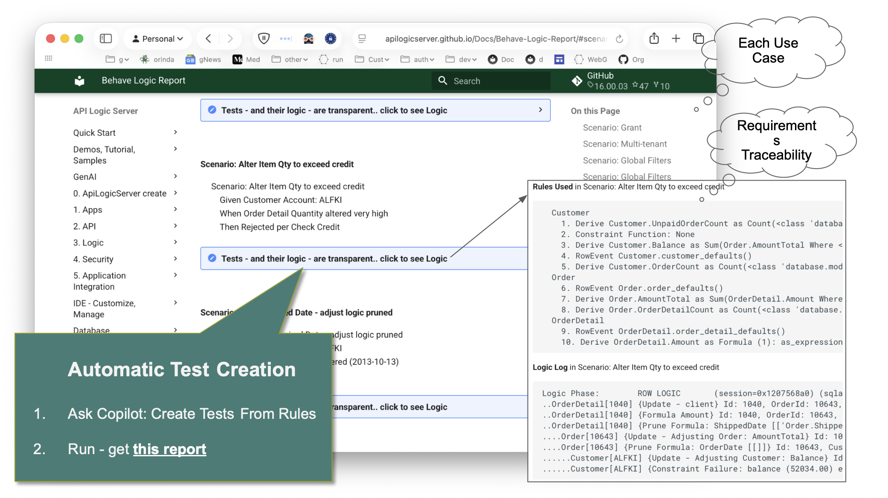
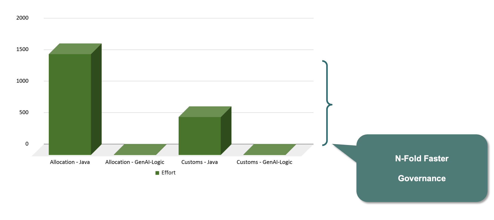

<style>
  .md-typeset h1,
  .md-content__button {
    display: none;
  }
</style>

# Governance By Architecture, Not Discipline

## GenAI-Logic Governance architecture

Agentic AI has enormous potential. It also has a recognized governance problem. Existing / new paths must consistently enforce business policy - credit limits, order rules, data integrity.  As paths multiply with AI Agents, discipline is not enough — an architecture is required.

We've created such a governance architecture:

1. **Context Engineering** directs AI to generate Data Rules — not procedural code.  Intent becomes declarations.
2. **Data Rules** distill path-dependent logic into path-independent rules on data. See them below — `Rule.constraint, Rule.sum`. No missed paths. Every path inherits them automatically.
3. The **Commit Listener** hooks into the ORM commit. Every transaction — API, agent, workflow — passes through one control point.  Nothing bypasses it.
4. The **Rule Engine** computes dependency order from the Data Rules at startup — deterministically. No pattern-matching, no subtle ordering bugs.



&nbsp;

## Why This Matters

This is not a theoretical concern — AI Governance ranks #1 among CIO priorities in 2026, overtaking cybersecurity for the first time. The concern isn't adoption. It's control at scale.

&nbsp;

## The AI Agent Problem

Every enterprise deploying AI agents faces the same question: what happens when the agent touches production data? Prompts can be crafted carefully. Models can be fine-tuned. But none of that governs what actually persists to the database.

The Commit Listener answers this architecturally. Every transaction — whether from a human API call, a workflow, or an AI agent — passes through one control point. The agent cannot bypass it. Neither can a new developer, a new endpoint, or a carefully crafted prompt. The rules govern the data, not the caller.

&nbsp;

## Consequence: Executable Requirements

When governance is architectural, requirements become executable. Some setup, then a single prompt creates a running system — logic, custom APIs, messaging, and security.  Let's have a look.

&nbsp;

### Initial Creation

The setup below creates a project from an existing database — standard Python, open in your IDE, ready to run:

* **JSON:API:** an endpoint for each table, with pagination, optimistic locking, filtering, sorting, etc.  With Swagger.

    * In minutes, you have an MCP-discoverable API.  Vibe custom UIs.

* **Admin App:** a multi-table admin app, providing master detail, lookups, etc.


```bash title="Establish Initial State, Execute Requirements"
# A - Create project from existing database
genai-logic create --project_name=demo_eai --db_url=sqlite:///samples/dbs/basic_demo.sqlite

# B - In created project, get these requirements
$ cp -r ../samples/requirements/demo_eai/ .

# C - Optionally, configure security
$ (cd devops/keycloak; docker compose up -d)
$ genai-logic add-auth --provider-type=keycloak --db-url=localhost

# D - Create system from requirements
implement requirements docs/requirements/demo_eai
```

The following is the exact prompt (steps 1-6) you can then submit to create logic, custom APIs, Messaging, and Security.  AI uses the Context Engineering to create executable software from the actual requirements below (step D).  This is the entire system — not a prototype.

&nbsp;

**1. Business Logic — Check Credit**

```gherkin
Feature: Check Credit

  Scenario: Place an order
    Given a customer with a credit limit
    When an order is placed
    Then copy the price from the product
    And multiply by quantity to get the item amount
    And sum item amounts to get the order total
    And sum unpaid order totals to get the customer balance
    And reject if balance exceeds the credit limit
```

**2. B2B API — Accept orders from external partners**

```gherkin
Feature: B2B Order Integration

  Scenario: Accept order from external partner
    Given an inbound B2B order in partner format (message_formats/order_b2b.json)
    When the order is received via a Custom API endpoint named OrderB2B
    Then map Account to Customer by name
    And map Items.Name to Product by name
    And map Items.QuantityOrdered to Item.quantity
    And create the order with all Check Credit rules enforced
```

**3. Kafka Subscribe — Inbound orders from sales channel**

```gherkin
Feature: Kafka Subscribe Order Integration

  Scenario: Accept inbound orders from sales channel
    Given an inbound order message in JSON format (message_formats/order_b2b.json)
    When the message is received from Kafka topic order_b2b
    Then use the 2-message pattern
    And save the raw payload as a blob in the first transaction
    And parse and persist the order in the second transaction
    And map Account to Customer by name
    And map Items.Name to Product by name
    And map Items.QuantityOrdered to Item.quantity
    And create the order with all Check Credit rules enforced
```


**4. Kafka Publish — Notify shipping on dispatch**

```gherkin
Feature: Kafka Publish Shipping Notification

  Scenario: Notify shipping when an order is dispatched
    Given an Order exists
    When date_shipped is set
    Then publish to Kafka topic order_shipping
    And use message_formats/order_shipping.json as the message shape
    And use by-example publish rather than key-only publish
```


**5. Security**

```gherkin
Feature: Row-Level Security
  Scenario: Sales role sees limited customers
    Given a user with the sales role
    When querying the Customer list
    Then only return customers where credit_limit >= 3000 or balance > 0
```

&nbsp;

## More On Governance

Directed by Context Engineering, AI generates Data Rules in Python — from Gherkin (above) or plain text (below).


**Any source, any path**<br>
The rules execute on commit — *any* commit.

* **Any source** - APIs and messages are all *funneled* into the commit gate, automatically.  No bypass.
* **Any path** - The resultant logic governs eight scenarios... the Gherkin specified one.  Delete an order — nobody mentioned that. Ship an order — nobody mentioned that. An agent updates a quantity — not in the spec. Yet, all enforce the rules, because the rules are on the data, not the path. They don't know or care which scenario triggered the transaction. A new developer adds an endpoint next month. A new agent connects next year. Both inherit the same rules — automatically, with no additional work.

**Correctness**<br>
Contrast this with AI *without* context engineering — those same 5 rules generate over 200 lines of code. 40X. Not just unwieldy: it introduces significant **correctness issues**.

AI pattern matching introduces subtle errors. When we asked AI to create logic without rules, it produced code with missed dependencies, incorrect ordering, and incomplete path coverage — errors AI itself documented, unprompted, when asked to compare the two approaches. [See the study](https://github.com/ApiLogicServer/ApiLogicServer-src/blob/main/api_logic_server_cli/prototypes/basic_demo/logic/procedural/declarative-vs-procedural-comparison.md){:target="_blank" rel="noopener"}.

> When we asked Copilot 'what if the order's customer changes?' — it found a bug. 'What if the item's product changes?' — another bug. Both discovered only after prompting. Both the same failure: a foreign key change leaving the old parent's balance uncorrected.

The Governance Architecture addresses this by delegating dependency management to the rules engine. Dependencies are computed at startup, deterministically — automatic invocation, automatic ordering, simpler maintenance.

&nbsp;

The formalized rules also enable the system to create and run tests directly from rules. These don't just demonstrate requirements are fulfilled — they make the **requirement → rules → execution log** visible to the entire organization: developers, business users, auditors.



&nbsp;

## Business Impact



The rules are the requirement — restated with precision. They're what runs, what auditors review, and what every path inherits. They can't drift from what they enforce.

And because governance is architectural — not disciplinary — the agility follows. One prompt replaced 4 developers × 2 years ([Allocation](https://apilogicserver.github.io/Docs/Sample_Allo_Dept_GL_full/)). XR replaced months of traditional framework work ([Customs](https://apilogicserver.github.io/Docs/Customs-readme/), and the [requirements](https://github.com/ApiLogicServer/ApiLogicServer-src/blob/main/api_logic_server_cli/prototypes/manager/samples/requirements/customs_demo/docs/requirements/customs_demo/requirements.md)).

Governance and agility are not a tradeoff. They're the same architecture.
