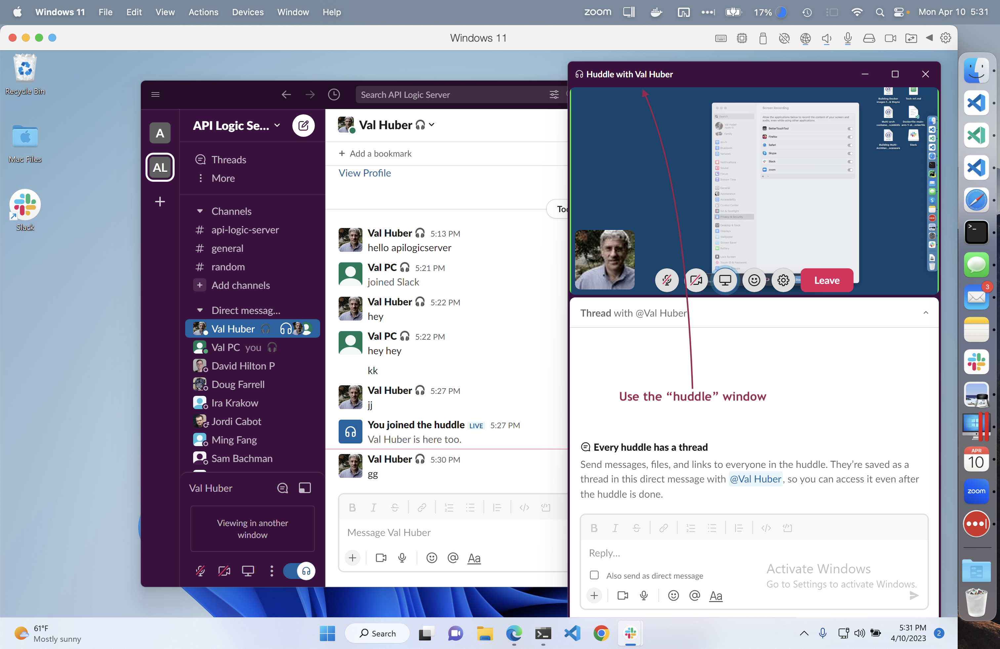

We use Slack for internal communication and support: apilogicserver.slack.com.

We have seen issues in Windows users gaining access to huddle screen sharing.  Note huddles have a dedicated window for this:

