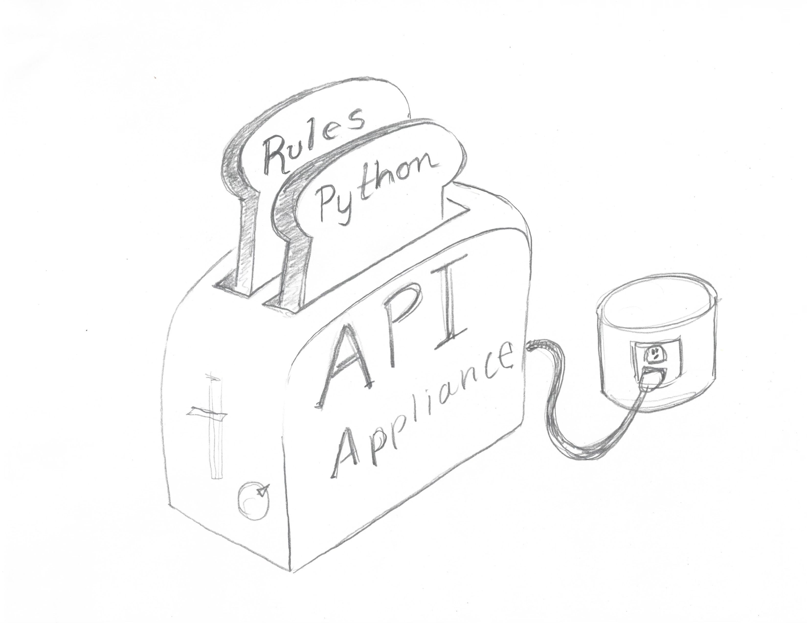
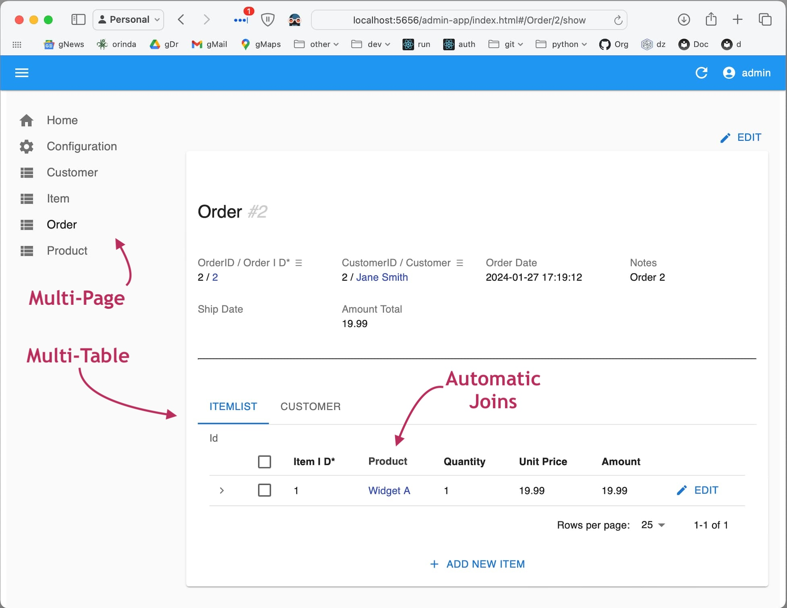
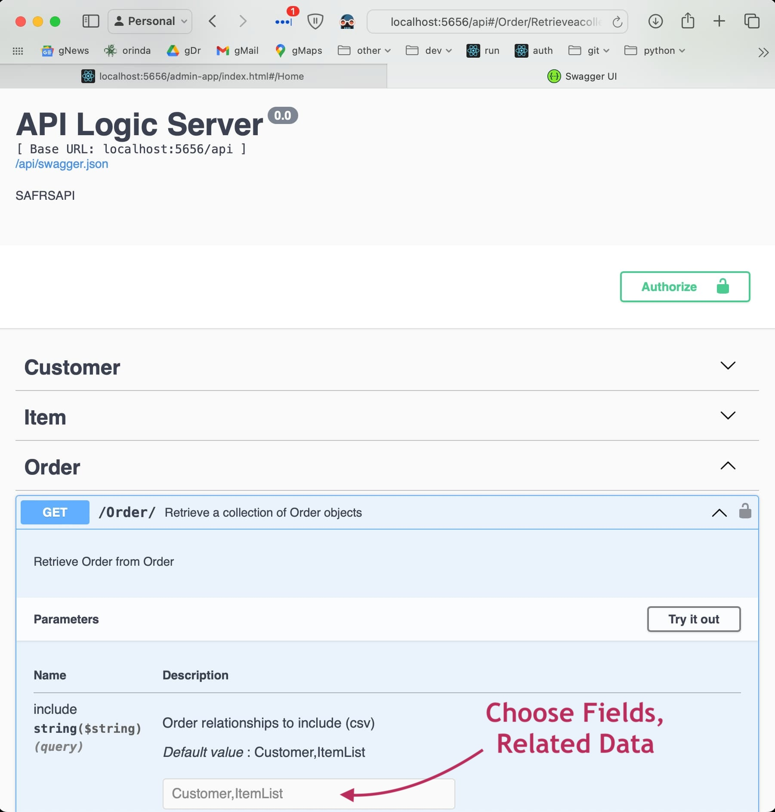
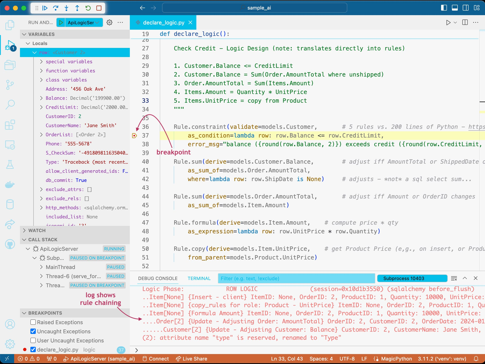
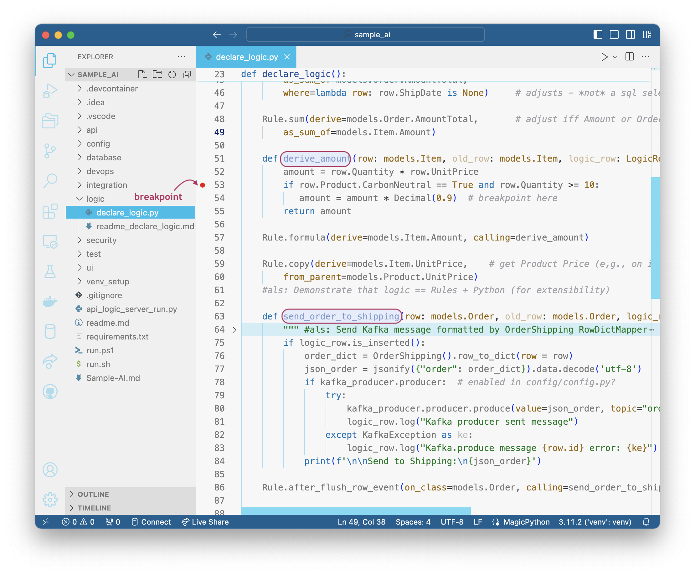

!!! pied-piper ":bulb: TL;DR - An API Appliance"

    {: style="height:300px;width:300px"; align=right }
    
    Just as you plug in a toaster and add bread,

    You can plug this appliance into your database, and add rules and Python

    Automation can provide remarkable agility and simplicity, with all the flexibility of a framework.

## 1. Plug It In

Here's how you plug the docker appliance into your database:

```bash
> docker run -it --name api_logic_server --rm -p 5656:5656 -p 5002:5002 -v ${PWD}:/localhost apilogicserver/api_logic_server

$ ApiLogicServer create-and-run --project_name=/localhost/sample_ai --db_url=sqlite:///sample_ai.sqlite
```

> Note: API Logic Server can run as a container (shown above), or a standard pip install.  In either case, you can containerize your project for deployment, e.g. to the cloud.

&nbsp;

### It Runs: Admin App and API

You have a running system: a multi-page ***Admin App:***



&nbsp;
---
The app is supported by a multi-table ***JSON:API with Swagger***, supporting custom client app deve and hoc integration, out of the box.



&nbsp;

## 2. Add Logic Using Rules

Behind the running application is a project you can open with your IDE, and add logic:



The 5 spreadsheet-like rules above perform the same logic as 200 lines of Python: the bakend half of your system is ***40X more concise.***

Similar rules are provided for granting row-level access to user roles.

&nbsp;

## 3. Customize With Python

Automation and Rules provide remarkable agility, but you need flexibility to deliver.  Use Python and popular packages to complete the job.  Here we customize for pricing discounts, and sending Kafka messages:



&nbsp;

# Summary

The screenshots above illustrate remarkable agility.  Note also the simplicity -- you can create microservices even if you are new to Python.

We call this XDA: Extensible Declarative Automation

* Automation - instead of slow and complex framework coding, just plug in your database for a running API and Admin App

* Declarative - instead of tedious code that describe ***how*** logic operates, rules express ***what*** you want to accomplish

* Extensible - finish the remaining elements with your IDE, Python and standard packages such as Flask and SQLAlchemy.


