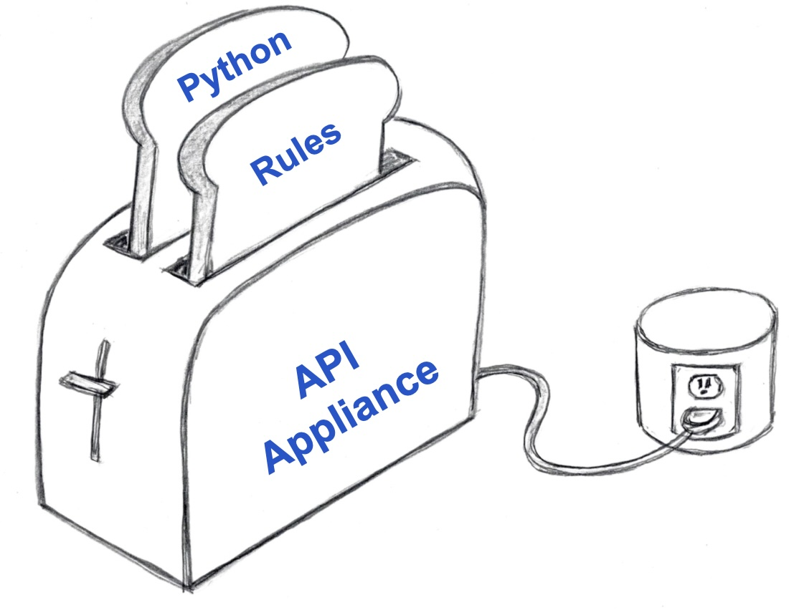

!!! pied-piper ":bulb: TL;DR - An API Appliance"

    {: style="height:201px;width:300px"; align=right }
    
    Just as you can plug in a toaster, and 
    <br>add bread,

    You can plug this appliance into your database, and 
    <br>add Rules and Python.

    Automation can provide:
    * Remarkable agility and simplicity
    * With all the flexibility of a framework

## 1. Plug It Into Your Database

Here's how you plug the docker appliance into your database:

```bash
> docker run -it --name api_logic_server --rm -p 5656:5656 -p 5002:5002 -v ${PWD}:/localhost apilogicserver/api_logic_server

$ ApiLogicServer create-and-run --project-name=/localhost/sample_ai --db-url=sqlite:///sample_ai.sqlite
```

> Note: API Logic Server can run as a container (shown above), or a standard pip install.  <br>In either case, you can containerize your project for deployment, e.g. to the cloud.

&nbsp;

### It Runs: Admin App and API

You have a running system: a multi-page ***Admin App:***


&nbsp;

The app is supported by a multi-table ***JSON:API with Swagger**.  So, right out of the box, you can support

* Custom client app dev, and 
* Ad hoc application integration


&nbsp;

## 2. Add Rules for Logic

Behind the running application is a project you can open with your IDE, and add logic:


The 5 spreadsheet-like rules above perform the same logic as 200 lines of Python: the backend half of your system is ***40X more concise.***

> Similar rules are provided for granting row-level access, based on user roles.

&nbsp;

## 3. Add Python for Flexibility

Automation and Rules provide remarkable agility, but you need flexibility to deliver a complete result.  Use Python and popular packages to complete the job.  

Here we customize for pricing discounts, and sending Kafka messages:


&nbsp;

# Extensible Declarative Automation

The screenshots above illustrate remarkable agility.  This system might have taken weeks or mnnths using frameworks.

But it's more than agility.  The *level of abstraction* here is very high... you can create microservices even if you are new to Python, or Frameworks such as Flask or SQLAlchemy.

We call this XDA - Extensible Declarative Automation:

* Automation - instead of slow and complex framework coding, just plug in your database for a running API and Admin App

* Declarative - instead of tedious code that describe ***how*** logic operates, rules express ***what*** you want to accomplish

* Extensible - finish the remaining elements with your IDE, Python and standard packages such as Flask and SQLAlchemy.


