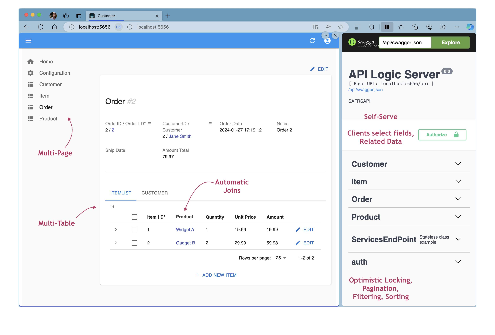

!!! pied-piper ":bulb: TL;DR - An API Appliance"

    {: style="height:201px;width:300px"; align=right }
    
    Just as you can plug in a toaster, and 
    <br>add bread,

    You can plug this appliance into your database, and 
    <br>add Rules and Python.

    Automation can provide:

    * Remarkable agility and simplicity
    * With all the flexibility of a framework

&nbsp;

## 1. Plug It Into Your Database

Here's how you plug the appliance into your database:

```bash
$ ApiLogicServer create-and-run --project-name=sample_ai --db-url=sqlite:///sample_ai.sqlite
```

> No database?  Create one with AI, as [described here](https://dzone.com/articles/ai-and-rules-for-agile-microserves){:target="_blank" rel="noopener"}.

&nbsp;

### It Runs: Admin App and API

Instantly, you have a running system as shown on the split-screen below: 

* a multi-page ***Admin App*** (shown on the left), supported by...
* a multi-table ***JSON:API with Swagger*** (shown on the right)



So, right out of the box, you can support:

* Custom client app dev, and 
* Ad hoc application integration
* Agile Collaboration, based on Working Software

> Unlike weeks of complex and time-consuming framework coding, you have **working software, *now.***

&nbsp;

### Containerize

API Logic Server can run as a container, or a standard pip install.  In either case, you can containerize your project for deployment, e.g. to the cloud.


&nbsp;

## 2. Add Rules for Logic

Instant working software is great, but without logic enforcement it's little more than a cool demo. 

Behind the running application is a standard project.  Open it with your IDE, and 

* Declare logic with code completion
* Debug it with your debugger


Instead of conventional procedural logic, the code above is *declarative.*  Like a spreadsheet, you declare ***rules*** for multi-table derivations and constraints.  The rules handle all the database access, dependencies, and ordering.

> The result is quite remarkable: the 5 spreadsheet-like rules above perform the same logic as 200 lines of Python.  The backend half of your system is ***40X more concise.***

Similar rules are provided for granting row-level access, based on user roles.

&nbsp;

## 3. Add Python for Flexibility

Automation and Rules provide remarkable agility, but you need flexibility to deliver a complete result.  Use Python and popular packages to complete the job.  

Here we customize for pricing discounts, and sending Kafka messages:


&nbsp;

# Extensible Declarative Automation

The screenshots above illustrate remarkable agility.  This system might have taken weeks or months using conventional frameworks.

But it's more than agility.  The *level of abstraction* here is very high, bringing a level of simplicity that enables you to create microservices -- even if you are new to Python, or Frameworks such as Flask or SQLAlchemy.

There are 3 key elements that deliver this speed and simplicity:

1. **Microservice Automation:** instead of slow and complex framework coding, just plug into your database for a running API and Admin App

2. **Logic Automation with Declarative Rules:** instead of tedious code that describe ***how*** logic operates, rules express ***what*** you want to accomplish

3. **Extensibility:** finish the remaining elements with your IDE, Python and standard packages such as Flask and SQLAlchemy.


