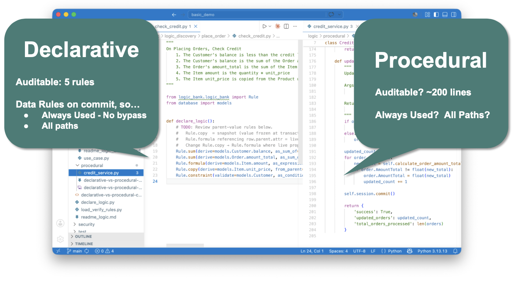
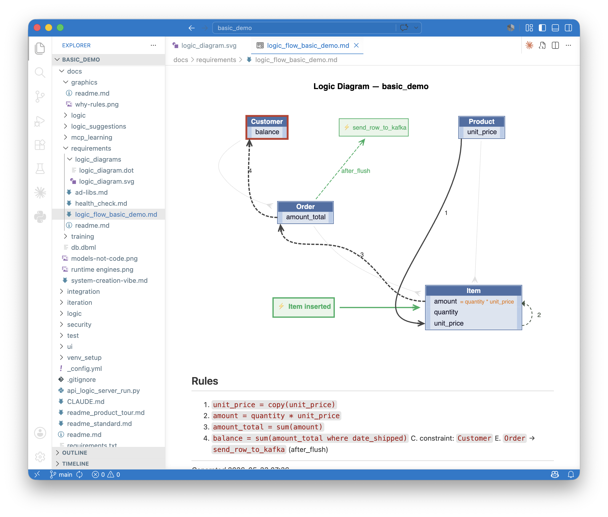

# AI Made Executable Requirements Real. Governance Is What Makes Them Deployable.

*Why the next enterprise unlock isn't speed.*

---

AI cracked the speed problem.

Watch any vibe-coding demo: a paragraph of English goes in, a working app comes out, minutes not months. The translation from intent to running code — the bottleneck enterprise IT has lived with for forty years — really did get faster. That is a genuine accomplishment, and the AI tooling community deserves the credit it's getting for it.

But there's a question every enterprise reader is asking when the demo ends. Would I put this into production? Where it touches my customers, my regulators, my eight-figure exposure? Where an auditor will eventually ask which rule fired on which transaction, and whether the same rule fires on every path?

Today, the honest answer is no. Not because the code doesn't run — it does. Because nothing about it is governed.

This article is about closing that gap. The capability has a name: **Executable Governable Requirements**, or **XGR**. In short: AI does what it's great at (translating intent), and a purpose-built runtime does what AI can't (enforcing that intent deterministically, on every path, with no bypass). The pipeline your team already runs doesn't change. What comes out the other end does.

For business analysts, the payoff is direct: the requirement you wrote becomes the artifact that runs. There is no translation layer between your specification and what production enforces. For management, the payoff is governance that scales — measurable across the portfolio, reviewable by compliance, provable to auditors.

---

## Why AI alone is not enough

Both traditional development and AI-assisted development fail in the same two ways. The failures are easier to see side by side — and they matter because business logic (the multi-table derivations, constraints, and side-effects that make enterprise software *enterprise* software) is typically 40–50% of coding and debugging effort. These failures describe where most of the work happens, and most of the rework.

**Failure one: lost intent.** A business analyst writes a requirement in five lines of English. A developer interprets it as 200 lines of procedural code. The intent ends up dispersed across handlers, branches, and helper functions — somewhere in there, but no longer visible. Six months later, compliance can't read it. The next developer who has to maintain it can't read it either. Both have to reconstruct what the system means from how it behaves.

AI doesn't fix this. It accelerates it. A modern coding assistant takes the same five-line requirement and produces the same 200 lines, faster. Developers have a name for it: *FrankenCode* — code you didn't write, don't fully understand, and now have to maintain. Technical debt at generation speed.

**Failure two: dependency bugs.** Enterprise business logic has transitive dependencies — change an item's price, and the order total changes, and the customer balance changes, and the credit check should re-run. A three-table system has nine distinct change paths. Procedural code has to enumerate each one explicitly. Developers miss paths. So does AI, for the same reason: pattern-matching across procedural control flow cannot reliably infer transitive dependencies. Multiple AI systems have admitted this when asked directly. It is a structural limitation, not a capability gap that will be patched in the next model.

In a recent side-by-side test, the same five-rule requirement produced two outputs from the same AI assistant: a declarative version with five rules and zero bugs, and a procedural version with about 200 lines and two silent bugs — both involving foreign-key changes that updated the new parent but not the old. No exception was thrown. The data was just wrong. At five rules you might catch them. At five hundred — which is what an enterprise system looks like — you won't.

So: prototypes are real. Demos are real. But the two things that have always broken enterprise software — intent loss and dependency bugs — are not solved by AI. AI just produces them faster.

---

## Why this matters now

Governance has emerged as the number-one CIO priority for 2026, overtaking cybersecurity for the first time. That's not a marketing statistic; it's the consequence of a structural shift. AI agents now touch production data. New endpoints get added every quarter. New developers join, new integrations land, new workflows route around old ones. Every path is another way to bypass a rule that lives on some other path.

The cost of getting this wrong is no longer theoretical. Regulatory penalties run into the millions per incident. Compliance staffing has become a major line item. Audit findings that used to be embarrassing now threaten the business. And the audit problem itself is genuinely intractable under the traditional model: read hundreds of thousands of lines of code, determine whether the relevant rules exist, prove they execute on every path. Auditors sample and hope.

This is the actual problem AI was supposed to help with, and the one current AI tooling makes worse — not better — because faster generation of unreviewable code is not progress. It's the same problem at higher velocity.

---

## XGR: what changes

The reframe is simple and consequential. Today's AI tooling translates intent into **code**. XGR translates intent into **rules** — declarative statements about data — and a purpose-built runtime enforces them at the database commit point.

The five-line "check credit" requirement becomes five declarative rules:

These are not code in the procedural sense. They are the requirement itself, written precisely enough to execute. Each rule maps directly to a clause an analyst wrote. A compliance officer can read them. An auditor can read them. The next developer to inherit the system can read them. The 200-line procedural version dispersed that intent across handlers; the rule version restates it with precision.

This is the property that makes governance work. **The rule is the requirement.** Business and IT review the same artifact. There is no translation layer where intent can go missing.

Four architectural pieces make this real. The [Logic Governance Architecture diagram on the GenAI-Logic home page](https://www.genai-logic.com) walks through them visually; the short version is:

1. **Context Engineering** directs the AI to produce declarative rules, not procedural code. Without this constraint, AI pattern-matches to what it sees most often — procedural code. With it, intent becomes declarations.
2. **Data Rules** distill path-dependent intent ("on placing an order, check credit") into path-independent rules on data ("customer balance is the sum of unpaid orders"). The rule no longer cares which path triggered the change.
3. **The Commit Listener** hooks into the ORM. Every transaction — from any API, any agent, any workflow, any future endpoint that hasn't been built yet — passes through one control point. There is no architectural path that routes around it.
4. **The Rules Engine** computes dependency order from rule semantics at startup, deterministically. No pattern-matching, no subtle ordering bugs.

The result is what your team already wants: governance that doesn't depend on developers remembering, doesn't degrade as the system grows, and produces the same outcomes regardless of which path triggered the transaction.

---

## A specialized runtime, not a feature

A note on the engine itself.

This is not a RETE engine. Classic rules engines are *called* — application code hands them a list of objects, the engine pattern-matches across working memory, fires rules. They have no idea what changed; they see a bag of state and re-derive everything that might depend on it.

The XGR engine hooks the ORM directly. It doesn't get a bag of objects — it gets the actual change event: *Item inserted*, *Order.amount_total moved from X to Y*, *Customer.id changed from A to B*. Two consequences follow.

The first is the **no-bypass guarantee**. Because the engine sits at the commit boundary inside the data layer, every persistent change passes through. A new developer can't forget to call it. A new agent can't route around it. A prompt-injected agent can't bypass it. There is no path to persistence that doesn't go through the engine. Governance becomes architectural, not behavioral.

The second consequence is performance. Because the engine sees what changed, it can prune the rule graph to only the rules whose inputs actually moved, and it can maintain aggregates incrementally instead of recomputing them. A `count of children` rule, when a new child is added, costs one read and one update — not a `SELECT COUNT(*)` across the child table. In production work in an earlier generation of this architecture, this category of optimization turned four-minute transactions into two-second transactions. The analyst wrote `count`. They didn't have to know any of that happened.

These properties — no-bypass enforcement, delta-aware optimization, adjustment semantics per rule type — are not features layered onto a rules engine. They are consequences of where the engine sits and what it sees. The result is a specialized runtime in the lineage of a relational query optimizer: a piece of infrastructure that takes years to mature and lives below the abstraction layer the user works at. The analyst writes `count`. The engine handles incremental maintenance, dependency ordering, and the dozens of edge cases that come with multi-table transactional logic. That is the right division of labor.

Versata measured this category of system across production deployments before the AI era: declarative rules required writing only about 3% of equivalent procedural code. That reduction wasn't a style preference — it was the visible consequence of removing the procedural enumeration of paths that the engine handles structurally.

---

## Two proofs: requirements in, regulation in

The architecture has been demonstrated in two shapes, from two different sides of the requirements pipeline.

**Requirements in: the basic Check Credit example.** A plain-English five-line requirement, written the way analysts naturally write requirements, compiled into five declarative rules, enforced on every commit, governed by architecture. The Logic Diagram you'll see in the next section is generated from this example. The pipeline doesn't change — analysts write what they already write. What changes is what comes out the other end.

**Regulation in: the CBSA Steel Derivative Goods Surtax proof-of-concept.** This is the more interesting case. The input was not a requirements document at all. It was a nine-line prompt citing the Canadian regulation directly — program code, tariff subsection, trigger conditions, four example country scenarios. No schema. No field mapping. No specs.

The output was a working, tested system — and it's worth being specific about what "system" means here, because the inventory is the point:

- A **standard Python project**, git-managed, IDE-openable, debugger-attachable
- The **Data Rules** for duty calculation, enforced by the rules engine at commit
- An **MCP-enabled enterprise-class API** — JSON:API with filtering, sorting, pagination, and optimistic locking, plus MCP discoverability so AI agents can find and use it natively
- An **Admin UI**, multi-table, ready to use out of the box; custom apps can be vibed on top of the governed API as needed
- **Kafka publish/subscribe handlers** when integration is specified — standard topics, consumer-group semantics, governed capture on the inbound side
- **RBAC via Keycloak** (or equivalent) when role-based security is specified
- An **auto-generated test suite**, with the Logic Report artifact we'll discuss shortly
- **Container deployment**, standard Python, ready for cloud or on-prem

All from one prompt. All governed by the same rules engine at the commit point. And the part that matters at portfolio scale: **every component inherits the governance automatically**, including ones added later. A new endpoint inherits the rules. A new Kafka handler ingesting messages goes through the commit listener. An MCP-discovered agent calling the API hits the same gate. A vibed custom UI calling the JSON:API is governed without the developer doing anything. Governance is not applied per-component — it is inherited from sitting above the commit boundary.

This answers the agent question every CIO is asking: *won't they bypass my controls?* The structural answer is no. The agent's only path to persistence is through the gate.

This is a proof-of-concept, not a production deployment — a real, runnable, tested one, with the regulation citation in the prompt traceable through to the rules that enforce it. For a regulated industry, this compression of the regulation-to-enforcement chain is the larger unlock. The most expensive translation chain in compliance is *regulation → requirements → specs → code → enforcement → audit*. Every handoff is a defect generator. The Surtax POC compresses that chain to a single step, with the regulator's text as the source of truth and the running system as the artifact that enforces it.

Both proofs produce the same governed runtime. Same engine, same enforcement guarantees, same auto-generated artifacts. The difference is how far upstream the source of truth lives. What makes this work is the composition: AI as translator, rules as the target, the engine as enforcement, the auto-generated artifacts as audit. Each layer has existed in some form. The combination is what creates deployable governance.

---

## Why this didn't work before

Declarative rules engines are not new. They have been available in mature form for thirty years. The Versata engine of the late 1990s did most of what is described here, minus the AI translation and the auto-generated artifacts. It worked. Teams that adopted it shipped systems faster, with fewer defects, and with audit characteristics the procedural alternative could not match.

It still mostly didn't take over. The reason was not technical. W. Ries, who built systems on the Versata engine in that era, puts it this way:

> *"We had the engine. We had the rules. What we didn't have was scale. To keep a team on rules instead of procedural code, you had to bird-dog them — walk the floor, catch the reversions, redirect them back. Take the bird-dog away and the system grew procedural shadows alongside the rules. Governance decayed back into the discipline problem the engine was supposed to solve."*

His term for what XGR changes is **governance at scale.** What is different now is not the engine — it is the funnel that feeds it. When the entry point is a Gherkin scenario or a plain-English requirement, and AI is constrained by context engineering to produce rules rather than code, there is no procedural off-ramp for the developer to revert to. The standard practice — write the requirement, run the prompt — produces rules by default. The funnel is structurally rule-producing.

The discipline problem the bird-dog was solving is now solved by the architecture above it. No bypass at the entry point. No bypass at the commit point. Governance at scale: rules a practitioner can read and depend on, without having to walk the floor. For those who have lived through the previous attempts, this is the first version that doesn't require them to do the walking.

---

## At enterprise scale: three artifacts

A single governed system is interesting. An organization that makes governed-by-architecture the norm — across hundreds of services, dozens of teams, requirements coming in from every direction — is the argument that matters at the level enterprise IT actually operates.

Three auto-generated artifacts make this work at portfolio scale. Each addresses a different governance question, and each is produced automatically — not by hand, not by discipline.

### 1. The Governance Report — portfolio health

Governance by architecture only holds if teams are actually using rules instead of reverting to procedural code. A built-in health check scores each project on two dimensions: **Coverage** (are the right tables governed by rules?) and **Integrity** (do the rules pass anti-pattern checks?). A portfolio leaderboard makes adoption visible across teams without reading a line of code.

This is the layer management asks for and rarely gets: *show me where governance is strong, show me where it's weak, show me the trend.* The same tool that enforces rules also measures whether teams are using them.

### 2. The Logic Diagram — per-requirement structure

Every developer insists on a database diagram. You can't engage with a system you can't visualize. The same is true for logic — and until now, there has been no equivalent artifact for the rules that govern that data.

The diagram for the Check Credit requirement shows what governance looks like statically. The requirement appears at the top in plain English, exactly as the analyst wrote it. The rules appear at the bottom in declarative form. Between them, the diagram shows the four-step dependency chain the engine will execute: Product price copies into Item price, formula computes Item amount, sum rolls up to Order total, sum rolls up (conditionally) to Customer balance.

Unlike a database diagram, which shows every column on every table, the Logic Diagram shows only what governance acts on. The signal-to-noise ratio is what makes it reviewable. A compliance officer can look at one of these and verify, in under a minute, that the rules implement the requirement.

At portfolio scale, this is how review becomes tractable. One diagram per requirement, generated automatically, readable by the people whose job is to review them.

### 3. The Logic Report — per-test execution

The Logic Diagram shows structure. The Logic Report shows what actually ran.

For each test scenario, the report shows three things stacked vertically: the Gherkin scenario the analyst wrote ("Given customer with credit limit 20… when order placed with 2 Chai… then order is rejected"), the specific rules that participated in that scenario, and the actual execution trace — including, in this example, the constraint failure that rejected the transaction at the commit boundary.

This closes a traceability loop the industry has been chasing for decades: **Requirement → Rule → Execution Log**, in one file, generated automatically, with the analyst's own words at the top.

This is what makes the compliance audit tractable. The auditor no longer reads code. The audit becomes three steps:

1. Confirm the rules correctly implement the requirement. (Read the Logic Diagram.)
2. Confirm the rules ran on the transactions they should have. (Read the Logic Report.)
3. Spot-check a sample. (The execution log is right there.)

Compliance proven, not asserted.

---

## Agile, finally

There's a derivative effect to all of this that deserves to be named, because it has been promised for twenty-five years and never quite delivered.

The original agile vision was *working software over comprehensive documentation* — short cycles, real feedback from real stakeholders looking at something that actually runs. The methodology spread. The vision mostly didn't. The reason was economic: producing working software to react to cost two weeks of developer time per iteration, so teams had to lock the requirement before development started. Sprint reviews ended up showing wireframes, mockups, or partial implementations. The requirement was frozen before anyone saw it run. That is waterfall on a sprint cadence.

XGR changes the cost curve. An analyst with a requirements document can run the prompt, get a complete governed system in minutes, click through the Admin UI, watch the rules fire, notice that clause three doesn't mean what they thought it meant, edit the requirement, re-run, and demonstrate the result to colleagues on a laptop — all before any developer has been asked to build anything.

The iteration is on the requirement itself, not on code generated from a frozen requirement. The analyst's artifact is the deliverable. The running system is how they validate it. The rules are the precise restatement of what they meant. No translation layer means no drift between intent and enforcement.

For business analysts, this is a higher-leverage role than the one the job description usually describes. You are no longer writing specs that get interpreted into something else. You are producing the artifact that runs. For product owners and stakeholders, sprint reviews stop being slideware — the conversation is grounded in observable behavior. For development teams, the handoff is different: developers work on extensions, custom UI beyond what's generated, integration work, performance, security policy — not interpreting requirements into procedural code.

Most requirements bugs are not bugs of expression. They are bugs of unexamined assumption. A twenty-minute round-trip from prompt to running system surfaces those assumptions immediately. The system finds the bug the analyst didn't know to look for.

The same architecture that makes governance auditable makes the agile loop fast. Speed and governance are not a tradeoff — they are consequences of the same thing.

---

## Standard tools, standard outputs

One last point. None of this requires entering a proprietary world.

The runtime is built from several engines — ORM integration, API generation, Admin UI, the rules engine — and they are open source. More importantly, what they produce is standard. The rules are Python in a standard project. Open them in your IDE. Set a breakpoint inside a rule, step through with the debugger. Check them into git. The API is JSON:API. The ORM is SQLAlchemy. The Admin UI is a standard pattern. The database is the one you already use — Postgres, MySQL, SQL Server, SQLite. Deploy as a container.

This is the difference between adopting infrastructure and adopting an exception. Platforms that require you to enter their world — their IDE, their data model, their runtime, their certified consultants — succeed in narrow domains and fail at enterprise breadth. The XGR runtime is a framework, but a framework whose artifacts live in the world the enterprise already runs.

---

## The dividing line

Governance-by-discipline was already failing in traditional systems, at significant cost, well before AI arrived. AI didn't create the problem. It made it the problem every CIO has to solve in the next budget cycle, not the one after.

As W. Ries [argued in this publication recently](https://medium.com/), the organizations that solve it will solve it architecturally — rules at the commit point, in declarative form, generated from the requirements the business already writes. The organizations that try to solve it with more process, tighter agent confinement, and better-trained reviewers will spend the next five years discovering, in audit findings, that those approaches scale with the size of the discipline problem rather than against it. That is the dividing line.

Speed alone produces prototypes. What you can actually deploy is a complete system — API, UI, integration, security — where every component, including the ones added tomorrow, inherits governance from the commit boundary. The rule is the requirement. The engine enforces it. The artifacts prove it ran. The analyst validated it before development began.

This is not a faster way to write code. It is a different kind of infrastructure — governed transactional logic as a first-class layer of the enterprise stack, alongside the database and the message bus. Once you have seen it, the procedural alternative looks like what it always was: a translation layer the industry could never quite get right, at a cost the next budget cycle is no longer willing to pay.

---

*Val Huber is co-founder and architect of GenAI-Logic, and previously CTO at Versata.*
