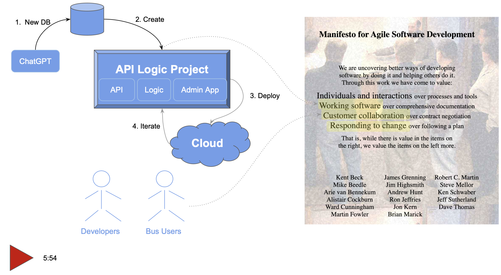

!!! pied-piper ":bulb: AI-Driven Automation with ChatGPT Delivers the Agile Vision"

      Agile wisely advises getting Working Software as fast as possible, to facilitate Business User Collaboration and Iteration.  ChatGPT and API Logic Server deliver this vision, with 1 hour project cycles:

      1. **Create Database With ChatGPT**
      2. **Create Working Software *Now* with API Logic Server:**

          * Creates executable, customizable projects from databases: API with Swagger, Admin App
          * Declare logic and security with spreadsheet-like rules, using your IDE
      3. **Deploy for *Collaboration* with API Logic Server:** e.g. to the Azure Cloud
      4. **Iterate:** add additional rules, with a pinch of Python as required

      This process **leverages your existing IT infrastructure:** your IDE, GitHub, the cloud, your database… open source.

      > To give it a try, [**click here**](Tech-AI.md).  Allow 20 minutes, a bit more if you are new to Azure.
,
{:target="_blank" rel="noopener"}