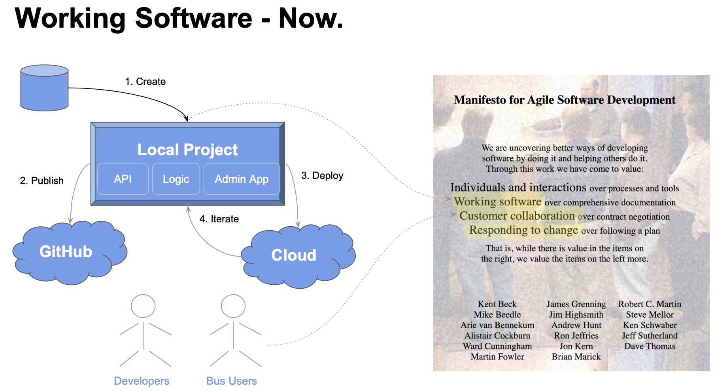

!!! pied-piper ":bulb: TL;DR - Working Software, Now"

      Agile correctly advises getting Working Software as fast as possible, to facilitate Business User Collaboration and Iteration:

      1. **Instant Creation:** create working software from a database.

      2. **Publish to GitHub:** for dev team collaboration

      2. ***Dev Deploy* to the Cloud:** use the working software to collaborate with Business Users

      With API Logic Server, if you have a database, you can create and dev deploy ***within an hour***.

# Deployment Tutorial

In this Tutorial, we start with a database, and:

1. Create a Project, and verify it works

3. Create a Docker Image, and verify it works

4. Create a docker-compose application (project + database), and verify it works

5. Deploy it to Azure - collaboration-ready for UI Developers and Business Users

The entire process takes about 20 minutes.

While your team is collaborating, you can proceed to declare logic and security, augmented with Python code.

To begin, [click here](../DevOps-Containers-Deploy-Multi).

