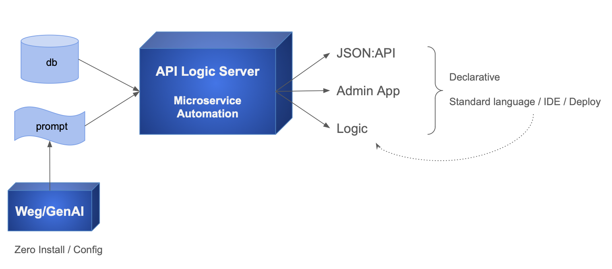

!!! pied-piper ":bulb: TL;DR - Create Microservice from Natural Language Prompt using CLI"

    API Logic Server / GenAI provides CLI commands that accepts a Natural Language prompt (e.g, CRM system), and produces:

    * a Microservice, an Admin App and a JSON API
    * a project that you can download and customize in your IDE using rules and Python
    * which can be deployed as a container using automatically generated scripts.

    API Logic Server / GenAI uses: 
    
    * GenAI services for data model creation, and 
    * API Logic Server for project creation.

    You can also use GenAI services via the [GenAI WebSite](GenAI.md){:target="_blank" rel="noopener"}.

&nbsp;

## Overview

To use GenAI to create projects

1. Establish your virtual environment (suggestion: [use the Manager](Manager.md){:target="_blank" rel="noopener"})
2. Provide a prompt in either a file (`als genai`), or a CLI argument (`als genai-create`):

```bash title='Project creation with GenAI'
als genai --using=system/genai/examples/genai_demo/genai_demo.prompt

# or, provide the prompt in an **quoted** argument:
als genai-create --project-name='customer_orders' --using='customer orders'
```

Projects are created in the currrent working directory, here, the manager.

&nbsp;

## Configuration

GenAI uses ChatGPT, which requires an API Key.  The simplest approach is to

1. Obtain one from [here](https://platform.openai.com/account/api-keys) or [here](https://platform.openai.com/api-keys)
2. Authorize payments [here](https://platform.openai.com/settings/organization/billing/overview)
3. Create an environmental variable `APILOGICSERVER_CHATGPT_MODEL`

&nbsp;

## Conversations vs. resubmit

You can review created projects by using the app, and/or reviewing the [data model](Database-Connectivity.md){:target="_blank" rel="noopener"}.  Of course, it's simple to resubmit a new prompt and re-create the project.

However, this will be a completely new rendition of your idea, and it may change things you like about the project.  ***Conversations*** enable you to keep what you already have, while making desired changes.

When you create a project, the API Logic Server / GenAI saves your prompt and response in a conversation-directory.  Conversations are saved in 2 different conversation-directories:

* the manager's `system/genai/temp/<project>` directory

* the created project's `doc` directory.

You can iterate with interactive prompts, or by adding files to the  manager's `system/genai/temp/<project>` directory.

&nbsp;

### Conversations - Interactive

The figure below creates and iterates a project, using the manager:

```bash title='create and iterate project with interactive prompts using genai-iterate'
als genai-create -project-name=conv —-using='customer orders'
als genai-iterate —-project-name=conv —using='add payments'
```


&nbsp;

### Conversations - Files

Alternatively, you can iterate projects by adding files to the Manager's temp directory:

```bash title='iterate project using files (Note: genai, not genai-iterate)'
als genai-create --project-name=conv --using='customer orders'
echo "add payments" | cat >> system/genai/temp/conv/conv_002.prompt
als genai --using=system/genai/temp/conv
```

The project name can be provided with the `--project-name` argument (as of release 11.02.01).  If omitted, it is defaulted to the last node of the directory name, here, *conv*.

This will recreate the project based on the existing context.  See the next section, below.

&nbsp;

### Customized Project Sync

In the prior section, the result was a *recreated* project.  If you have customized the project, you can preserve your customizations as follows:

1. Copy `database/models.py` and `db.sqlite` from the GenAI to your customized project
2. In your customized project, use `als rebuild-from-model` 

    * For further information, see [Database Design Changes](Database-Changes.md){:target="_blank" rel="noopener"}.

&nbsp;

## Natural Language Logic

As of release 11.2.10, you can declare Natural Language Logic when you create projects, and for existing projects.  Natural Language support includes derivation (sum, count, formula), constraints, and send.  Additional rules are provided via the CLI; for more information, see [Logic](Logic.md){:target="_blank" rel="noopener"}.

For example:

```python title='Sample Natural Language Logic'
Create a system with customers, orders, items and products.

Include a notes field for orders.

Use LogicBank to enforce business logic.

Use case: Check Credit    
    1. The Customer's balance is less than the credit limit
    2. The Customer's balance is the sum of the Order amount_total where date_shipped is null
    3. The Order's amount_total is the sum of the Item amount
    4. The Item amount is the quantity * unit_price
    5. The Item unit_price is copied from the Product unit_price

Use case: App Integration
    1. Send the Order to Kafka topic 'order_shipping' if the date_shipped is not None.

Ensure each customer has a unique name.

Ensure each Item quantity is not null.

Ensure each order has a valid customer_id that exists in the Customer table.
```

> Status: Beta.  Current implementation presumes projects are running in the Manager directory.

&nbsp;

### Create Projects with Logic

As shown below, you can use the CLI `als genai` command to designate a prompt file that generates a system, including logic.


Note:

1. Logic files can contain derivations and constraints
2. The system will create model attributes for derived columns.  Note that these can dramatically improve performance.

You can declare logic formally, or informally.

&nbsp;

#### Logic Suggestions

You can ask GenAI to suggest logic for your system.  This can help you learn about rules, and can inspire your own imagination about required logic.

It's AI, so or course you will want to review the suggestions carefully.

Explore suggestions using the [Manager](Manger.md){:target="_blank" rel="noopener"}:


```bash title='1. Create Project, without Rules'
# 1. Create Project, without Rules
als genai --project-name='genai_demo_no_logic' --using=system/genai/examples/genai_demo/genai_demo_no_logic.prompt
```

```bash title="2. Request Rule Suggestions"
# 2. Request Rule Suggestions
cd genai_demo_no_logic
als genai-logic --suggest
```

You can review the resultant logic suggestions in the `genai_demo_no_logic` project:

 * See and edit: `docs/logic_suggestions/002_logic_suggestions.prompt` (used in step 3, below)
    * This corresponds to the WebGenAI Logic Editor - Logic View in the WebGenAI web app

```bash title="3. See the rules for the logic"
# 3. See the rule code for the logic
als genai-logic --suggest --logic='*'
```

Important notes about suggestions and generated code:
* `--suggest --logic='*'` is intended to enable you to identify logic that does not translate into proper code
* The example above was pretty good, but sometimes the results are downright silly:
    * Just run suggest again, or
    * Repair `docs/logic_suggestions/002_logic_suggestions.prompt`

Also...
* It is not advised to paste the code into `logic/declare_logic.py`
    * The suggested logic may result in new data model attributes
    * These are created automatically by running `als genai` (next step)

The [logic suggestions directory](genai_demo_no_logic/docs/logic_suggestions) now contains the prompts to create a new project with the suggested logic.  
When you are ready to proceed:
1. Execute the following to create a *new project* (iteration), with suggested logic:

```bash title="4. Create a new project with the Rule Suggestions"
# 4. Create a new project with the Rule Suggestions
cd ..  # important - back to manager root dir
als genai --project-name='genai_demo_with_logic' --using=genai_demo_no_logic/docs/logic_suggestions
```

Observe:
1. The created project has the rule suggestions in `logic/declare_logic.py`
2. A revised Data Model in `database/models.py` that includes attributes introduced by the logic suggestions
3. Revised test database, initialized to reflect the derivations in the suggested logic


&nbsp;

#### Formal Rules

You can use familiar dot notation in declaring rules, e.g.


```bash title='Formal Logic - Familiar Dot Notation'
Create a system with customers, orders, items and products.

Include a notes field for orders.

Use LogicBank to enforce the Check Credit requirement:
1. Customer.balance <= credit_limit
2. Customer.balance = Sum(Order.amount_total where date_shipped is null)
3. Order.amount_total = Sum(Item.amount)
4. Item.amount = quantity * unit_price
5. Store the Item.unit_price as a copy from Product.unit_price
```

&nbsp;

#### Informal Rules

You can also use a more relaxed declaration.  For example, you can create a system (database, API, Admin App and Logic) with the following prompt (see `system/genai/examples/genai_demo/genai_demo_informal.prompt`):

```bash title='Prompt With Informal Logic'
Create a system with customers, orders, items and products.

Include a notes field for orders.

Use LogicBank to enforce the Check Credit requirement:
    1. The Customer's balance is less than the credit limit
    2. The Customer's balance is the sum of the Order amount_total where date_shipped is null
    3. The Order's amount_total is the sum of the Item amount
    4. The Item amount is the quantity * unit_price
    5. The Item unit_price is copied from the Product unit_price
```

&nbsp;

#### Integration Logic
In the example above, note the rule:

```text title ='Integration Logic'
Send the Order to Kafka topic 'order_shipping' if the date_shipped is not None
```

This sends all the columns of the Order object to the Kafka topic if date_shipped is not None.

&nbsp;

#### Multi-rule Logic

You can even declare logic that is transformed into 2 rules:

```bash title='Prompt with Multi-Rule Logic'
System for Departments and Employees.

LogicBank:
1. Sum of employee salaries cannot exceed department budget
```

This creates a running system: a database, an API, an Admin App, and logic.  From the Manager:

```bash title='CLI Command to Create a microservice, with logic'
als genai --using=system/genai/examples/emp_depts/emp_dept.prompt
```

The logic is non-trivial:

1. A `Department.total_salaries` is created
2. Two rules are created in `logic/declare_logic.py`

```python title='Logic Creates 2 Rules'
    # Logic from GenAI: (or, use your IDE w/ code completion)

    # Aggregate the total salaries of employees for each department.
    Rule.sum(derive=Department.total_salaries, as_sum_of=Employee.salary)

    # Ensure the sum of employee salaries does not exceed the department budget.
    Rule.constraint(validate=Department, as_condition=lambda row: row.total_salaries <= row.budget, error_msg="Total salaries ({row.total_salaries}) exceed the department budget ({row.budget})")

    # End Logic from GenAI
```

&nbsp;

#### Conditional Derivations

You can make derivations conditional, for example:

```html title='conditional logic'
Provide a 10% discount when buying more than 10 carbon neutral products

The Item carbon neutral is copied from the Product carbon neutral
```
You can find this example in the Manager Readme; see **2. New Database** > **You can iterate the logic and data model**:


&nbsp;

#### Cardinality Patterns

Logic GenAI training has enabled the following:

```html title='Cardinality Patterns'
Products have Notices, with severity 0-5.

Raise and error if product is orderable == True and there are any severity 5 Notices, or more than 3 Notices.
```

Notes:

1. Note the use of a "qualified any", resulting in a count with a where condition:

```python title='Logic Recognizes "qualified any"'
    # Logic from GenAI: (or, use your IDE w/ code completion)

    # Derive product notice count from related notices.
    Rule.count(derive=Product.notice_count, as_count_of=Notice)

    # Derive count of severity 5 notices for products.
    Rule.count(derive=Product.class_5_notice_count, as_count_of=Notice, where=lambda row: row.severity == 5)

    # Ensure product is not orderable if conditions on notices are met.
    Rule.constraint(validate=Product,
    as_condition=lambda row: not (row.orderable and (row.class_5_notice_count > 0 or row.notice_count > 3)),
    error_msg="Orderable product contains severity 5 or excessive notices.")

    # End Logic from GenAI
```

&nbsp;

### Add Logic to Existing Projects

As shown below, in an existing project located under the Manager:

1. Create a prompt such as `docs/logic/check_credit.prompt`

    * Create logic files in `docs/logic`
    * Use a descriptive name to denote the purpose of the logic
    * Your `docs/logic` can contain multiple files; only `.prompt` files are processed

2. In the terminal window:

```bash title='Create logic from docs/logic prompt files'
cd <project root>
als genai-logic
```

3. Your logic is created in `logic/logic_discovery`

Notes:

* See the notes above for creating new projects with logic
* Unlike new projects, columns are not created automatically for derived attributes.  You can create these as described in [data model changes](Database-Changes.md){:target="_blank" rel="noopener"}.


&nbsp;

## Export

You can export project from WebGenAI, either from the Browser or from GitHub:


This enables you to verify all aspects of project operation, and extend GenAI functionality in your local IDE.

&nbsp;

### Open in your IDE

Once have exported and expanded the tar file:

1. Setup your virtual environment - see [Virual Environment](Project-Env.md){:target="_blank" rel="noopener"}

    * Note: in some configurations of VSCode (e.g., mac multiple projects in the same window), it may not allow you specif your virtual environment.  You can fix this:

        * Set the proper virtual environment in `.vscode/settings.json`: `    "python.defaultInterpreterPath": "~/dev/ApiLogicServer/ApiLogicServer-dev/build_and_test/ApiLogicServer/venv/bin/python"`
        * Rename the project

2. You should then be able to open and run the exported project in your IDE, 

&nbsp;

### wg_rules and IDE rules

The system is designed to support concurrent ongoing Multi-Team Development from WebGenAI, and from traditional development.  For more information, see [Import / Merge WebGenai](IDE-Import-WebGenAI.md){:target="_blank" rel="noopener"}.

To simplify the file mechanics during merge, WebGenAI rules are stored separately from rules created in the IDE:

| Logic Source | Stored   | Source of Truth - Manage In |
| :-------------: |:-------------:| :-----:|
| WebGenAI Rules | `logic/wg_rules` | The **WebGenAI system.**  Import / merge projects into local dev environment using [Import / Merge WebGenAI](IDE-Import-WebGenAI.md){:target="_blank" rel="noopener"} |
| IDE Rules | `logic/declare_logic.py`, and (optionally) as files in `logic/logic_discovery` | **IDE** / Source control |


&nbsp;

### Multiple wg_rules files

Consider that WebGenAI and IDEs are quite different environments.  For example, IDEs support code completion and highlight errors, while WebGenAI uses Natural Language (which does not have 'syntax errors').

Without an IDE, WebGenAI users still require diagnostics about which rules fail to properly compile.  This requires the system to break each rule into a separate file, as shown above.

Since the source of truth is the WebGenAI system, you should not alter the wg_rules.  You can and should use these files to:

* Review and verify the logic created by WebGenAI
* Debug the logic using debugger and the logic log; see [Debugging Logic](Logic-Debug.md){:target="_blank" rel="noopener"}.

&nbsp;

#### active_rules_export.py

The separate wg_rules files are gathered into a single `active_rules_export.py` file.  This simplifies verification / debugging (see above).  

This is a different execution path for IDE execution vs. WebGenAI execution.  You can force the WebGenAI execution path using the environment variables shown above.  This is normally not necessary.

&nbsp;

----


## Appendices

### GenAI and API Logic Server

GenAI is part of API Logic Server.  As shown below:

* API Logic Server can create microservices (Admin Apps, APIs, and Logic) from databases.

* It can also create microservices from database models (`als create --from-model=my_model.py`)

* GenAI

    * Use ChatGPT APIs, and creates a model file from the response
    * Submit that to `als create --from-model=my_model.py`




### Error Recovery

AI results are not consistent, so you may sometimes need to correct errors and resume.  This requires a bit of background about genai processing.

&nbsp;

#### GemAI Processing

`genai` processing is shown below (internal steps denoted in grey):

1. You create your .prompt file, and invoke `als genai --using=your.prompt`.  genai then creates your project as follows:

    a. Submits your prompt to the `ChatGPT API`

    b. Writes the response to file, so you can correct and retry if anything goes wrong

    c. Extracts model.py from the response

    d. Invokes `als create-from-model`, which creates the database and your project

2. Your created project is opened in your IDE, ready to execute and customize.  

    a. Review `Sample-Genai.md`, Explore Customizations.


&nbsp;

#### Recovery options

AI somtimes fails - here's how to recover after you correct the response or the model file.

##### From the Model File

You can find the models file at `system/genai/temp/model.py`.  You can correct the model file, and then run:

```bash
als create --project-name=genai_demo --from-model=system/genai/temp/create_db_models.py --db-url=sqlite
```

##### From the Response

Or, correct the chatgpt response, and

```bash
als genai --using=genai_demo.prompt --repaired-response=system/genai/temp/chatgpt_retry.response
```


