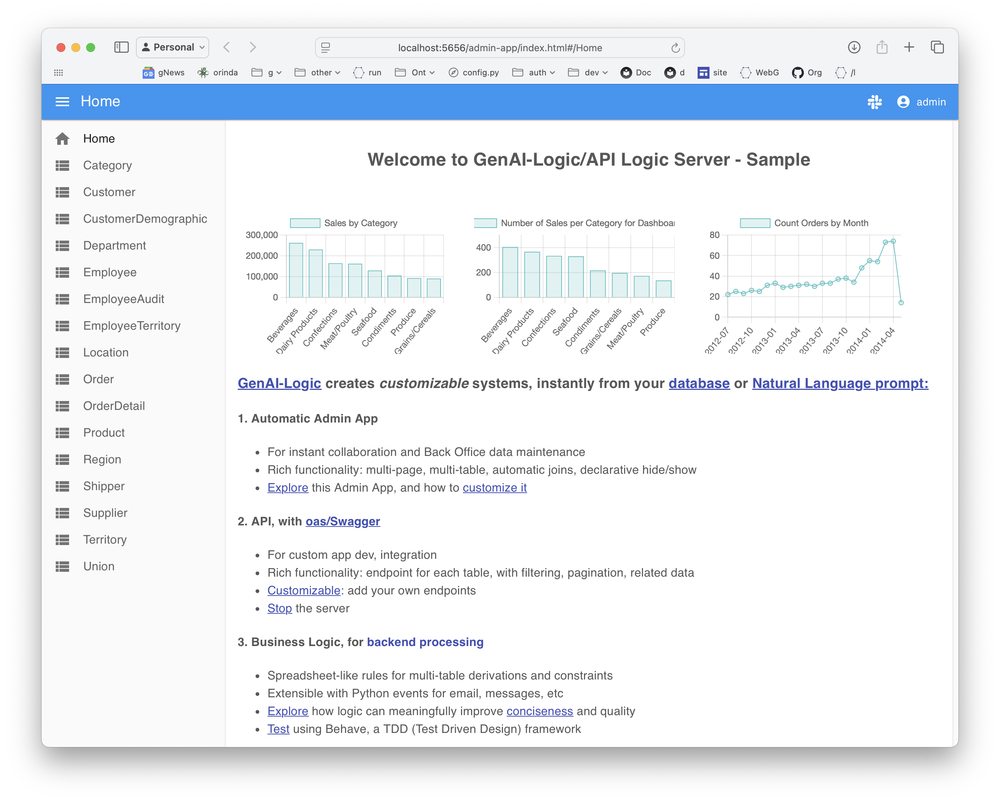

!!! pied-piper ":bulb: TL;DR - Create Microservice from Natural Language Prompt using CLI"

    API Logic Server / GenAI provides CLI commands that accept a Natural Language prompt (e.g, CRM system), and produces:

    * an executable database system: an Admin App, a JSON API and logic
    * the underlying project that you can download and customize in your IDE using rules and Python
    * which can be deployed as a container using automatically generated scripts.

    API Logic Server / GenAI uses: 
    
    * GenAI services (ChatGPT) for data model creation, and 
    * API Logic Server for project creation.

    You can also use GenAI services via the [GenAI WebSite](WebGenAI.md){:target="_blank" rel="noopener"}.  For Web/GenAI architecture, [click here](Architecture-What-Is-GenAI.md){:target="_blank" rel="noopener"}.

&nbsp;

## Overview

To use GenAI to create projects

1. Establish your virtual environment (suggestion: [use the Manager](Manager.md){:target="_blank" rel="noopener"})
2. Provide a `--using` prompt in either a file or a directory:

```bash title='Project creation with GenAI'
als genai --using=system/genai/examples/genai_demo/genai_demo.prompt
```

Projects are created in the currrent working directory, here, the manager.

&nbsp;

## Configuration

GenAI uses ChatGPT, which requires an API Key.  The simplest approach is to

1. Obtain one from [here](https://platform.openai.com/account/api-keys) or [here](https://platform.openai.com/api-keys)
2. Authorize payments [here](https://platform.openai.com/settings/organization/billing/overview)
3. Create an environmental variable `APILOGICSERVER_CHATGPT_MODEL`

&nbsp;


## Create Projects

You can use the als cli to create projects with logic.  See the example provided in the Manager:


Note:

1. Logic files can contain derivations and constraints
2. The system will create model attributes for derived columns.

&nbsp;


### Key Directories: Temp and Docs

When you create projects, the system saves prompts and responses.  This provided for documentation, error recovery, and iterations (described below):


&nbsp;

## Iterating Projects

You can review created projects by using the app, and/or reviewing the [data model](Database-Connectivity.md){:target="_blank" rel="noopener"}.  Of course, it's simple to resubmit a new prompt and re-create the project.

However, this will be a completely new rendition of your idea, and it may change things you like about the project.  ***Iterations*** enable you to keep what you already have, while making desired changes.

When you create a project, the API Logic Server / GenAI saves your prompt and response in a conversation-directory.  Iterations are saved in 2 different conversation-directories:

* the manager's `system/genai/temp/<project>` directory

* the created project's `doc` directory.

The `--using` argument can be a file, or a directory.  That means you can iterate by adding files to the  manager's `system/genai/temp/<project>` directory.  See the example provided in the Manager:


&nbsp;

### Add Prompt to docs directory

The approach for an iteration is to create a new project from an existing one:

1. add another prompt to an existing projects' `docs` directory, specifying your changes
2. use `als genai`, specifying 
    * `--using` existing projects `docs` directory, and 
    * `--project-name` as the output project
 
See the readme of the Manager for examples.

&nbsp;


### IDE Nat Language: `docs/logic`

As shown below, you can add Natural Language logic to existing projects.  Using an existing project located under the Manager:

1. Create a prompt such as `docs/logic/check_credit.prompt`

    * Create logic files in `docs/logic`
    * Use a descriptive name to denote the purpose of the logic
    * Your `docs/logic` can contain multiple files; only `.prompt` files are processed

2. In the terminal window:

```bash title='Create logic from docs/logic prompt files'
cd <project root>
als genai-logic
```

3. Your logic is created in `logic/logic_discovery`.  For more information, see [Managing Logic](Logic-Use.md#managing-logic){:target="_blank" rel="noopener"}.

Notes:

* See the notes above for creating new projects with logic
* Unlike new projects, columns are not created automatically for derived attributes.  You can create these as described in [data model changes](Database-Changes.md){:target="_blank" rel="noopener"}.
* Most likely, you will maintain the logic in the `logic_discovery` directory.
    * When you are done, you might want to rename the `docs/logic` files (e.g., change the file extension) so they are not processed on future runs.


&nbsp;

### Logic Suggestions

You can ask GenAI to suggest logic for your system.  This can help you learn about rules, and can inspire your own imagination about required logic.

It's AI, so or course you will want to review the suggestions carefully.


Explore suggestions using the [Manager](Manager.md){:target="_blank" rel="noopener"}:


```bash title='1. Create Project, without Rules'
# 1. Create Project, without Rules
als genai --project-name='genai_demo_no_logic' --using=system/genai/examples/genai_demo/genai_demo_no_logic.prompt
```

```bash title="2. Request Rule Suggestions"
# 2. Request Rule Suggestions
cd genai_demo_no_logic
als genai-logic --suggest
```

You can review the resultant logic suggestions in the `genai_demo_no_logic` project:

 * See and edit: `docs/logic_suggestions/002_logic_suggestions.prompt` (used in step 3, below)
    * This corresponds to the WebGenAI Logic Editor - Logic View in the WebGenAI web app

```bash title="3. See the rules for the logic"
# 3. See the rule code for the logic
als genai-logic --suggest --logic='*'
```

Important notes about suggestions and generated code:

* `--suggest --logic='*'` is intended to enable you to identify logic that does not translate into proper code
* The example above was pretty good, but sometimes the results are downright silly:
    * Just run suggest again, or
    * Repair `docs/logic_suggestions/002_logic_suggestions.prompt`

Also...

* It is not advised to paste the code into `logic/declare_logic.py`
    * The suggested logic may result in new data model attributes
    * These are created automatically by running `als genai` (next step)

The logic suggestions directory (`genai_demo_no_logic/docs/logic_suggestions`) now contains the prompts to create a new project with the suggested logic.  
When you are ready to proceed:
1. Execute the following to create a *new project* (iteration), with suggested logic:

```bash title="4. Create a new project with the Rule Suggestions"
# 4. Create a new project with the Rule Suggestions
cd ..  # important - back to manager root dir
als genai --project-name='genai_demo_with_logic' --using=genai_demo_no_logic/docs/logic_suggestions
```

Observe:

1. The created project has the rule suggestions in `logic/declare_logic.py`
2. A revised Data Model in `database/models.py` that includes attributes introduced by the logic suggestions
3. Revised test database, initialized to reflect the derivations in the suggested logic


&nbsp;
&nbsp;

### Fixup: Add Missing Attributes

Fixes project issues by updating the Data Model and Test Data. 
When adding rules, such as using suggestions, you may introduce new attributes.
If these are missing, you will see exceptions when you start your project.

The `genai-utils --fixup` fixes such project issues by updating the Data Model and Test Data.  For more information, see [Fixup](IDE-Fixup-Attrs.md){:target="_blank" rel="noopener"}.

&nbsp;

### Rebuild Test Data

The following is provided to fix project issues by rebuilding the database to conform to the derivation rules.  This procedure is available in the Manager README (see *Explore Creating Projects > Rebuild the test data*).

1. Create genai_demo: 
```
als genai --using=system/genai/examples/genai_demo/genai_demo.prompt --project-name=genai_demo
```
2. Rebuild:
```
cd genai_demo
als genai-utils --rebuild-test-data
```

&nbsp;

***Fixup***

To Fix it:
```bash title="1. Run FixUp to add missing attributes to the fixup response data model"
# 1. Run FixUp to add missing attributes to the data model
cd genai_demo_fixup_required
als genai-utils --fixup
```

Finally, use the created fixup files (`genai_demo_fixup_required/docs/fixup`) to rebuild the project:
```bash title="2. Rebuild the project from the fixup response data model"
# 2. Rebuild the project from the fixup response data model
cd ../
als genai --repaired-response=genai_demo_fixup_required/docs/fixup/response_fixup.json --project-name=fixed_project
```
    
&nbsp;
The created project may still report some attributes as missing.  
(ChatGPT seems to often miss attributes mentioned in sum/count where clauses.)  To fix:

1. Note the missing attributes(s) from the log
2. Add them to `docs/003_suggest.prompt`
3. Rebuild the project: `als genai --project-name='genai_demo_with_logic' --using=genai_demo_no_logic/docs`


Internal Note: this sequence available in the run configs (f1/f2).

&nbsp;

### Customized Project Sync

In the prior section, the result was a *recreated* project.  If you have customized the project, you can preserve your customizations as follows:

1. Copy `database/models.py` and `db.sqlite` from the GenAI to your customized project
2. In your customized project, use `als rebuild-from-model` 

    * For further information, see [Database Design Changes](Database-Changes.md){:target="_blank" rel="noopener"}.

&nbsp;

## Export

You can export your project from WebGenAI, either from the Browser or from GitHub:


This enables you to verify all aspects of project operation, and extend GenAI functionality in your local IDE.

&nbsp;

### Open in your IDE

Once have exported and expanded the tar file:


1. Optionally, copy the project folder to your manager folder (where you installed API Logic Server).
    * This keeps your projects organized and gives quick access to the Samples that illustrate typical customizations.
    * If you copy it into the manager folder, the project will share the manager's `venv` — the simplest setup.

2. **Fix the VS Code settings** — the exported project contains Docker-specific paths that must be corrected for local use.  Make the following changes to `.vscode/settings.json`:

    a. Set the interpreter path to the manager's shared venv:
    ```json
    "python.defaultInterpreterPath": "${workspaceFolder}/../venv/bin/python"
    ```
    b. Remove these lines (they reference Docker-internal paths that do not exist locally):
    ```
    "python.envFile": ...
    "terminal.integrated.profiles.osx": ...
    "terminal.integrated.profiles.linux": ...
    "terminal.integrated.defaultProfile.osx": ...
    "terminal.integrated.defaultProfile.linux": ...
    "python-envs.defaultEnvManager": ...
    "python-envs.pythonProjects": ...
    ```

3. **Fix `.vscode/launch.json`** — add the `"python"` key to each server launch configuration (e.g. `ApiLogicServer`, `ApiLogicServer DEBUG`).  This is required for F5 to use the correct interpreter; `defaultInterpreterPath` alone is not sufficient:
    ```json
    "python": "${workspaceFolder}/../venv/bin/python"
    ```

4. If a root `.env` file is present, delete it.  (It contains only commented-out Docker paths and causes a VS Code warning.)

5. **Rename the project folder** before opening in VS Code for the first time — e.g. `AcademicManagementSystem` → `AcademicMyProject`.  VS Code caches the interpreter selection keyed to the folder path; starting with a fresh name avoids picking up a stale cached selection.

6. Open the renamed folder in VS Code (`code .` from the terminal, or **File > Open Folder**) and press **F5**.


&nbsp;

### wg_rules and IDE rules

The system is designed to support concurrent ongoing Multi-Team Development from WebGenAI, and from traditional development.  For more information, see [Import / Merge WebGenai](IDE-Import-WebGenAI.md){:target="_blank" rel="noopener"}.

To simplify the file mechanics during merge, WebGenAI rules are stored separately from rules created in the IDE:

| Logic Source | Stored   | Source of Truth - Manage In |
| :------------- |:------------- | :----- |
| WebGenAI Rules | `logic/wg_rules` | The **WebGenAI system.**  Import / merge projects into local dev environment using [Import / Merge WebGenAI](IDE-Import-WebGenAI.md){:target="_blank" rel="noopener"} |
| IDE Rules | `logic/declare_logic.py`, and (optionally) as files in `logic/logic_discovery` | **IDE** / Source control |

> Note: when using the project in the IDE, you can force wg_rules mode by setting environment variable `WG_PROJECT`.  This can be useful in problem diagnosis


&nbsp;

### Multi read-only wg_rules files

Consider that WebGenAI and IDEs are quite different environments.  For example, IDEs support code completion and highlight errors, while WebGenAI uses Natural Language (which does not have 'syntax errors').

Without an IDE, WebGenAI users still require diagnostics about which rules fail to properly compile.  This requires the system to break each rule into a separate file, as shown above.

Since the source of truth is the WebGenAI system, you should not alter the wg_rules.  You can and should use these files to:

* Review and verify the logic created by WebGenAI
* Debug the logic using the debugger and the logic log; see [Debugging Logic](Logic-Debug.md){:target="_blank" rel="noopener"}.

&nbsp;

#### active_rules_export.py

The separate wg_rules files are gathered into a single `active_rules_export.py` file.  This simplifies verification / debugging (see above).  

This is a different execution path for IDE execution vs. WebGenAI execution.  You can force the WebGenAI execution path using the environment variables shown above.  This is normally not necessary.

&nbsp;

### Multi-Team Development

Since the logic is in separate directories, the system is able to support ongoing development in both WebGenAI and your IDE.

> Please see [Import / Merge GenAI](IDE-Import-WebGenAI.md){:target="_blank" rel="noopener"}.

<br>

## Dashboard Graphics

Release 14.04 provides a technology preview of Dashboard Graphics:



Dashboard Graphics have already been installed in `samples/nw_sample`, using the following creation process after installing the [Manager](Manager.md){:target="_blank" rel="noopener"}:

1. Open project: `samples/nw_sample`
2. Observe `docs/graphics/count_orders_by_category.prompt` (contains `Graph number of sales per category, for dashboard`)
3. In a terminal window: `genai-logic genai-graphics`; observe this creates:

		* `database/database_discovery/graphics_services.py` - methods in data model classes to return group by results
		* `api/api_discovery/dashboard_services.py` to return dashboard information
4. Update `ui/admin/home.js` to include the following (e.g., before the line containing *Welcome to GenAI-Logic/API Logic Server*): 

```html
'<div class="dashboard-iframe">' +

'<iframe id="iframeTargetDashboard" src="http://localhost:5656/dashboard" style="flex: 1; border: none; width: 100%; height: 200px;"></iframe>' +

'</div>' +
```

As always, generative AI can make mistakes.  You may need to issue the `als genai-graphics` command more than once.


----


## Appendices

### Error Recovery

AI results are not consistent, so you may sometimes need to correct errors and resume.  This requires a bit of background about genai processing.

&nbsp;

#### GenAI Processing

`genai` processing is shown below (internal steps denoted in grey):

1. You create your .prompt file, and invoke `als genai --using=your.prompt`.  genai then creates your project as follows:

    a. Submits your prompt to the `ChatGPT API`

    b. Writes the response to file, so you can correct and retry if anything goes wrong

    c. Extracts model.py from the response

    d. Invokes `als create-from-model`, which creates the database and your project

2. Your created project is opened in your IDE, ready to execute and customize.  

    a. Review `Sample-Genai.md`, Explore Customizations.


&nbsp;

#### Recovery options

AI somtimes fails - here's how to recover after you correct the response or the model file.

##### From the Model File

You can find the models file at `system/genai/temp/model.py`.  You can correct the model file, and then run:

```bash
als create --project-name=genai_demo --from-model=system/genai/temp/create_db_models.py --db-url=sqlite
```

##### From the Response

Or, correct the chatgpt response, and

```bash
als genai --using=genai_demo.prompt --repaired-response=system/genai/temp/chatgpt_retry.response
```


