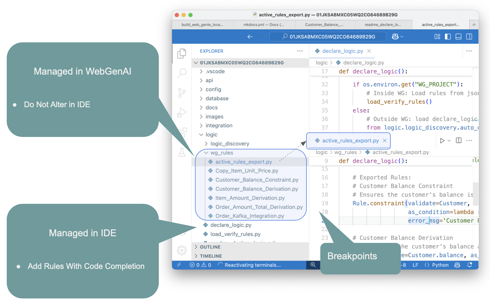

!!! pied-piper ":bulb: TL;DR - Create Microservice from Natural Language Prompt using CLI"

    API Logic Server / GenAI provides CLI commands that accepts a Natural Language prompt (e.g, CRM system), and produces:

    * a Microservice, an Admin App and a JSON API
    * a project that you can download and customize in your IDE using rules and Python
    * which can be deployed as a container using automatically generated scripts.

    API Logic Server / GenAI uses: 
    
    * GenAI services for data model creation, and 
    * API Logic Server for project creation.

    You can also use GenAI services via the [GenAI WebSite](GenAI.md){:target="_blank" rel="noopener"}.

&nbsp;

## Overview

To use GenAI to create projects

1. Establish your virtual environment (suggestion: [use the Manager](Manager.md){:target="_blank" rel="noopener"})
2. Provide a prompt in either a file (`als genai`), or a CLI argument (`als genai-create`):

```bash title='Project creation with GenAI'
als genai --using=system/genai/examples/genai_demo/genai_demo.prompt

# or, provide the prompt in an **quoted** argument:
als genai-create --project-name='customer_orders' --using='customer orders'
```

Projects are created in the currrent working directory, here, the manager.

&nbsp;

## Configuration

GenAI uses ChatGPT, which requires an API Key.  The simplest approach is to

1. Obtain one from [here](https://platform.openai.com/account/api-keys) or [here](https://platform.openai.com/api-keys)
2. Authorize payments [here](https://platform.openai.com/settings/organization/billing/overview)
3. Create an environmental variable `APILOGICSERVER_CHATGPT_MODEL`

&nbsp;


## Create Projects

You can use the als cli to create projects with logic.  See the example provided in the Manager:


Note:

1. Logic files can contain derivations and constraints
2. The system will create model attributes for derived columns.

&nbsp;


### Key Directories: Temp and Docs

When you create projects, the system saves prompts and responses.  This provided for documentation, error recovery, and iterations (described below):


&nbsp;

## Iterating Projects

You can review created projects by using the app, and/or reviewing the [data model](Database-Connectivity.md){:target="_blank" rel="noopener"}.  Of course, it's simple to resubmit a new prompt and re-create the project.

However, this will be a completely new rendition of your idea, and it may change things you like about the project.  ***Iterations*** enable you to keep what you already have, while making desired changes.

When you create a project, the API Logic Server / GenAI saves your prompt and response in a conversation-directory.  Iterations are saved in 2 different conversation-directories:

* the manager's `system/genai/temp/<project>` directory

* the created project's `doc` directory.

The `--using` argument can be a file, or a directory.  That means you can iterate by adding files to the  manager's `system/genai/temp/<project>` directory.  See the example provided in the Manager:


&nbsp;

### IDE Nat Language: `docs/logic`

As shown below, you can add Natural Language logic to existing projects.  Using an existing project located under the Manager:

1. Create a prompt such as `docs/logic/check_credit.prompt`

    * Create logic files in `docs/logic`
    * Use a descriptive name to denote the purpose of the logic
    * Your `docs/logic` can contain multiple files; only `.prompt` files are processed

2. In the terminal window:

```bash title='Create logic from docs/logic prompt files'
cd <project root>
als genai-logic
```

3. Your logic is created in `logic/logic_discovery`

Notes:

* See the notes above for creating new projects with logic
* Unlike new projects, columns are not created automatically for derived attributes.  You can create these as described in [data model changes](Database-Changes.md){:target="_blank" rel="noopener"}.
* Most likely, you will maintain the logic in the `logic_discovery` directory.
    * When you are done, you might want to rename the `docs/logic` files (e.g., change the file extension) so they are not processed on future runs.


&nbsp;

### Fixup: Add Missing Attributes

Fixes project issues by updating the Data Model and Test Data:
when adding rules, such as using suggestions, you may introduce new attributes.
If these are missing, you will see exceptions when you start your project.

The `genai-utils --fixup` fixes such project issues by updating the Data Model and Test Data:

1. Collects the latest model, rules, and test data from the project. 
2. Calls ChatGPT (or similar) to resolve missing columns or data in the project.
3. Saves the fixup request/response under a 'fixup' folder.
4. You then use this to create a new project

This procedure is available in the Manager README (see *Explore Creating Projects > Fixup - update data model with new attributes from rules*).

***Setup***

After starting the [Manager](https://apilogicserver.github.io/Docs/Manager): 

```bash title="0. Create Project Requiring Fixup"
# 0. Create a project requiring fixup
als genai --repaired-response=system/genai/examples/genai_demo/genai_demo_fixup_required.json --project-name=genai_demo_fixup_required
```

If you run this project, you will observe that it fails with:
```bash
Logic Bank Activation Error -- see https://apilogicserver.github.io/Docs/WebGenAI-CLI/#recovery-options
Invalid Rules:  [AttributeError("type object 'Customer' has no attribute 'balance'")]
Missing Attrs (try als genai-utils --fixup): ['Customer.balance: constraint']
```
&nbsp;

### Rebuild Test Data

The following is provided to fix project issues by rebuilding the database to conform to the derivation rules.  This procedure is available in the Manager README (see *Explore Creating Projects > Rebuild the test data*).

1. Create genai_demo: 
```
als genai --using=system/genai/examples/genai_demo/genai_demo.prompt --project-name=genai_demo
```
2. Rebuild:
```
cd genai_demo
als genai-utils --rebuild-test-data
```

&nbsp;

***Fixup***

To Fix it:
```bash title="1. Run FixUp to add missing attributes to the fixup response data model"
# 1. Run FixUp to add missing attributes to the data model
cd genai_demo_fixup_required
als genai-utils --fixup
```

Finally, use the created [fixup files](genai_demo_fixup_required/docs/fixup/) to rebuild the project:
```bash title="2. Rebuild the project from the fixup response data model"
# 2. Rebuild the project from the fixup response data model
cd ../
als genai --repaired-response=genai_demo_fixup_required/docs/fixup/response_fixup.json --project-name=fixed_project
```
    
&nbsp;
The created project may still report some attributes as missing.  
(ChatGPT seems to often miss attributes mentioned in sum/count where clauses.)  To fix:

1. Note the missing attributes(s) from the log
2. Add them to `docs/003_suggest.prompt`
3. Rebuild the project: `als genai --project-name='genai_demo_with_logic' --using=genai_demo_no_logic/docs`


Internal Note: this sequence available in the run configs (f1/f2).

&nbsp;

&nbsp;

### Customized Project Sync

In the prior section, the result was a *recreated* project.  If you have customized the project, you can preserve your customizations as follows:

1. Copy `database/models.py` and `db.sqlite` from the GenAI to your customized project
2. In your customized project, use `als rebuild-from-model` 

    * For further information, see [Database Design Changes](Database-Changes.md){:target="_blank" rel="noopener"}.

&nbsp;

## Export

You can export your project from WebGenAI, either from the Browser or from GitHub:


This enables you to verify all aspects of project operation, and extend GenAI functionality in your local IDE.

&nbsp;

### Open in your IDE

Once have exported and expanded the tar file:


1. Setup your virtual environment - see [Virual Environment](Project-Env.md){:target="_blank" rel="noopener"}.  

    * You can create a new venv, but it's simplest just to use the one used by the Manager.

    * Note: in some configurations of VSCode (e.g., mac multiple projects in the same window), it may not allow you to specify your virtual environment.  You can fix this:

        * Set the proper virtual environment in `.vscode/settings.json`: `    "python.defaultInterpreterPath": "~/dev/ApiLogicServer/ApiLogicServer-dev/build_and_test/ApiLogicServer/venv/bin/python"`
        * Rename the project

2. You should then be able to open and run the exported project in your IDE, 


&nbsp;

### wg_rules and IDE rules

The system is designed to support concurrent ongoing Multi-Team Development from WebGenAI, and from traditional development.  For more information, see [Import / Merge WebGenai](IDE-Import-WebGenAI.md){:target="_blank" rel="noopener"}.

To simplify the file mechanics during merge, WebGenAI rules are stored separately from rules created in the IDE:

| Logic Source | Stored   | Source of Truth - Manage In |
| :------------- |:------------- | :----- |
| WebGenAI Rules | `logic/wg_rules` | The **WebGenAI system.**  Import / merge projects into local dev environment using [Import / Merge WebGenAI](IDE-Import-WebGenAI.md){:target="_blank" rel="noopener"} |
| IDE Rules | `logic/declare_logic.py`, and (optionally) as files in `logic/logic_discovery` | **IDE** / Source control |



&nbsp;

### Multi read-only wg_rules files

Consider that WebGenAI and IDEs are quite different environments.  For example, IDEs support code completion and highlight errors, while WebGenAI uses Natural Language (which does not have 'syntax errors').

Without an IDE, WebGenAI users still require diagnostics about which rules fail to properly compile.  This requires the system to break each rule into a separate file, as shown above.

Since the source of truth is the WebGenAI system, you should not alter the wg_rules.  You can and should use these files to:

* Review and verify the logic created by WebGenAI
* Debug the logic using the debugger and the logic log; see [Debugging Logic](Logic-Debug.md){:target="_blank" rel="noopener"}.

&nbsp;

#### active_rules_export.py

The separate wg_rules files are gathered into a single `active_rules_export.py` file.  This simplifies verification / debugging (see above).  

This is a different execution path for IDE execution vs. WebGenAI execution.  You can force the WebGenAI execution path using the environment variables shown above.  This is normally not necessary.

&nbsp;

### Multi-Team Development

Since the logic is in separate directories, the system is able to support ongoing development in both WebGenAI and your IDE.

> Please see [Import / Merge GenAI](IDE-Import-WebGenAI.md){:target="_blank" rel="noopener"}.

<br>

----


## Appendices

### GenAI and API Logic Server

GenAI is part of API Logic Server.  As shown below:

* API Logic Server can create microservices (Admin Apps, APIs, and Logic) from databases.

* It can also create microservices from database models (`als create --from-model=my_model.py`)

* GenAI

    * Use ChatGPT APIs, and creates a model file from the response
    * Submit that to `als create --from-model=my_model.py`


### Error Recovery

AI results are not consistent, so you may sometimes need to correct errors and resume.  This requires a bit of background about genai processing.

&nbsp;

#### GemAI Processing

`genai` processing is shown below (internal steps denoted in grey):

1. You create your .prompt file, and invoke `als genai --using=your.prompt`.  genai then creates your project as follows:

    a. Submits your prompt to the `ChatGPT API`

    b. Writes the response to file, so you can correct and retry if anything goes wrong

    c. Extracts model.py from the response

    d. Invokes `als create-from-model`, which creates the database and your project

2. Your created project is opened in your IDE, ready to execute and customize.  

    a. Review `Sample-Genai.md`, Explore Customizations.


&nbsp;

#### Recovery options

AI somtimes fails - here's how to recover after you correct the response or the model file.

##### From the Model File

You can find the models file at `system/genai/temp/model.py`.  You can correct the model file, and then run:

```bash
als create --project-name=genai_demo --from-model=system/genai/temp/create_db_models.py --db-url=sqlite
```

##### From the Response

Or, correct the chatgpt response, and

```bash
als genai --using=genai_demo.prompt --repaired-response=system/genai/temp/chatgpt_retry.response
```


