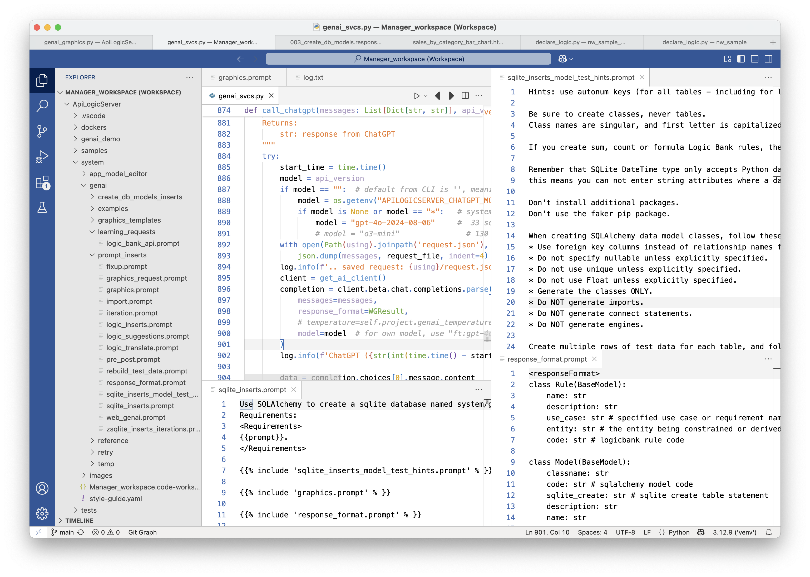
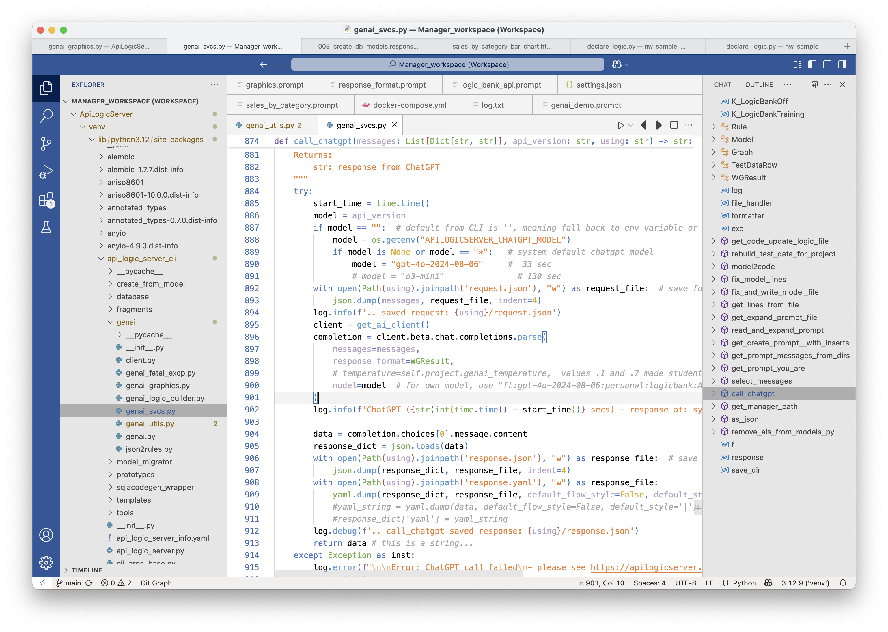
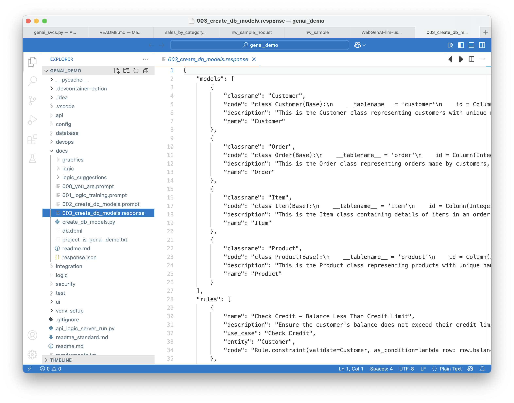

!!! pied-piper ":bulb: WebGenAI - Projects from Prompts"

      LLM (Large Language Model) usage is currently based on OpenAI, for:

      * Creating SQLAlchemy data models
      * Translating NL (Natural Language) logic into Python rules
      
&nbsp;

# LLM Technology Usage

## Learning

When you install the [Manager](Manager.md){:target="_blank" rel="noopener"}, it creates the structures shown below.  These are used to "train" ChatGPT about how to create models, and how to translate logic.



&nbsp;

## Invocation

The `api_logic_server_cli/genai` files are called by the CLI (which is called by WebGenAI) to create projects, iterate them, repair them, and so forth.  `api_logic_server_cli/genai/genai_svcs.py` is a collection of common services used by all, including the function `call_chatgpt()` shown below.  



&nbsp;

### ChatGPT Results: WGResult

Initially, we called ChatGPT and got the standard response, which in our case was a text file of code.  We parsed that to find the code we wanted, and merged it into the project.

That proved to be an unstable choice.  So, we now train ChatGPT results to return smaller code snippets, in json format.  This is defined by `WGResults`.It also contains the definitions of the `WGResult` objects.  Note these are defined both in the learnings, *amd* in `genai_svcs.py`.

&nbsp;

### `docs`: requests and responses

Requests and responses are stored in the project, which can be used for subsequent requests and error correction.  They can be stored in the location noted below (both the `docs` directory and its sub-directories):



Observe that a typical call the ChatGPT is a "conversation" - a list of `messages` (requests and responses) provided as an argument to ChatGPT.

# GenAI Project Creation Overview

GenAI is a wrapper around the existing API Logic Server project-creation flow.  API Logic Server already knows how to build an API + Admin UI from a database (or a SQLAlchemy model).  GenAI's twist is to let you start with a natural-language prompt: it has ChatGPT describe the model, feeds that model to the standard API Logic Server pipeline, and keeps trying until a compilable model appears.  The dominant design constraint is that LLM output can be wrong, so GenAI treats every request as a **three-attempt mission** with automatic retries, diagnostics capture, and manual escape hatches.

## Execution Stack

1. **CLI (`api_logic_server_cli/cli.py`)** – the `genai` click command collects prompt options (`--using`, `--retries`, `--repaired-response`, etc).
2. **Retry wrapper (`genai_cli_with_retry` in `genai.py`)** – for each attempt it spins up a standard project run, catches failures, snapshots diagnostics, and decides whether to try again.
3. **GenAI core (`GenAI.create_db_models`)** – called from `ProjectRun`; it asks ChatGPT for a model, fixes obvious issues, writes `system/genai/temp/create_db_models.py`, and records `post_error` if the model is unusable.
4. **Project runner (`ProjectRun.create_project` in `api_logic_server.py`)** – the same engine used for database- and model-driven starts; it compiles the generated model, creates the SQLite database, scaffolds the project, and merges logic comments.

Each layer reports errors upward; the retry wrapper decides whether to try again, toggle safeguards, or stop.

## Flow Diagram

```
┌─────────────┐
│ CLI         │
│ genai()     │
└────┬────────┘
     │ (1)
     ▼
┌─────────────────────────────┐
│ GenAI module                │
│  genai_cli_with_retry()     │
│  ┌───────────────────────┐  │
│  │ attempt loop (up to 3)│◄─┘
│  └──────────┬────────────┘
└─────────────┼─────────────
              │ (2)
              ▼
     ┌──────────────────────────────┐
     │ api_logic_server.ProjectRun  │
     │  ↳ GenAI.create_db_models()  │
     │  ↳ create_db_from_model.py   │
     └───────────┬──────────────────┘
                 │ (3)
                 ▼
           ┌──────────────┐
           │ Generated    │
           │ project      │
           └──────────────┘
```

## Inside a Single Attempt

1. **Resolve the prompt** – `GenAI.get_prompt_messages()` reads the `--using` argument (text, `.prompt` file, or conversation directory) and prepends any training inserts.
2. **Call ChatGPT** – `genai_svcs.call_chatgpt()` returns JSON with `models`, `rules`, and `test_data_rows` (or, with `--repaired-response`, a saved JSON file is used instead of an API call).
3. **Fix and emit the model** – `genai_svcs.fix_and_write_model_file()` cleans the JSON, writes `create_db_models.py`, and populates `post_error` if the response still can't compile (eg, tables instead of classes).
4. **Persist diagnostics** – `save_prompt_messages_to_system_genai_temp_project()` copies prompts, responses, and the generated model into `system/genai/temp/<project>`.
5. **Hand off to API Logic Server** – `ProjectRun` executes `create_db_models.py`, builds the SQLite database, scaffolds the project, and merges the prompt logic comments into `declare_logic.py`.

During this flow no exceptions are raised inside GenAI; instead `self.post_error` carries the message back to `ProjectRun`, which raises when non-empty so the retry loop can react.

## Three-Attempt Strategy

The retry logic in `genai_cli_with_retry()` keeps project creation resilient:

- **Loop control** – the CLI supplies `retries` (defaults to three).  The wrapper keeps looping until one attempt finishes or the budget is exhausted.
- **Failure detection** – any exception from `ProjectRun.create_project()` or a non-empty `gen_ai.post_error` marks the attempt as failed.
- **Automatic diagnostics** – work files are copied to `system/genai/temp/<project>_<try#>` before the next attempt; in-place conversation folders have the latest `.response` removed so the user can iteratively repair the conversation.
- **Adaptive retry** – if the failure mentions “Could not determine join condition” the next run toggles `use_relns=False` (foreign keys remain, only inference is skipped).
- **Exit conditions** – success breaks the loop; persistent failure logs and exits with status 1 so calling automation can react.

This approach mirrors real-world LLM behaviour: one response might be malformed, but a clean run usually appears within three tries, and each failure leaves a breadcrumb trail for debugging.

## Manual Recovery Hooks

- **Repaired responses** – run `ApiLogicServer genai --using prompt_dir --repaired-response system/genai/temp/chatgpt_retry.response` after editing the JSON.  The retry loop treats this as the last attempt (no additional retries needed).
- **Conversation iteration** – reuse the same `--using` directory; GenAI appends numbered prompt/response files so you can evolve a design across attempts.
- **Logic review** – generated logic is inserted as commented guidance in `declare_logic.py`; keep `--active-rules` disabled until you have reviewed the suggestions.


## GenAI Module Files

### Core Files
- **`genai.py`** - Main GenAI class and project creation driver
- **`genai_svcs.py`** - Internal service routines used by other genai scripts (ChatGPT API calls, model fixing, response processing)
- **`genai_utils.py`** - Additional CLI functions for GenAI utilities and operations

### Specialized Generators
- **`genai_react_app.py`** - Creates React projects inside an existing GenAI project
- **`genai_graphics.py`** - Generates graphics and visualizations for GenAI projects
- **`genai_logic_builder.py`** - Builds and suggests business logic rules
- **`genai_mcp.py`** - Model Context Protocol integration

### Supporting Files
- **`client.py`** - Client interface utilities
- **`json2rules.py`** - Converts JSON rule definitions to LogicBank rules
- **`genai_fatal_excp.py`** - Fatal exception handling for GenAI operations
- **`logic_bank_apiX.prompt`** - Prompt template for LogicBank API training

## Deferred Error Handling

The `post_error` instance variable implements a **deferred error reporting pattern** in the GenAI module, allowing the system to detect and recover from common ChatGPT response formatting issues through an automated retry mechanism.
