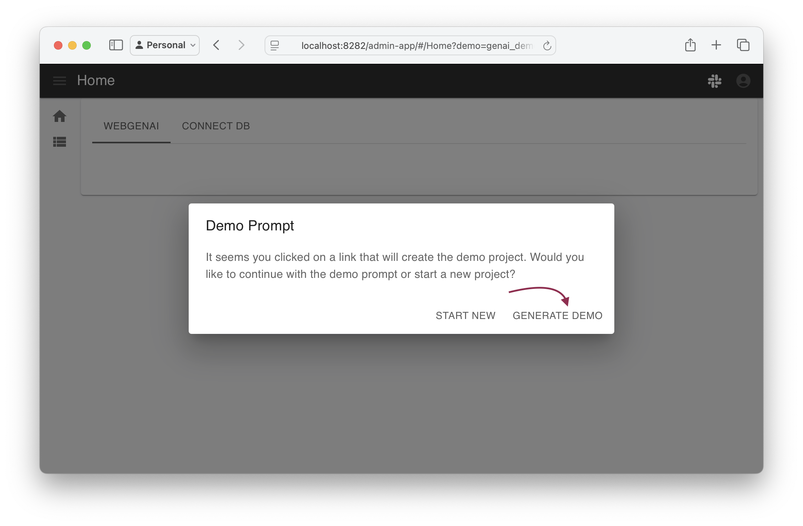
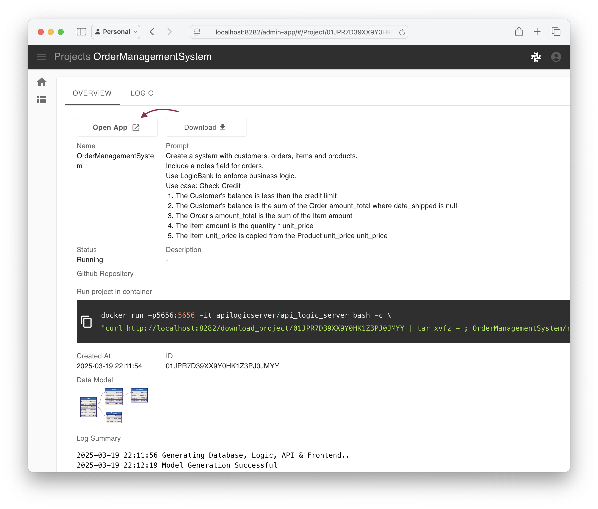
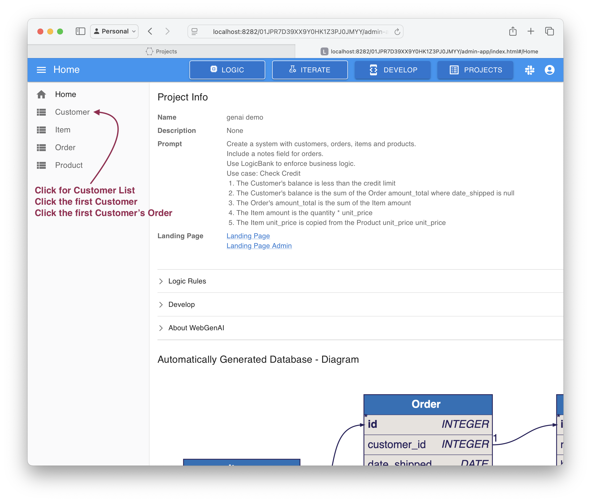
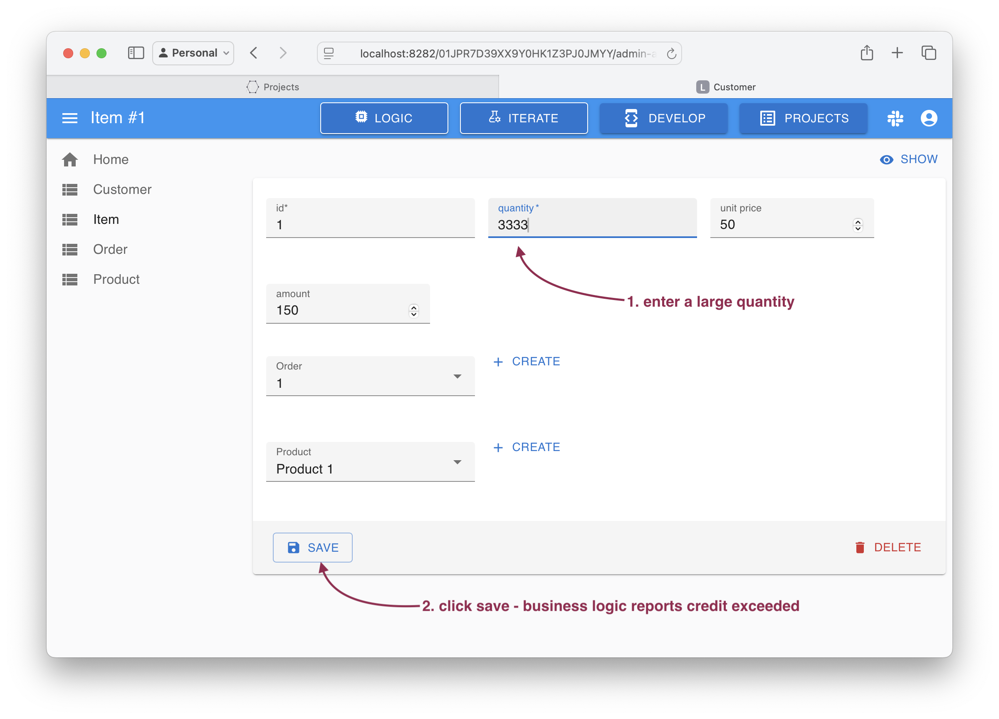

Open your browser at [http://localhost:8282/admin-app/#/Home?demo=genai_demo](http://localhost:8282/admin-app/#/Home?demo=genai_demo), and follow these steps:







The constraint is produced by the business logic:

* The quantity change recomputed the amount (rule 4)
* The amount adjusted the amount_total (rule 3)
* The amount_total adjusted the balance (rule 2)
* The balance exceeded the credit limit (rule 1), which produced the message and reverted the transaction

```bash
Use case: Check Credit    
    1. The Customer's balance is less than the credit limit
    2. The Customer's balance is the sum of the Order amount_total where date_shipped is null
    3. The Order's amount_total is the sum of the Item amount
    4. The Item amount is the quantity * unit_price
    5. The Item unit_price is copied from the Product unit_price
```
