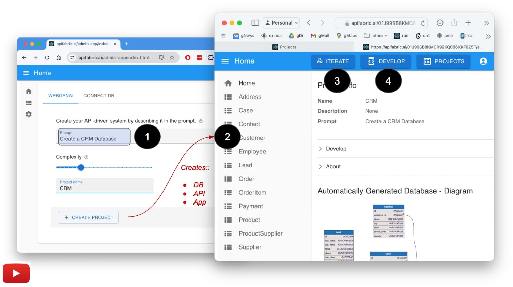
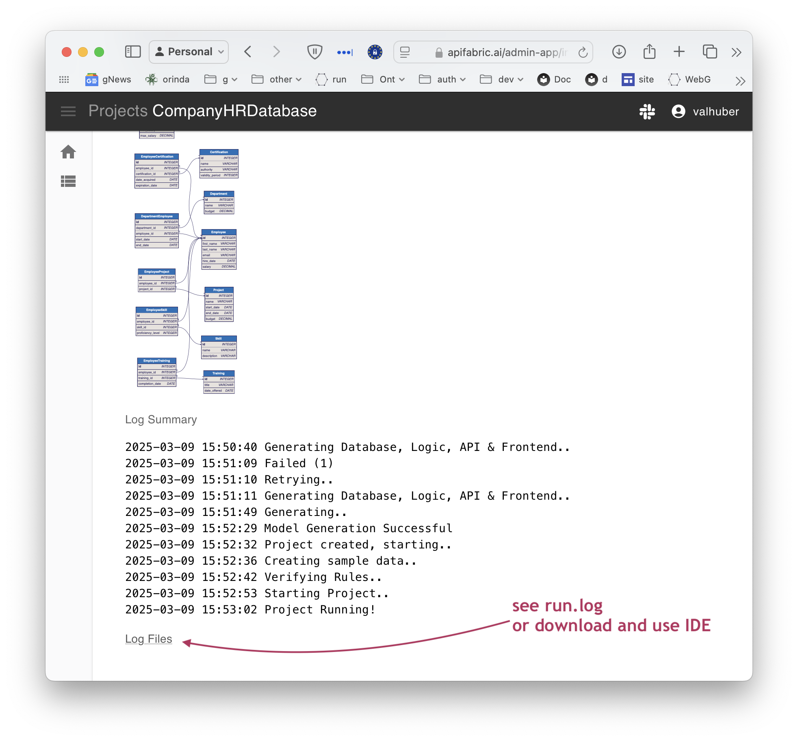

!!! pied-piper ":bulb: WebGenAI - Web Interface for GenAI-Logic"

      GenAI is a web app that creates database systems from a Natural Language prompt.  For background, [see Why WebGenAI](https://www.genai-logic.com/publications/webgenie){:target="_blank" rel="noopener"}.
      
      You can access WebGenAI either at 
      
      * the [public trial site](https://apifabric.ai/admin-app/){:target="_blank" rel="noopener"}, or 
      * as a [docker container](https://hub.docker.com/repository/docker/apilogicserver/web_genai/general){:target="_blank" rel="noopener"}.
      
      The site includes the code, and storage for the created projects and their SQLite datbases.
      
      To use GenAI:

      1. **Create** systems from a Natural Language prompt: database, API, an Admin Web App
        * Prompts describe the database structure and business logic, including application integration
      2. **Iterate** them (add new tables, columns, rules etc) to *get the requirements right*
      3. **Export** the project to your local desktop to customize (add endpoints, complex logic, etc)

      Web/GenAI is based on API Logic Server.  API Logic Server provides the CLI functions used by WebGenAI.
      
      * For more on the GenAI CLI, [click here](WebGenAI-CLI.md){:target="_blank" rel="noopener"}

      * For Web/GenAI architecture, [click here](Architecture-What-Is-GenAI.md){:target="_blank" rel="noopener"}

&nbsp;

## Create

*Click* the image below to watch a 2 minute video:

[](https://www.youtube.com/watch?v=-tMGqDzxd2A&t=3s "Microservice Automation"){:target="_blank" rel="noopener"}

In addition to running in the browser, the website provides a docker command to run the created project locally.

&nbsp;

### Prompt Design

Prompt design is "AI Programming".  Your prompt can be very general, or quite specific.  Consider the alternatives and examples described below.

| Approach | Notes | Example
| :------------- | :-----| :---- |
| Business Area | Provide a very general prompt | * `an auto dealership`, or<br>* `a restaurant`
| Database Oriented | Provide a specific prompt that identifies specific tables, columns and relationships | `Create a system for Customer, Orders, Items and Products`
| With Logic | Declare backend behavior with rules | See below - *With Logic*
| Detailed Database and Logic | Complete Natural Language projects | See below - *Detailed Database and Logic*

&nbsp;

<details markdown>

<summary> With Logic </summary>

```bash title='Database, API, Web App and Logic'
Create a system with customers, orders, items and products.

Include a notes field for orders.

Use LogicBank to enforce the Check Credit:

1. Customer.balance <= credit_limit
2. Customer.balance = Sum(Order.amount_total where date_shipped is null)
3. Order.amount_total = Sum(Item.amount)
4. Item.amount = quantity * unit_price
5. Store the Item.unit_price as a copy from Product.unit_price
```

You can verify this by altering a sample order/item with a very high quantity, and verifying the credit limit is checked.  (Note this is not trivial - 3 table transaction.)

For more, see 

* the [logic editor](#using-the-logic-editor)
* [natural languge logic](WebGenAI-CLI.md#natural-language-logic){:target="_blank" rel="noopener"}

</details>

&nbsp;

<details markdown>

<summary> Detailed Database and Logic </summary>

This example illustates:

1. More control on database structure
2. Logic
3. Organized by Use Case


```bash title='Time Tracking System'

Generate a project time tracking and invoice application

Use these names for tables and attributes:
* Client (id, name, email, phone, total_hours, total_amount, budget_amount, is_over_budget)
* Project ( id, client_id, name, total_project_hours, total_project_amount, project_budget_amount, is_over_budget, is_active)
* Invoice: (id, invoice_date, project_id, invoice_amount, payment_total, invoice_balance, is_paid, is_ready,task_count,completed_task_count)
* InvoiceItem(id, invoice_id, task_id, task_amount, is_completed)
* Task (id, project_id, name, description, total_task_hours_worked, total_task_amount_billed, task_budget_hours, is_over_budget,is_completed)
* Person (id, client_id, name, email, phone, billing_rate, total_hours_entered, total_amount_billed)
* Timesheet (id,task_id, person_id, date_worked, hours_worked, billing_rate, total_amount_billed, is_billable)
* Payment (id, invoice_id, amount, payment_date, notes)

Use decimal(10,2) for: hours_worked, total_hours, hours_entered, total_amount, billing_rate, total_task_amount_billed, project_budget_amount, total_project_amount, total_project_hours
Default hours_worked, total_hours, hours_entered, total_amount, billing_rate, total_task_amount_billed, project_budget_amount, total_project_amount, total_project_hours to zero
Create relationships between all tables

Use LogicBank to enforce business logic.

Use case: Person
Total Hours entered is sum of timesheet hours worked
Total amount billed is total hours entered times billing rate
Billing rate must be greater than 0 and less than 200

Use case: Timesheet
Copy billing rate from Person billing rate
The total amount billed is the billing rate times hours worked
Hours worked must be greater than 0 and less than 15

Use Case: Task
Total task hours worked is the sum of the Timesheet hours worked
Total task amount billed is the sum of the Timesheet total amount billed
Formula: is Over Budget  when total task hours worked exceeds task budget hours

Use Case: Project
Total project hours is the sum of Task total task hours worked
Total project amount is the sum of Task total amount billed
Formula: is Over Budget when total project amount exceeds project budget amount

Use Case: Client
Total hours is the sum of Project total project hours
Total amount is the sum of Project total project amount
Formula: is Over Budget equals true when total amount exceeds budget amount

Use Case: Invoice
Invoice Amount is the sum of InvoiceItem task amount
Payment total is the sum of Payment amount
Invoice balance is invoice amount less payment total
Formula: is_paid when invoice balance is than or equal to zero
Task Count is count of InvoiceItem 
Task completed count is count of InvoiceItem where is_completed is True
Formula: is ready when Task Count is equal to Task Completed Count
When Invoice is_ready send row to Kafka with topic 'invoice_ready'

Use Case: InvoiceItem
InvoiceItem task amount is copied from Task total task amount billed
Task is_completed is sum of InvoiceItem is_completed

Create at least 8 tables (models).
```
</details>

&nbsp;

### Using Logic

Backend Logic is nearly half the effort in a transactional system.  Instead of procedural code, WeGenAI provides declarative rules that are 40X more concise.  They can be expressed in Python, or Natural Language as described here.

It's often a good idea to create your project with an initial focus on structure: tables, columns, relationships.  As you review and iterate, you will likely want to introduce multi-table derivations and constraints. 

You can use normal iterations, or the Logic Editor.

For more on logic, including patterns and examples, see [Logic](Logic-Why.md){:target="_blank" rel="noopener"}.

&nbsp;

#### Using Iterations

You can iterate your project, and include logic.  This is a good approach when you are familiar with logic, and reasonably clear on what you want to do.

!!! pied-piper ":bulb: Important - test data recreated"

      The system rebuilds a new project and database with new test data on each iteration.  If you have entered important data, it is still available in the previous iteration.


&nbsp;

#### Using the Logic Editor

You can also the the Logic Editor:


Create logic by clicking **Rule Prompt**, or **Suggest**.  For each element, you can **reject** or **accept**.

* When you accept, the system translates the logic prompt (Natural Language) into Code (a Logic Bank Rule expressed in Python), shown in back.

Errors shown in red.  Correct errors in Natural Language using the **black icon button** by providing a new / altered prompt.

Logic may introduce new attributes.  These must be added to the data model, using **Update Data Model**.  When you run, this will update the database and test data.

&nbsp;

##### Logic Suggestions

You can ask GenAI to suggest logic for your system.  See **Suggest Rules** in the diagram above.  This can help you learn about rules, and can inspire your own imagination about required logic.

It's AI, so or course you will want to review the suggestions carefully.

For more information, see [Suggestions CLI](WebGenAI-CLI.md#logic-suggestions).

&nbsp;

#### Debugging Logic

Logic can fail to load at runtime.  The system will

* restart the project with rules disabled, so you can still see your data.  You should generally not update when logic is in error.

* report the errors back to the Logic Editor, where you can correct them.

Logic can also fail when you make an update.  You can:

1. Review the log to see the state of the row(s) as each rule fires (see below)
2. Download the project and use [standard logic debugging](Logic-Debug.md){:target="_blank" rel="noopener"}.



&nbsp;

## Iterate

You can *iterate* your prompt to include more tables etc, while preserving the design you have already created.

* This enables you to break your system down into a set of "Use Cases", solving one at a time, and integrating back to the others.

&nbsp;

### Fixup

Fixes project issues by updating the Data Model and Test Data.
When adding rules, such as using suggestions, you may introduce new attributes.
If these are missing, you will see exceptions when you start your project.

Use the **Update Model** button on the screen shot above.

&nbsp;

## Export / Customize

You can explore the created microservice on your own computer.

1. [Export](WebGenAI-CLI.md#export){:target="_blank" rel="noopener"} your project (customize in your IDE to add logic & security)

    * Observe the project is a set of [models]() - not a huge pile of difficult-to-understand code

2. Use Python and your IDE services.  For more information, see [Customize in Your IDE](IDE-Customize.md){:target="_blank" rel="noopener"}.

&nbsp;

&nbsp;

## Appendices

### Limitations

The created systems are basic database applications, not completed systems with sophisticated functionality such as images, custom screens, etc.

You can "build out" the project by downloading it and using your IDE with Python and rules, or perform the same functions using Codespaces (a browser-based version of VSCode - a link is provided for this).

&nbsp;

### Context

This explains the premise behind GenAI, and how it fits into a project life cycle.

&nbsp;

#### Why GenAI

A common project experience is:

* Weeks (or months) to get running screens
* Then, when Business Users explore the screens, it becomes clear there were basic misunderstandings

Which leads to our premise:

1. **Instant screens** (Agile "Working Software"); collaborate, and iterate to ***get the requirements right***
2. Kickstart the project with a **solid backend** - a Database, API and Logic from declarative / Natural Language models

    * Logic in particular is key: security and multi-table derivations / constraints constitute as much as half your project: declarative rules make them 40X more concise  &nbsp; :trophy:

    * The remaining logic is built in your IDE using standard Python, providing the speed and simplicity of AI - including logic - with the flexibility of a framework

&nbsp;

#### Project Life Cycle

As shown in the Life Cycle outline below, this approach is complementary to your existing UI Dev tools such as UI frameworks or Low Code Screen Painters. 

* In addition to existing UI Dev tools, please explore automation support for [Ontimize](App-Custom-Ontimize-Overview.md){:target="_blank" rel="noopener"}.

As illustrated by the green graphics below, we seek to provide value in the Inception Phase (get the requirements right), and for backend development. 


&nbsp;
