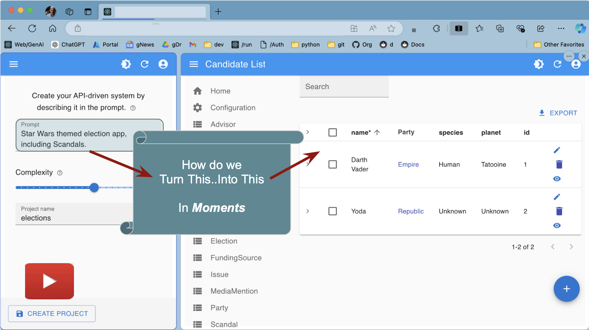

Under construction

!!! pied-piper ":bulb: TL;DR - Create an API-driven system from a Natural Language prompt"

    Describe your system with a prompt, such as:

    * An Airport System
    * A Restaurant System
    * A Starwars System

    Or, provide a longer prompt as shown below.

    Use the slider to suggest complexity (number of tables).

## Video

{:target="_blank" rel="noopener"}