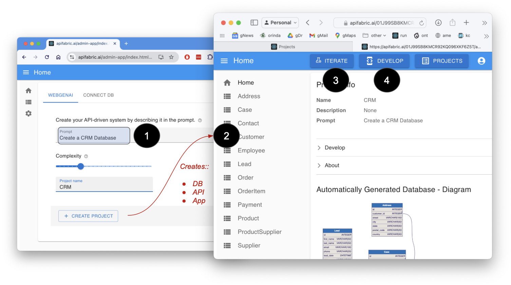
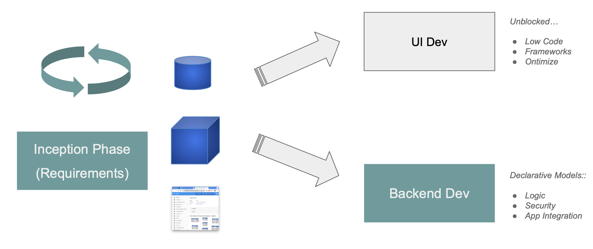

&nbsp;

## Access GenAI

***[Access the site here]()*** to use GenAI:

1. Provide a prompt, and
2. The system creates a microservice: a database, an API, and a multi-page application

  * Review the project - running screens, with data - and the database diagram
  * Iterate to ***get the requirements right***

3. Download the project to continue development with rules and Python in your IDE

&nbsp;

*Click* the image below to watch a 3 minute video:

{:target="_blank" rel="noopener"}

## About

1. Instant Working Software - Get the Requirements Right

Automation has turned your prompt into a microservice: a **database**, a working **application**, and a **standard API.**

It simply cannot be faster or simpler.

* Eliminate weeks to months of complex framework coding, db design, or screen painting.  
* Far more effective than 'dead` wireframes, you can...

    * Collaborate with stakeholders using Working Software, live data

    * Iterate 15 times... before lunch.

 

2. Microservice Development - Declarative Rules and Python in your IDE

The speed and simplicity of AI, plus all the flexibility of a framework.  

* Download the standard project, and [**customize in your IDE**](https://apilogicserver.github.io/Docs/Tutorial/#3-customize-and-debug-in-your-ide)

* Use standard Python: e.g. provide [Application integration](https://apilogicserver.github.io/Docs/Sample-Integration/) (custom APIs and kafka messaging) 

* [Declarative security](https://apilogicserver.github.io/Docs/Security-Overview/): configure keycloak authentication, declare role-based row authorization 

* [Declarative business logic](https://apilogicserver.github.io/Docs/Logic-Why/): multi-table constraints and derivations using ***unique rules*** that are 40X more concise than code, extensible with Python 

 

3. Deploy - Standard container, no fees, no lock-in

Created projects include scripts to automate docker creation, so you can deploy anywhere.  

There are no runtime fees, no lock-in.

 
&nbsp;

## Develop

You can explore the created microservice on your own computer.

1. [Download]() your project (customize in your IDE to add logic & security)

    * Observe the project is a set of [models]() - not a huge pile of difficult-to-understand code

2. Executable Docker Image

    * The website provides a docker command to run the created project.

&nbsp;

## Contact for full access

To create unlimited projects in your environment, contact `ApiLogicServer@gmail.com` for a free docker image, and project support.

The underlying services are also available in the [genai CLI](WebGenAI-CLI.md){:target="_blank" rel="noopener"}.

&nbsp;

## Prompt Design

Notes reqarding prompts:

1. You can provide a very general prompt (*an auto dealership*), or a specific one that identifies specific tables, columns and relationships (for example, [click here](https://github.com/ApiLogicServer/ApiLogicServer-src/blob/main/tests/test_databases/ai-created/budget_allocation/budget_allocations/genai.prompt){:target="_blank" rel="noopener"}).

2. You can *iterate* your prompt to include more tables etc, while preserving the design you have already created.

  * This enables you to break your system down into a set of "Use Cases", solving one at a time, and integrating back to the others.

&nbsp;

## Context

This explains the premise behind GenAI, and how it fits into a project life cycle.

&nbsp;

### Why GenAI

A common project experience is:

* Weeks (or months) to get running screens
* Then, when Business Users explore the screens, it becomes clear there were basic misunderstandings

Which leads to our premise:

1. **Instant screens** (Agile "Working Software"); collaborate, and iterate to ***get the requirements right***
2. Kickstart the project with a **solid backend** - a Database, API and Logic from declarative / Natural Language models

    * Logic in particular is key: security and multi-table derivations / constraints constitute as much as half your project: declarative rules make them 40X more concise  &nbsp; :trophy:

    * The remaining logic is built in your IDE using standard Python, providing the speed and simplicity of AI - including logic - with the flexibility of a framework

&nbsp;

### Project Life Cycle

As shown in the Life Cycle outline below, this approach is complementary to your existing UI Dev tools such as UI frameworks or Low Code Screen Painters. 

* In addition to existing UI Dev tools, please explore automation support for [Ontimize](App-Custom-Ontimize-Overview.md){:target="_blank" rel="noopener"}.

As illustrated by the green graphics below, we seek to provide value in the Inception Phase (get the requirements right), and for backend development. 

&nbsp;
