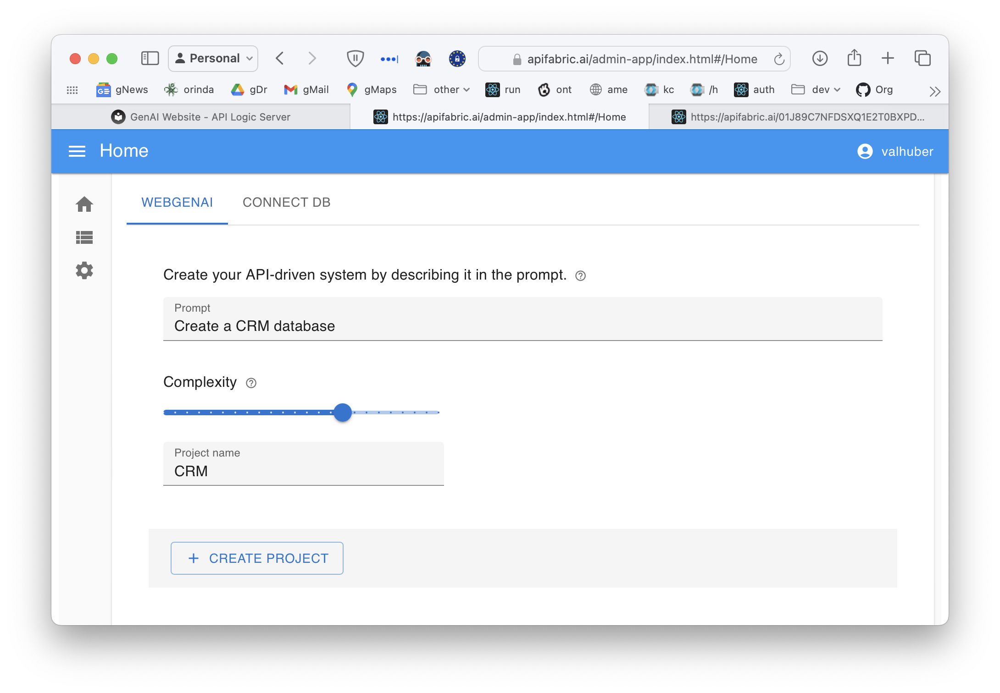

    

## Example

Enter a prompt describing the system you have in mind:

The system creates and executes this multi-page application and API.  It is live, including test data, so can evalute your business idea and iterate.

&nbsp;

## Contact for full access

To create unlimited projects in your environment, contact `ApiLogicServer@gmail.com` for a free docker image, and project support.

&nbsp;

## Develop

You can explore the created microservice on your own computer.

1. [Download]() your project (customize in your IDE to add logic & security)

    * Observe the project is a set of [models]() - not a huge pile of difficult-to-understand code

2. Executable Docker Image

    * The website provides a docker command to run the created project.

 

## About

 

1. Instant Working Software - Get the Requirements Right

Automation has turned your prompt into a microservice: a working **application**, and a **standard API.**

It simply cannot be faster or simpler.

* Eliminate weeks to months of complex framework coding, db design, or screen painting.  

* Iterate 15 times... before lunch.

 

 

 

2. Customize - Declarative Rules and Python in your IDE

The speed and simplicity of AI, plus all the flexibility of a framework.  

* Download the standard project, and [**customize in your IDE**](https://apilogicserver.github.io/Docs/Tutorial/#3-customize-and-debug-in-your-ide)

* Use standard Python: e.g. provide [Application integration](https://apilogicserver.github.io/Docs/Sample-Integration/) (custom APIs and kafka messaging) 

* [Declarative security](https://apilogicserver.github.io/Docs/Security-Overview/): configure keycloak authentication, declare role-based row authorization 

* [Declarative business logic](https://apilogicserver.github.io/Docs/Logic-Why/): multi-table constraints and derivations using ***unique rules*** that are 40X more concise than code, extensible with Python 

 

 

 

3. Deploy - Standard container, no fees, no lock-in

Created projects include scripts to automate docker creation, so you can deploy anywhere.  

There are no runtime fees, no lock-in.

 

To create unlimited projects on your cloud/network, contact `apilogicserver@gmail.com` for a free docker image, and project support.

&nbsp;

## Video

Provide a prompt, and the system creates a microservice: a database, an API, and a multi-page application.  **Click** the image below to watch a 3 minute video:

{:target="_blank" rel="noopener"}

&nbsp;

## Prompt Design

Notes reqarding prompts:

1. You can provide a very general prompt (*an auto dealership*), or a specific one that identifies specific tables, columns and relationships (for example, [click here](https://github.com/ApiLogicServer/ApiLogicServer-src/blob/main/tests/test_databases/ai-created/budget_allocation/budget_allocations/genai.prompt){:target="_blank" rel="noopener"}).

2. You can *iterate* your prompt to include more tables etc, while preserving the design you have already created.

  * This enables you to break your system down into a set of "Use Cases", solving one at a time, and integrating back to the others.