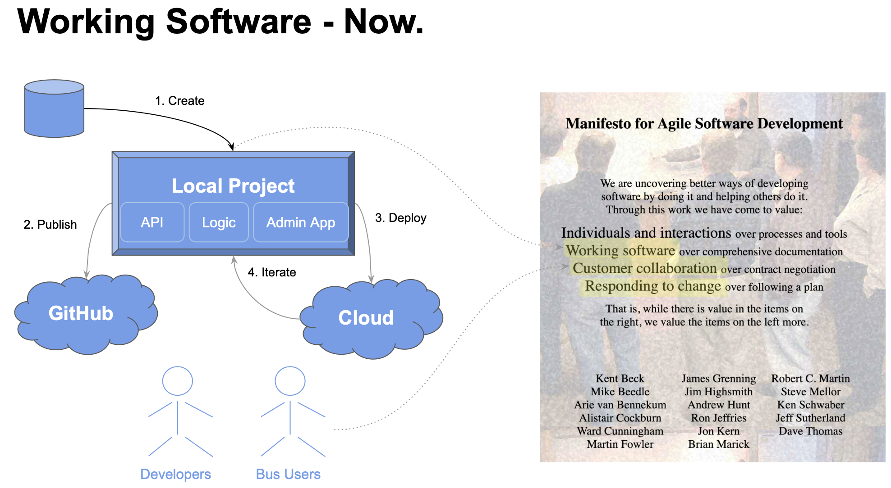

!!! pied-piper ":bulb: TL;DR - Working Software, Now"

      Agile correctly advises getting Working Software as fast as possible, to faciliate Business User Collaboration and Iteration:

      1. **Instant Creation:** create working software from a database.

      2. **Publish to GitHub:** for dev team collaboration

      2. **Deploy to the Cloud:** use the working software to collaborate with Business Users

      With API Logic Server, if you have a database, you can create and deploy ***within an hour***.

