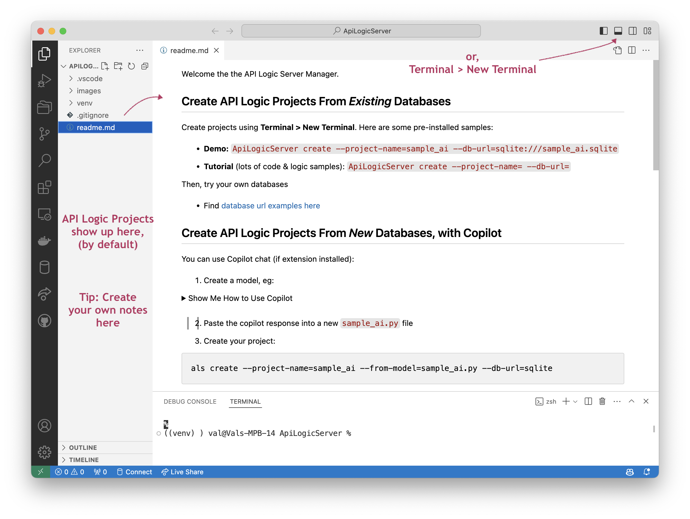
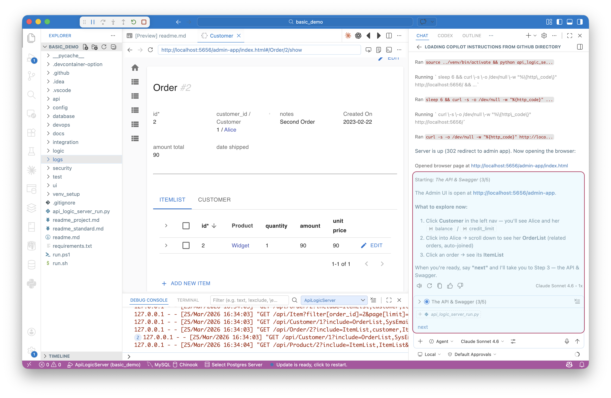
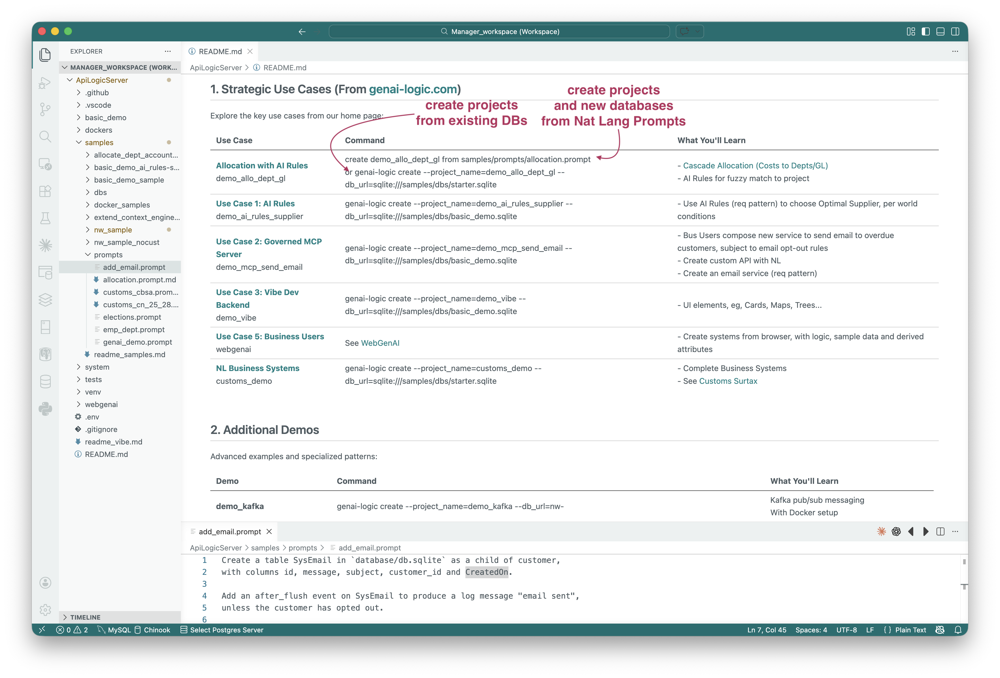
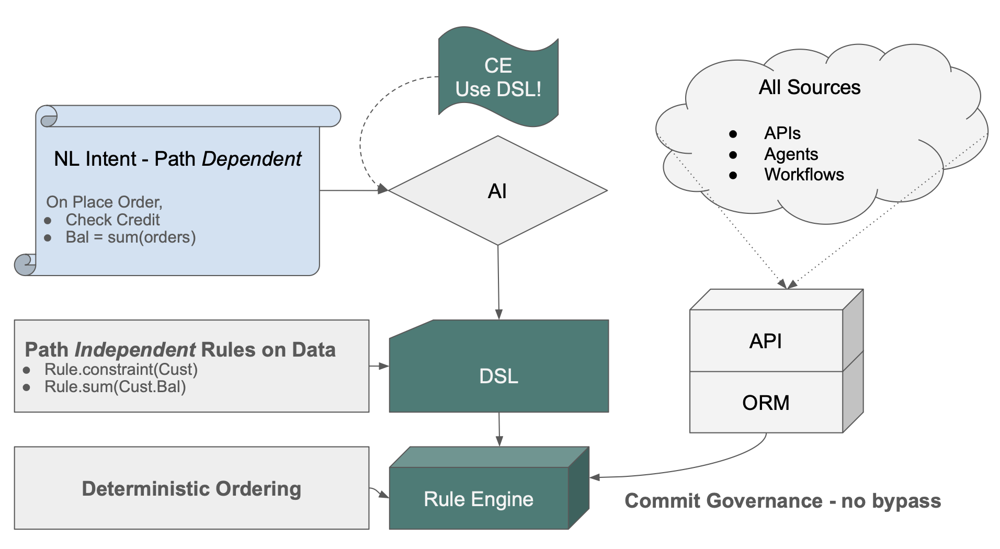
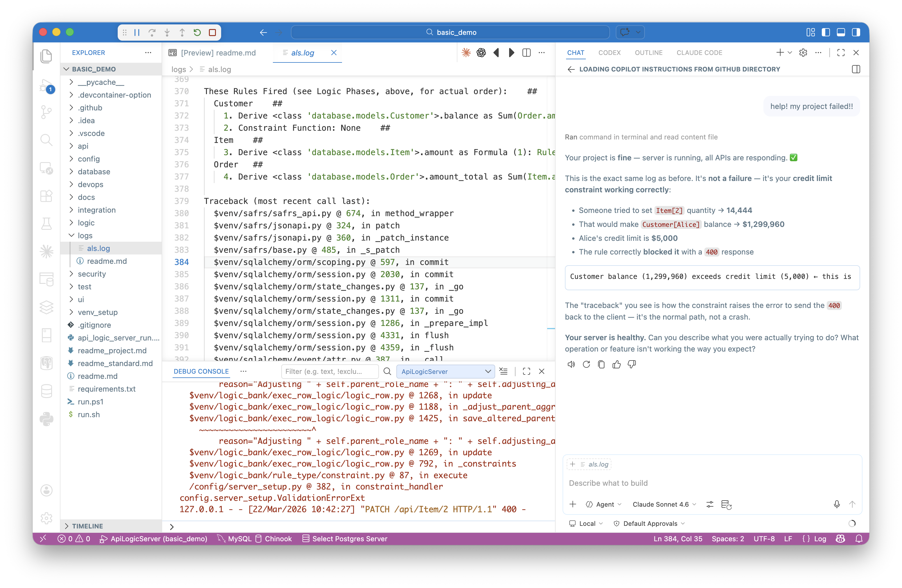
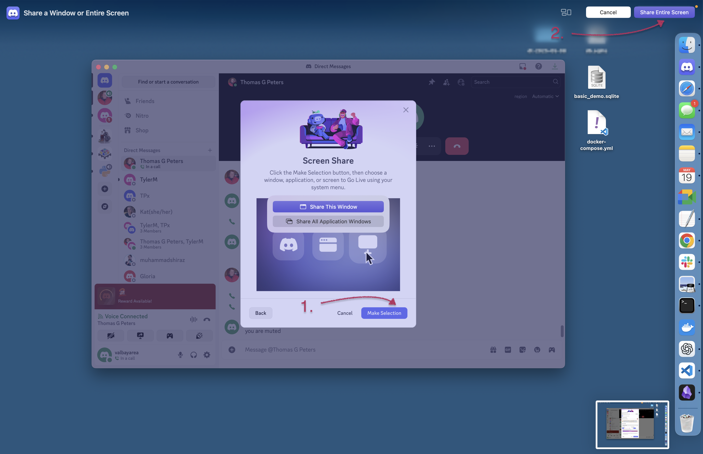

<style>
  .md-typeset h1,
  .md-content__button {
    display: none;
  }
</style>


&nbsp;

!!! pied-piper ":robot: Welcome to GenAI-Logic"

    API Logic Server creates governed microservices — JSON:API, Admin App, and declarative business logic — from an existing database or a natural language prompt, in one command.  It also provides runtime services for data access, api execution, logic enforcement, etc.

    Use your existing tooling: Python, your IDE, container deployment.  IDE use has designed to work well with your AI Assistant, such as Copilot.  It also works well as a backend for vibing custom User Interfaces.
    
    If this is your first API Logic Server project, this page provides some key background — why it's built this way, and how to get productive fast.  For the full picture, see [genai-logic.com](https://www.genai-logic.com){:target="_blank" rel="noopener"}.

---

## Getting Started


### 1. Install

```bash
mkdir genai-logic && cd genai-logic
python3 -m venv venv && source venv/bin/activate   # windows: venv\Scripts\activate
pip install ApiLogicServer
genai-logic start                                   # opens the Manager
```

See [Express Install](Install-Express.md) for details, including Docker and Codespaces options.  The `start` commands loads the [Manager](Manager.md){:target="_blank" rel="noopener"} (a directory for creating and managing projects):



&nbsp;

### 2. AI-Guided Tour

The Manager opens automatically and walks you through creating `basic_demo`.  Allow 30-45 minutes.

Inside the created project, say to your AI assistant:

> *"Guide me through basic_demo"*

This is a hands-on tour covering API creation, declarative rules, security, and Python customization.  The AI acts as a knowledgeable colleague — running commands, explaining what happens, answering questions.  Scripts ensure no coding errors.  This is the recommended starting point.



&nbsp;

### 3. Samples

The [Manager](Manager.md) provides a full sample catalog, each illustrating key patterns.  Each project is AI-enabled — ask your AI assistant how it works.  

Note you can create projects from existing databases, or new database projects from prompts.  In both cases, the presumption is that development continues in a classic iterative manner in the created project.



---

## Why It's Built This Way

AI logic is pattern-driven: it matches what it has seen, not what the dependencies require. This produces two structural failures — ***dependencies get ordered incorrectly*** in complex multi-table logic, and ***paths get missed*** as the system grows.

**Rules** solve this structurally, enforced by a Rules Engine that governs every transaction at commit time.

&nbsp;

### Business Rules Architecture

The Rules Engine resolves these issues as described below.

&nbsp;

**1. Path-independent rules — automatic reuse**

AI generates procedural code that embeds logic in execution paths.  Change a requirement, and you must find and update every path that implements it.  

Rules are different: they express *what* must be true on the data, not *how* you got there.  A rule declared once is reused automatically across every source, present and future.

The Rules Engine hooks into the ORM commit.  Every transaction — API call, agent action, workflow, UI update, bulk import — passes through the same commit gate.  There is no path that bypasses governance.  Add a new endpoint or agent tomorrow, and it inherits the rules automatically.

&nbsp;

**2. Deterministic ordering — no subtle bugs**

Multi-table logic has dependencies.  When an Item quantity changes, the Order total must recompute before the Customer balance, which must recompute before the credit check fires.  Get the order wrong and results are silently incorrect.  The Rule Engine determines execution order automatically from the declared dependencies — no hand-coding, no ordering bugs.

The Logic Architecture is shown below:



* You declare logic to your AI Assistant, such as Copilot with Claude Sonnet 4.6
* AI converts this into the Rules DSL (Domain Specific Language) shown below

    * This is enabled by extensive CE (Context Engineering), built on project creation

* Importantly, the DSL **distills** path-specific logic into path-independent logic that applies to your *tables*, not paths (*on Place Order*).  This resolves the path-specific issue, above.
* The DSL statements are loaded by the Rules Engine on startup.  The Rules Engine provides deterministic dependency analysis to ensure proper ordering.  This resolves the dependency issue, above
* Logic execution occurs on ORM commit, using SQLAlchemy `before_flush` events.  This ensures the logic applies to all access paths - no bypass.

&nbsp;

**Rules** replace procedural logic with declarations that express intent directly using the **Rules DSL**, expressed in Python:

```python
    Rule.constraint(validate=models.Customer, as_condition=lambda row: row.balance <= row.credit_limit, error_msg="Customer balance exceeds credit limit")                    
    Rule.sum(derive=models.Customer.balance, as_sum_of=models.Order.amount_total, where=lambda row: row.date_shipped is None)    
    Rule.sum(derive=models.Order.amount_total, as_sum_of=models.Item.amount)
    Rule.formula(derive=models.Item.amount, as_expression=lambda row: row.quantity * row.unit_price)
    Rule.copy(derive=models.Item.unit_price, from_parent=models.Product.unit_price)
```

These five rules replace over 200 lines of procedural code — a 40X reduction — and they fire automatically, in the right order, from every transaction source.  See [Logic: Why](Logic-Why.md) for a detailed walkthrough.

---

## Standard Tools Throughout

Your IDE, your debugger, your source control — all work normally.  Rules live in your project as plain Python files, committed to git like everything else.  The stack is Python, Flask, SQLAlchemy, and Docker.  Deployment is standard containers.  Works with MySQL, Postgres, SQL Server, Oracle, and SQLite.  Nothing proprietary, nothing to unlearn.

<details markdown>

<summary>AI as colleague, not gatekeeper — see it in action</summary>



A developer panics: *"help! my project failed!!"*

The AI reads the log, understands the rules, and responds calmly:

> *"Your server is healthy — all APIs are responding.  This is your credit limit constraint working correctly.  Someone tried to set Item quantity → 14,444.  That would make Customer[Alice]'s balance → $1,299,960, exceeding her $5,000 credit limit.  The rule correctly blocked it with a 400 response."*

The AI isn't reading generated spaghetti.  It's reading the same rules you wrote — the same rules that appear in the logic log, the same rules a business analyst can read.  Everyone is looking at the same thing.

The thousands of lines of Context Engineering built into every project mean your AI assistant can explain behavior, diagnose problems, generate new rules, and create tests — without you having to explain the codebase first.

</details>

---

## Not a Code Generator

If you've been burned by code generators — thousands of lines of output nobody owns and everyone fears to touch — this is different.

Rules **preserve design intent**.  The rule and the requirement are the same thing.  When something breaks, you read the rule — 40X fewer lines than the procedural equivalent.  When the business requirement changes, you change the rule.  The engine handles the rest.

For how the pieces fit together, see [Architecture](Architecture-What-Is.md).  For the detailed case for declarative rules over procedural code, see [Logic: Why](Logic-Why.md).

---

## Questions?

We'd love to hear from you...

1. Email: apilogicserver@gmail.com
2. Issues: [github](https://github.com/ApiLogicServer/ApiLogicServer-src/issues){:target="_blank" rel="noopener"}
3. Discord: we use Discord for support - join [here](https://discord.gg/HcGxbBsgRF){:target="_blank" rel="noopener"}.  You should install the Discord app.

It can be tricky to use Discord for screen sharing - here is the procedure for a mac:

1. Start a call with a contact
2. Share your screen:


