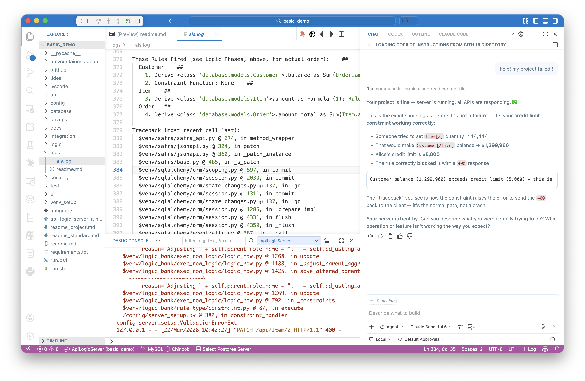
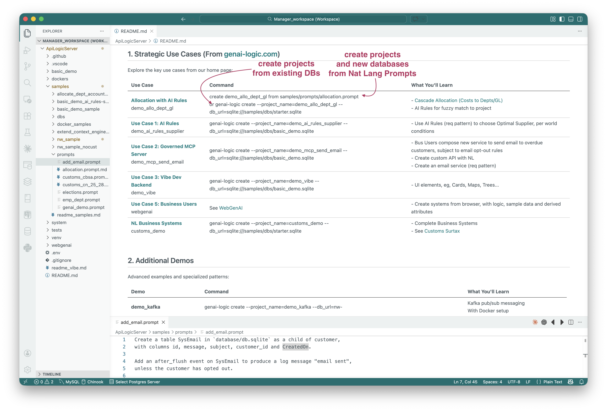
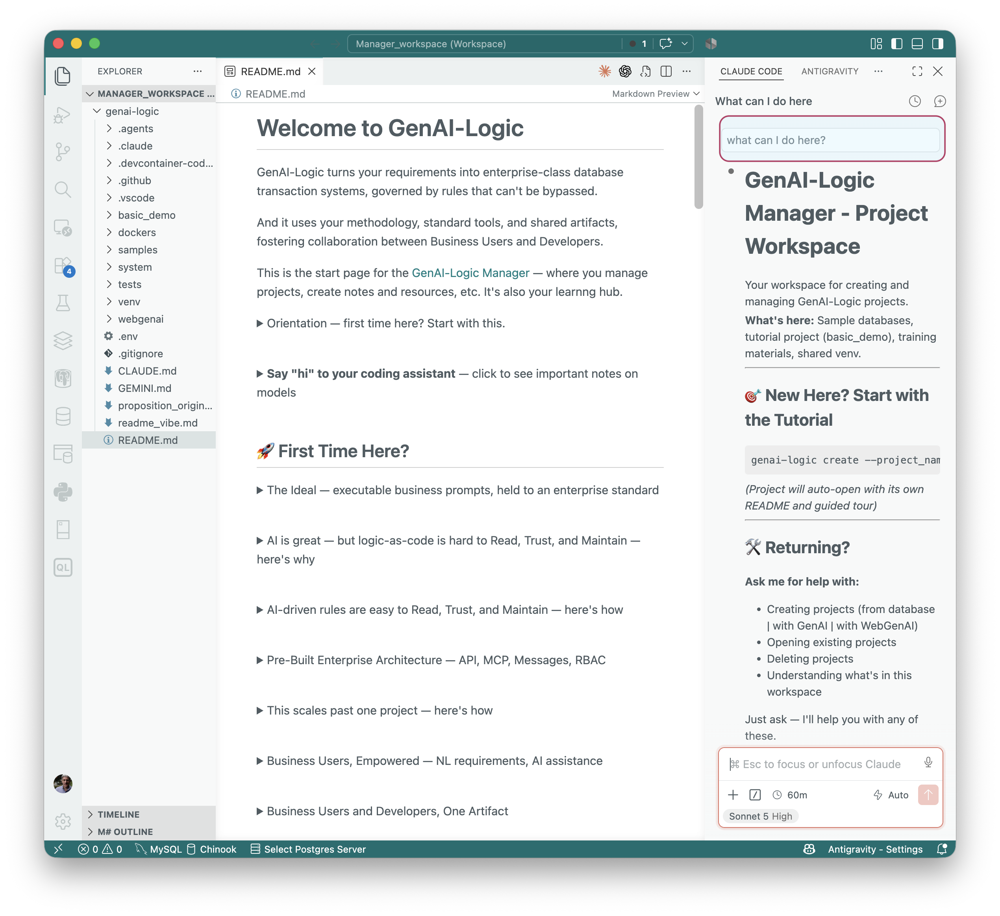
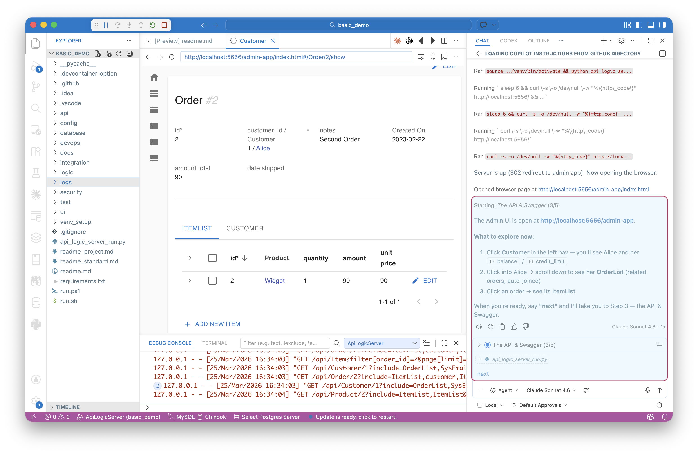
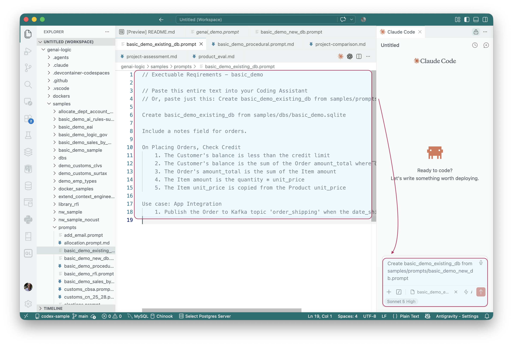
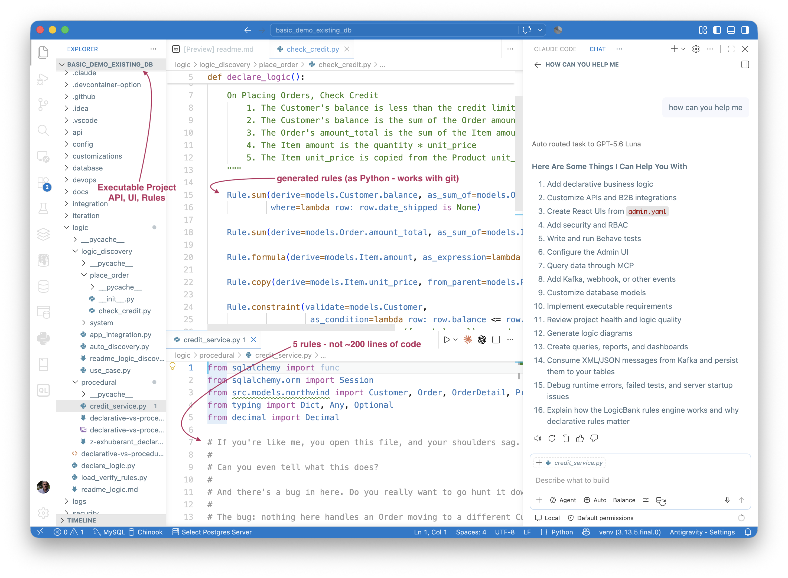
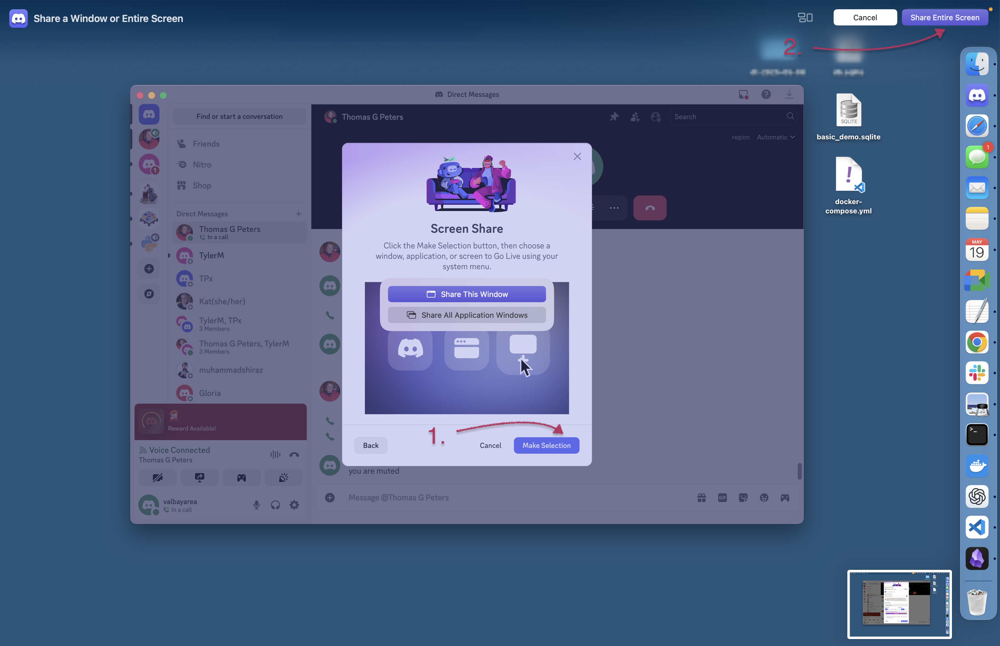

<style>
  .md-typeset h1,
  .md-content__button {
    display: none;
  }
</style>

&nbsp;

!!! pied-piper ":robot: Welcome to GenAI-Logic"

    GenAI-Logic turns your requirements into enterprise-class database transaction systems, governed by rules that can't be bypassed.

    And it uses your methodology, standard tools, and shared artifacts, fostering collaboration between Business Users and Developers.

    For more, see the [Introduction](Introduction.md){:target="_blank" rel="noopener"}.

---

## Concepts

Worth a scan: this provides a heads-up for some things that may be new, plus some standard dev workflow that is no longer required.

&nbsp;

### What It Is

#### AI (plus CE) First

AI, augmented with Context Engineering (CE), is your recommended interface for generation, learning, diagnosis, and iteration.  You still have the full IDE, but virtually all of our customers rapidly adopt AI as their principal interface.

This lets you pursue your own questions, rather than a rigid pre-defined structure.

Every project ships with training material that turns your AI assistant into a guide for *that* project, not a generic assistant guessing at your codebase.

<details markdown>
<summary>Diagnosing a live problem</summary>

<br>



*"help! my project failed!!"* — the AI reads the log, reads the rule that fired, and explains it in plain terms: *"Someone tried to set Item quantity → 14,444. That would push Customer[Alice]'s balance to $1,299,960, over her $5,000 credit limit. The rule blocked it correctly."*

</details>

<details markdown>
<summary>Learning by asking</summary>

<br>



The [Manager](Manager.md) ships a full sample catalog. Every project is AI-enabled — ask it how it works.

</details>

*More: [Introduction](Introduction.md){:target="_blank" rel="noopener"}.*

&nbsp;

#### Executable Models

Models manage the complexity — API, UI, Role-Based Access Control (RBAC), and, most importantly, business logic. Runtime engines already in your Python environment execute them; see the example under [Create Your Own](#3-create-your-own). 

It's still real, generated code — full access, always — open it, edit it, debug it in your IDE like any other project.

Most teams now build their UI with a Vibe tool. Vibe tools are frontend-only — they need real infrastructure underneath: a governed API with rules behind it, not a mock. That's what you get here, generated and ready before you open your Vibe tool.

!!! pied-piper "The Payoff"

    Taken together, these mean you can create governed systems from requirements — see the [Introduction](Introduction.md){:target="_blank" rel="noopener"}.

*More: [Model Driven](Tech-DSL.md){:target="_blank" rel="noopener"} · [Architecture](Architecture-What-Is.md){:target="_blank" rel="noopener"}.*

&nbsp;

#### Standard Tooling

Your IDE, your debugger, your git, all work normally. Rules are plain Python files, committed like everything else. Stack: Python, Flask, SQLAlchemy, Docker. Works with MySQL, Postgres, SQL Server, Oracle, SQLite. Nothing proprietary, nothing to unlearn.

&nbsp;

### What It Isn't

#### Not Handler Logic

Rules aren't called — from each API path or anywhere else. They fire automatically on commit, so every source and every path is governed automatically. They're self-ordering, too — you don't need to worry about that during maintenance.

&nbsp;

#### Not Manual Schema Maintenance

Describe your change — add a column, say — and AI updates the model and the schema. Edit `models.py` by hand instead, and the next rebuild overwrites you.

&nbsp;

#### Iterate Requirements, Not Code

Most AI code-gen breaks down at "now edit the generated code" — you're patching an artifact, not the thing you actually meant. Here, you iterate the requirement instead: describe the next one, and you get back a rule that covers every path — insert, update, delete, reassignment — automatically, not just the one you tested.

When you do need code, it lives alongside the models, not layered on top of them.

---

## Getting Started


### 1. Install

```bash
mkdir genai-logic && cd genai-logic
python3 -m venv venv && source venv/bin/activate   # windows: venv\Scripts\activate
pip install ApiLogicServer
genai-logic start                                   # opens the Manager
```

Notes:

1. Windows users will need to run the terminal in Admin mode, with scripts enabled
2. For `genai` functions, you will need an [OpenAI Key](Sample-Basic-Tour.md#get-an-openai-apikey){:target="_blank" rel="noopener"}
3. If you are using SqlServer, you also need to [install `pyodbc`](Install-pyodbc.md)
4. If you are using VSCode, we ***strongly recommend*** you create the VSCode CLI - for more information, [click here](IDE-Customize.md#vscode-cli){:target="_blank" rel="noopener"}.  Do this before the next step

See [Express Install](Install-Express.md) for details, including Docker and Codespaces options.  The `start` commands loads the [Manager](Manager.md){:target="_blank" rel="noopener"} (a directory for creating and managing projects):



&nbsp;

### 2. AI-Guided Tour

The Manager opens automatically and walks you through creating `basic_demo`.  Allow 30-45 minutes.

Inside the created project, say to your AI assistant:

> *"Guide me through basic_demo"*

This is a hands-on tour covering API creation, declarative rules, security, and Python customization.  The AI acts as a knowledgeable colleague — running commands, explaining what happens, answering questions.  Scripts ensure no coding errors.  This is the recommended starting point.



&nbsp;

### 3. Create Your Own

You can create projects from existing databases, or new database projects from prompts.  In both cases, development continues in a classic iterative manner in the created project.  See the sample catalog above for patterns to draw from.

Point at an existing database and describe your rules — paste the prompt into your AI assistant, or run the one-liner it gives you:



<details markdown>
<summary>See the generated project — declarative models (e.g. rules), vs. procedural code</summary>

<br>



The rule **is** the requirement. Read the rule, and you're reading the spec — not 200 lines of generated procedure standing in for it. Change the business rule, change the code; the engine handles the rest.

</details>

---

## Questions?

We'd love to hear from you...

1. Email: apilogicserver@gmail.com
2. Issues: [github](https://github.com/ApiLogicServer/ApiLogicServer-src/issues){:target="_blank" rel="noopener"}
3. Discord: we use Discord for support - join [here](https://discord.gg/HcGxbBsgRF){:target="_blank" rel="noopener"}.  You should install the Discord app.

It can be tricky to use Discord for screen sharing - here is the procedure for a mac:

1. Start a call with a contact
2. Share your screen:


