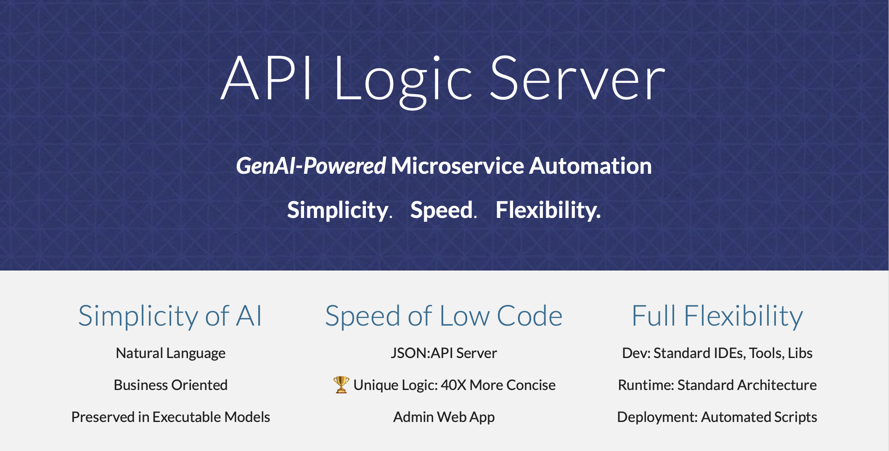
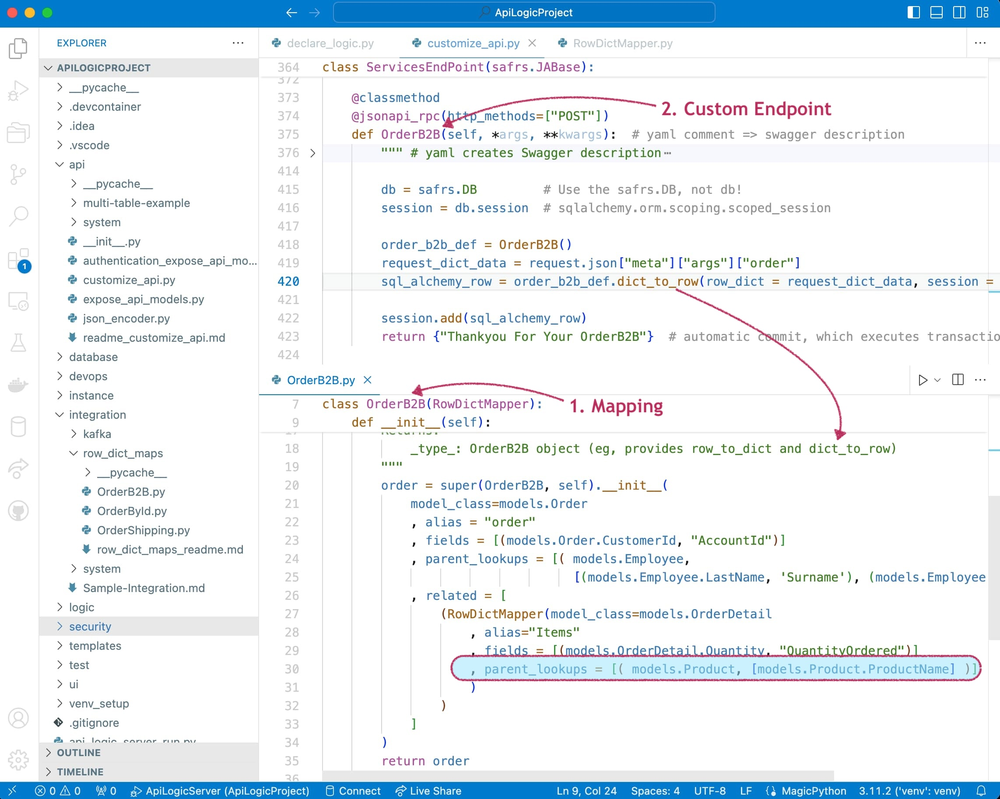

<style>
  .md-typeset h1,
  .md-content__button {
    display: none;
  }
</style>
[](https://pepy.tech/project/apilogicserver)
[](https://pypi.python.org/pypi/apilogicserver/)
[](https://pypi.python.org/pypi/apilogicserver/)


[](Doc-Home.md "Click for Docs, Getting Started")

# What is GenAI-Powered Microservice Automation?

Microservice Automation means you can create microservices from a database with 1 command.  You get an Admin App and a JSON:API with Swagger.  Then, use your IDE to declare logic using spreadsheet-like rules (40X more concise than code), and Python as necessary.  It's fast - you are up in seconds - and flexible using your IDE and familiar tools.

Power it with GenAI to make it even simpler.  Just describe the system in business terms, and the system is created.  Then, declare rules in natural language.

Let's have a look.

&nbsp;

## 1. Simplicity of AI

To create system, **provide a prompt *in business terms:***

<details markdown>

<summary>Create an AI Prompt file named genai_demo.prompt</summary>

```bash title="Create an AI Prompt file named genai_demo.prompt"
Use SQLAlchemy to create a sqlite database named system/genai/temp/model.sqlite,
with customers, orders, items and product

Hints: use autonum keys, allow nulls, Decimal types, foreign keys, no check constraints.

Include a notes field for orders.

Create a few rows of only customer and product data.

Enforce the Check Credit requirement (do not generate check constraints):
1. Customer.balance <= credit_limit
2. Customer.balance = Sum(Order.amount_total where date_shipped is null)
3. Order.amount_total = Sum(Item.mount)
4. Item.amount = quantity * unit_price
5. Store the Item.unit_price as a copy from Product.unit_price
```

{: style="height:200px;width:280px"; align=right }

&nbsp;

That's all it takes to create a system.  Note:

* This prompt is a ***high-level, business-oriented*** description of the system - not just the database, but the multi-table business logic too.

* It is not "techno-babble" of low-level framework details (routes...).  You don't need to provide. or even learn such details.  That would be a **failure to communicate.**

</details>

&nbsp;

## 2. Speed of Low Code

Then, **1 command** creates the project (you can also create from an existing database), providing remarkable *business agility:*

```bash title="Create the project"
als genai --using=genai_demo.prompt
```

<details markdown>

<summary>App and API are ready to run</summary>

The system creates the database, and an **executable project** providing API and App Automation.  The microservice is ready to run, instantly:


</details>

&nbsp;

## 3. Flexibility of a Framework

Agility includes **maintenance automation**, using **GenAI and Logic Automation**, with **standard tooling** such as Python and your IDE:

<details markdown>

<summary>Customize and Iterate the Logic and API</summary>

Declare executable **spreadsheet-like rules** - 40X more concise than code - using GenAI or code completion.  These address multi-table derivations and constraints, and role-based row filtering.

Declarative rules promote iterative development with support for [maintenance automation](FAQ-Maintenance.md){:target="_blank" rel="noopener"}, with automation for invocation, ordering, dependency management and optimization.

Use Python to **extend the rules** (e.g, to send a Kafka message), and use the Flask framework to **extend the API:**

Use your IDE debugger and the logic log to debug logic.


</details>

&nbsp;

# Fully Delivering on Simplicity, Speed, Flexibility

| Technology Promises | Limited By...   |  Deliver the Promise With API Logic Server  |
:-------|:-----------|:-------|
| Framework Promises Flexibility | - No API, Logic or App Automation<br>- Months of complex development | - Full Microservice Automation :bulb: <br>- Preserves Full framework access |
| Low Code Promises Speed | - No Logic Automation (nearly half the effort)<br>- Manual Screen Painting<br>- Proprietary IDE, Framework | - Logic Automation :bulb: <br>- App Automation<br>- Open IDE, Tools, Libraries :bulb: |
| GenAI Promises Simplicity | - No API, Logic or App Automation<br>- Only Database Automation | - API Logic Server uses GenAI, adding...<br>- Full Microservice Automation |

API Logic Server **differentiates** from traditional approaches:

* Unlike Frameworks, API Logic Server creates **complete microservices** (APIs and App in a customizable project), **including logic automation.**  You're ready to run.  With frameworks, you're ready to code -- weeks-to-months of complex development.

* Unlike Low Code, API Logic Server provides **Logic Automation,** **App Automation,** and preserves the **framework flexibility.**  With Low Code, you have to code your logic, quite likely in a non-standard IDE.

    * For systems providing update, logic automation is critical.  It's nearly half the effort.  The promise of Low Code *requires logic automation.* 

* Unlike basic GenAI, API Logic Server creates **complete microservices -- including logic automation.**  You have working software.  With GenAI, you have a database.

For more information, see [the FAQs](FAQ-Low-Code.md){:target="_blank" rel="noopener"}.

<details markdown>

<summary>Does GenAI require Microservice Automation?</summary>
{: style="height:150px;width:250px"; align=right }
GenAI brings well-known value to app development.  It's great for generating code snippets, particularly for *driving automation engines,* such as sql (e.g., "*create a database...*").  API Logic Server leverages both of these strengths, including [GenAI Logic Automation](Logic.md/#with-genai-logic-automation){:target="_blank" rel="noopener"}.
 
For large, complex systems (e.g., microservices and their logic), [GenAI breaks down](FAQ-AI.md){:target="_blank" rel="noopener"} -- results can be inconsistent, sometimes wrong, occasionally head-scratching hallunications.

Microservice Automation provides the missing pieces: **[logic, api and app automation engines](Architecture-What-Is.md/#model-execution-engines){:target="_blank" rel="noopener"}** (analogous to SQL), enabling **GenAI to scale up to complex microservice creation**, avoiding:

1. **Avoids "Franken-response":** the last thing you want is for AI to turn your 5 simple rules into 200 lines of code: hard to read, verify correctness, and change.  By contrast, creating declarative rules results in logic that is concise,  understandable, and provides Maintenance Automation.

1. **Avoids the "Franken-prompt":** in the absence of automation engines, developers are forced into complex *prompt engineering*, requiring detailed knowledge of the target code.  This defeats the objective of simplicity.

So, Microserve Automation not only **leverages the value of GenAI**, but ***enables it to address complex system creation, preserving simplicity.***

</details>

<details markdown>

<summary> Doesn't Low Code Make It Fast? </summary>

{: style="height:150px;width:250px"; align=right }

Yes, for *retrieval-oriented systems.*  But, if your system requires update logic, the multi-table derivations and constraints are **nearly half the effort** -- the iceberg under the surface of the API.  
    
> See the screenshot above: *Customize the Logic and API*.  **Logic automation** means logic is expressed in **spreadsheet-like *rules,* not code.**  These rules are 40X more concise than code, and are extensible with Python.  They are automatically invoked, and are multi-table, multi-field.  

So:

1. **Logic automation** is required to fulfill the promise of *fast*.  Without it, your project will simply not get moving.

2. **GenAI simplifies database creation**.  In the past, Low Code tools have found it challenging to make it easy for users to define foreign keys, indices, etc.

3. Developers will appreciate that **API Logic Server is standards-based** - use your own IDE, familiar tools such as source control, etc.

</details>

<details markdown>

<summary>Don't frameworks make it easy to create endpoints?</summary>

{: style="height:250px;width:250px"; align=right }
They do.  But a microservice is far more than a single endpoint.  It's a horse of an entirely different feather, requiring:

* Filtering, pagination, optimistic locking... for *all* the tables

* API design

* SQLAlchemy models

* Admin App

* Update APIs... *and their logic*

**GenAI Microservice Automation** does all of this, *automatically.*  It's a complete system, ready to run.

</details>

&nbsp;

# Watch it

## Create from GenAI
    
[](https://www.youtube.com/watch?v=6wnPsI5S6NM "Microservice Automation"){:target="_blank" rel="noopener"}


## Create from Existing Database

<details markdown>

<summary>Create and Customize Microservices from an existing database</summary>

[](https://www.youtube.com/watch?v=tOojjEAct4M&t=1s "Microservice Automation"){:target="_blank" rel="noopener"}

</details>


## Web/GenAI - Zero Install

<details markdown>

<summary>Create and run with zero-install - coming soon</summary>

Please see [FAQ - Low Code](FAQ-Low-Code.md#webgenai){:target="_blank" rel="noopener"}.

</details>


---

&nbsp;

# In Depth

<details markdown>

<summary>Simplicity of AI, Speed of Low Code, Flexibility of a Framework, Modern Software Architecture</summary>

&nbsp;

!!! pied-piper ":bulb: Instant Microservices, for Integration and App Backends"

    For Developers and their organizations seeking to **increase business agility,** API Logic Server provides 

    * ***AI Simplicity:*** create projects from a Natural Language business oriented prompts, or existing database, in seconds

    * ***Microservice Automation:*** create executable projects with *1 command*:
    
        1. ***API Automation:*** crud for each table, with pagination, optimistic locking, filtering and sorting, and
        2.  ***App Automation:*** a multi-page, multi-table Admin App.

    * **Standards-Based Customization:** use standard tools (your IDE, Python, Flask, SQLAlchemy, GitHub and Docker), with API Logic Server support for:

        3. ***Logic Automation:*** unique **rules - 40X** more concise multi-table derivations and constraints. :trophy:

        4. ***Deployment Automation:*** scripts created to containerize your system, and deploy to Azure. <br><br>

    API Logic Server **differentiates** from traditional approaches:
    
    * Unlike basic GenAI, API Logic Server creates systems from prompts **at the business level**, without tedious framework-level AI prompt engineering.

    * Unlike frameworks, API Logic Servers preserves full flexibility and standard Dev Tools, with **microservice automation** to eliminate weeks-to-months of complex development.

    * Unlike Low Code, API Logic Server provides **logic automation,** and preserves the **framework flexibility.**

&nbsp;

**Enterprise-class Architecture, Standards and Flexibility**

API Logic Server creates projects with a ***modern, service-based architecture***.  Systems are:
{: style="height:200px;width:200px"; align=right }

* API-enabled by default; self-serve means most new requests will not require custom api development

* *Shared logic enforced in the middle tier:*  unlike manually coded frameworks which may result in non-sharable logic on UI controllers, shared logic enables not only traditional forms, but also services, AI-driven bots, etc.

* Servers are stateless for scalability

* Scripts are provided to automate containterization

Developers appreciate a ***standards-based development*** approach.

* Projects are customized using standard IDEs, leveraging code completion for declaring logic. 

* Projects can utilize modern tooling, such as Git for source control, testing tools, etc.

Developers require the ***flexibility of a framework.*** In fact, 

* API Logic Server is based on Flask, so you can add new endpoints as required.  

* You have the full power of Python and its many libaries, enabling you to address requirements such as integration (e,g, with message-based integration with systems like Kafka)

&nbsp;

**Speed of Low Code - *including logic*** 

Unlike Low Code systems, API Logic Server:

{: style="height:150px;width:250px"; align=right }

* Provides *unique* :trophy: Logic Automation: for anything beyond trivial logic, missing backend logic automation means your project will simply not get moving.

* Automates modern, standard architectures

* Is IDE based, unlocking a wealth of tooling for customization

* Automates Instant Admin Apps, eliminating the need to use (and learn) a screen painter, and are executeable instantly

And, for systems requiring highly customized interfaces for Business Intelligence, API Logic Server works with Low Code. 

&nbsp;

**Simplicity of AI** 

Technology only becomes useful when it's simple enough for teams to be effective.  API Logic Server employs AI:

* Use Natural Language to create databases
* Use Natural Language to declare rules

</details>
---

&nbsp;

# Videos, Tour

API Logic Server is an open source Python project.  It is a **CLI** for project creation, and set of **runtimes** (SAFRS API, Flask, SQLAlchemy ORM, business logic engine) for project execution.

It runs as a standard pip install, or under Docker. For more on API Logic Server Architecture, [see here](Architecture-What-Is.md){:target="_blank" rel="noopener"}.

Explore it below.

<details markdown>

<summary>Video Tutorial (4 min)</summary>

&nbsp;

Click the image below for a video tutorial, showing complete project creation, execution, customization and debugging.  Or, see this article: [click here](Sample-Genai.md).

[](https://www.youtube.com/watch?v=LSh7mqGiT0k&t=5s "Microservice Automation"){:target="_blank" rel="noopener"}


</details>


<details markdown>

<summary>Quick Screenshot Tour of using API Logic Server: Create, Run, Customize, Deploy</summary>

{: style="height:150px;width:250px"; align=right }

**1. Create: *Microservice Automation***

Plug into your database, or database model: ***Microservice Automation*** means create projects instantly, with a single CLI command:

```bash
ApiLogicServer create --project_name=ApiLogicProject --db_url=nw
```

&nbsp;

**2. Run: *API Automation and App Automation***

Microservice Automation creates a project that is *executable,* with:

* ***API Automation*** means you have a running [**JSON:API**](API.md){:target="_blank" rel="noopener"}
* ***App Automation*** means you have a running [**Admin App**](Admin-Tour.md){:target="_blank" rel="noopener"}

> The API **unblocks UI Developers** from waiting on lengthy API development cycles.
<br>The Admin App can be used for **instant business user collaboration**.
<details markdown>

<summary>See JSON:API and Admin App</summary>

&nbsp;

You can run directly (`python api_logic_server_run.py`), or open it in your IDE and use the pre-created run configurations:


Unlike frameworks which require significant time and expertise, the create command builds a complete API for your database, with endpoints for each table, including swagger.  The Admin App provides a link to the Swagger:


</details>

&nbsp;

**3. Customize: Logic Automation, Python Flexibility**

Customize [created projects](Project-Structure.md){:target="_blank" rel="noopener"} in your IDE, with Python and standard libaries.  Significantly, Microservice Automation also includes:

* ***Logic Automation*** means you customize logic using **Rules and Python** in your IDE

> Rules are unique and confer **significant business agility** - [40X more concise than code](Logic-Why.md){:target="_blank" rel="noopener"}, <br>for security and multi-table derivations and constraints.


<details markdown>

<summary>See Logic With Rules and Python</summary>

&nbsp;

Rules are 40X more concise than code, and are extensible with Python:


For more on customization, [click here](IDE-Customize.md#customize){:target="_blank" rel="noopener"}.

</details>

&nbsp;

> Customization also provides **no-code ad hoc integrations**,<br>and enables **Instant Business Relationships.**

<details markdown>

<summary>See Integration: APIs and Messages</summary>

&nbsp;

The automatically created JSON:API provides **no-code ad hoc integrations**, enabling organizations to move beyond ETL.  For example, other applications might require a customer record, and their addresses.  The automatically created self-serve JSON:API requires no code, and reduces future custom API development:

1. Create the JSON:API
2. Declare [security](Security-Overview.md){:target="_blank" rel="noopener"}, to control access and row level authorization

Integrate with B2B Partners by creating **custom endpoints** using Python and Flask, with under 10 lines of code.  *Instant business relationships.*  Observe that:

1. Update logic is partitioned out of each service - or UI - into shared [Logic](Logic.md){:target="_blank" rel="noopener"}
2. Mapping between SQLAlchemy rows and requests is automated with the [RowDictMapper](Integration-Map.md){:target="_blank" rel="noopener"}



<br>

Integrate internal systems with **Kafka**, using business logic events:


For more on integration, explore running code in the [Application Integration Sample Tutorial](Sample-Integration.md){:target="_blank" rel="noopener"}.

</details>

&nbsp;

**4. Deploy: Deployment Automation**

The system [creates scripts](DevOps-Automation.md) to containerize your project, and deploy it to Azure.

<details markdown>

<summary>See Deployment Automation</summary>

&nbsp;

The `ApiLogicServer create` command builds scripts for containerizing your project, testing it locally, and deploying to Azure:


</details>

</details>


&nbsp;

# Key Features

<details markdown>

<summary>API Features</summary>

| Feature | Notes   |
:-------|:-----------|
| API Automation | Unlike Frameworks, API created automatically |
| Logic | Update requests automatically enforce relevant logic |
| Security | Role-based result filtering |
| [Self-Serve JSON:API](API.md){:target="_blank" rel="noopener"} | UI Developers and Partners don't require API Dev |
| Standards-based | JSON:API |
| Optimistic Locking | Ensure User-1 does not overwrite changes from User-2 |
| Multi-table | Retrieve related data (e.g. customers, *with orders*) |
| Pagination | Performance - deliver large result sets a page at a time |
| Filtering | Injection-safe filtering |

</details>

<details markdown>

<summary>Logic Features</summary>

| Feature | Notes   |
:-------|:-----------|
| Conciseness | Rules reduce the backend half your system by 40X |
| Automatic Ordering | Simplifies Maintenance |
| Automatic Optimization | Reduce SQLs by pruning and adjustment-based aggregates |
| Automatic Invocation | Rules called automatically to help ensure quality |
| Multi-Field | Formulas and contraints can access parent data, with optional cascade |
| Multi-table | Sum / Count Rules can aggregate child data, with optional qualification |
| Extensible | Formulas, Constraints and Events can invoke Python |
| Debugging | Use IDE Debugger, and logic log to see which rules fire |

</details>

<details markdown>

<summary>Security Features</summary>

| Feature | Notes   |
:-------|:-----------|
| Authentication | Control login access |
| Authorization | Row level access based on roles, or user properties |
| Authorization | Global filters (e.g, multi-tenant) |
| Extensible | Use sql for authentication, or your own provider |

</details>

<details markdown>

<summary>Admin App Features</summary>

| Feature | Notes   |
:-------|:-----------|
| App Automation | Unlike frameworks, Multi-Page App is created automatically |
| Multi-Table - Parents | Automatic Joins (e.g., Items show Product Name, not Product Id) |
| Multi-Table - Children | Parent pages provide tab sheets for related child data (e,g, Customer / Order List) |
| Lookups | E.g., Item Page provides pick-lists for Product |
| Cascade Add | E.g., Add Order defaults the Customer Id |
| Declarative Hiding | Hide fields based on expression, or insert/update/delete state |
| Intelligent Layout | Names and join fields at the start, Ids at the end
| Simple Customization | Simple yaml file (not complex html, framework, JavaScript) |
| Images | Show image for fields containing URLs |
| Data Types | Define customfields for your data types |

</details>

<details markdown>

<summary>Other Features</summary>

| Feature | Notes   |
:-------|:-----------|
| Microservice Automation | One-command API / App Projects |
| [Application Integration](Sample-Integration.md){:target="_blank" rel="noopener"} | Microservice support API Automation, and Kafka Messages |
| [AI-Driven Automation](Sample-AI.md){:target="_blank" rel="noopener"} | Use Copilot to automate database creation |
| [Multiple Databases](Data-Model-Multi.md){:target="_blank" rel="noopener"} | Application Integration |
| [Deployment Automation](Tutorial-Deployment.md){:target="_blank" rel="noopener"} | Automated Container Creation, Azure Deployment |

</details>
---

&nbsp;

# Business Scenarios

<details markdown>

<summary>Application Integration, B2B</summary>

As illustrated below, API Logic Server supports transactions from User Interfaces, and 3 alternatives for Application Integration:

1. **Ad Hoc Integration:** the automatically created JSON:API provides **no-code ad hoc integrations**, enabling organizations to move beyond ETL.  For example, other applications might require a customer record, and their addresses from an existing database.

    * *JSON:API* are a standard for self-serve APIs -- where clients can select the columns and the related data they require.

    * Analogous to GraphQL, self-serve APIs reduce the need for ongoing custom API development.

2. **B2B Partners:** you can use Python, Flask and SQLAlchemy to create Custom APIs, e.g. for B2B Partners.  These are simplified by automatic reuse of [Logic](Logic-Why.md){:target="_blank" rel="noopener"}, and [Integration Mapping](Integration-Map.md){:target="_blank" rel="noopener"}.

3. **Messages:** Application Integration support also provides automation for producing and consuming Kafka messages.  Here's an article: [click here](https://dzone.com/articles/instant-integrations-with-api-automation){:target="_blank" rel="noopener"}.  To see these services in a tutorial, [click here](Sample-Integration.md){:target="_blank" rel="noopener"}.


</details>


<details markdown>

<summary>Unblock Client App Dev</summary>

Framework-based API development is time-consuming and complex.  Since client App Dev depends on APIs, front-end dev is often blocked.  This serialized dev process reduces business agility, and increases pressure on the team.

API Logic server can change that.  

1. **API Automation** means client App Dev can start as soon as you have a database

2. **Logic Automation** means that

    1. Such logic - a substantial element of the system - is **automatically partitioned** out of each client into server-based logic.  This reduces client coding, and enables the logic to be shared between user interfaces and services.
    2. Logic development can proceed **in parallel** with client App Dev

Here's an [article, here](https://dzone.com/articles/instant-app-backends-with-api-and-logic-automation){:target="_blank" rel="noopener"}.  Or, the the [Tutorial, here](Tutorial.md){:target="_blank" rel="noopener"}.

</details>


<details markdown>

<summary>Instant Microservices with AI-Driven Schema Automation</summary>

API and Logic Automation begins with a database.  But what if it's a new project, and there is no database.

You can certainly use your SQL tools.  But we all know that SQL can be... tiresome.

AI provides a solution: ***Schema Automation***.  You can use Copilot to create the SQL DDL like this:

!!! pied-piper "Create database definitions from Copilot"

    Create a sqlite database for customers, orders, items and product
    
    Hints: use autonum keys, allow nulls, Decimal types, foreign keys, no check constraints.

    Include a notes field for orders.

    Create a few rows of only customer and product data.

    Enforce the Check Credit requirement:

    1. Customer.Balance <= CreditLimit
    2. Customer.Balance = Sum(Order.AmountTotal where date shipped is null)
    3. Order.AmountTotal = Sum(Items.Amount)
    4. Items.Amount = Quantity * UnitPrice
    5. Store the Items.UnitPrice as a copy from Product.UnitPrice

Then, employ API Logic Server API and Logic Automation, and use Python and standard frameworks to finish the job.

Here's a tutorial you can to explore this: [click here](Sample-AI.md){:target="_blank" rel="noopener"},or see [this article](https://dzone.com/articles/ai-and-rules-for-agile-microserves){:target="_blank" rel="noopener"}.

</details>

&nbsp;
For additional Use Cases, [click here](Product-Detail.md/#use-cases){:target="_blank" rel="noopener"}.

---

# Docs, Install, Eval Guide

To see the docs, [click here](Doc-Home.md).