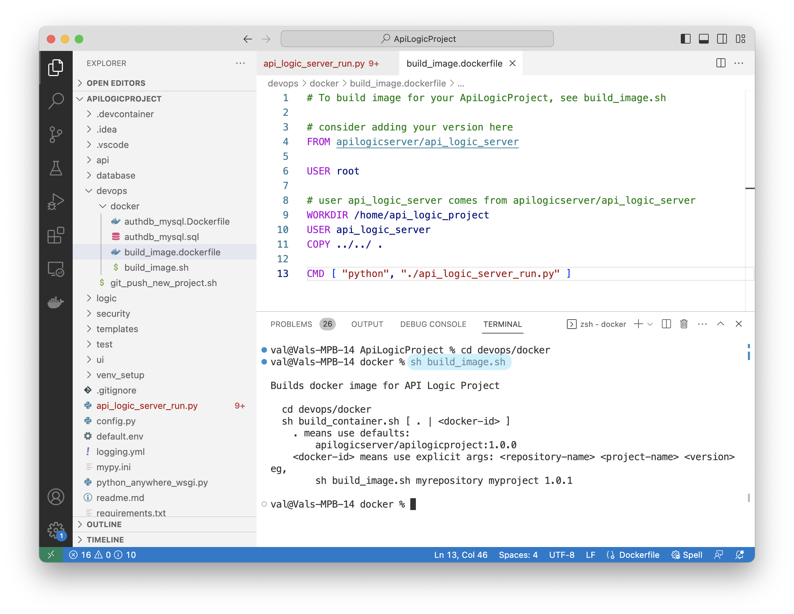

[](https://pepy.tech/project/apilogicserver)
[](https://pypi.python.org/pypi/apilogicserver/)
[](https://pypi.python.org/pypi/apilogicserver/)

[](#instant-evaluation-no-install "Click for instant cloud-based, no-install eval")


&nbsp;

!!! pied-piper ":bulb: TL;DR: Instant Creation, Rules, Standard Tooling.  &nbsp; Open Source."

    Eliminate long dev cycles that delay Agile Collaboration and custom app dev with **Working Software, *Now.***
    
    API Logic Server is the **fastest and simplest** way to create **modern, scalable API-based database systems:**
    
    1. **Create:** `ApiLogicServer create` builds an executable project from your database, instantly:
    
        * Multi-page web app - enable agile collaboration 

        * Self-serve API - unblock custom App Dev
    
    2. **Customize:** using Python, your IDE and standard libraries such as Flask and SQLAlchemy:
    
        * Declare **`rules`** that are 40X more concise than code -- unique to API Logic Server &nbsp;&nbsp; :trophy:

        * Extend with standard Python

        * Iterate from revised database designs, preserving customizations
    
    3. **Deploy:** automated scripts create standard containers for deployment

    ***Check out the new AI-Driven Tutorial --*** [click here for see it](Tech-AI.md), or watch [the video](https://www.youtube.com/watch?v=sD6RFp8S6Fg&t=7s){:target="_blank" rel="noopener"}, or try the [Basic Demo](Sample-Basic-Demo.md)

    &nbsp;

    <details markdown>

    <summary>Click to see Created Admin App, Project, Architecture</summary>

    &nbsp;

    **Created Admin App**

    The [Admin App](Admin-Tour.md){:target="_blank" rel="noopener"} is shown below:

    

    &nbsp;

    **Customize in IDE**

    VSCode and PyCharm users can customize and run/debug within their IDE with [these steps](IDE-Execute.md){:target="_blank" rel="noopener"}.  Created projects include Launch and Docker configurations.  

    { align=left }

    [Rebuild services](https://valhuber.github.io/ApiLogicServer/Project-Rebuild/){:target="_blank" rel="noopener"} are provided to accommodate changes to database structure or ORM classes.

    &nbsp;

    **Standard, Scalable Modern Architecture**

    * A modern 3-tiered architecture, accessed by **APIs**
    * Logic is **automatically reused**, factored out of web apps and custom services
    * **Containerized** for scalable cloud deployment - the project includes a dockerfile to containerize it to DockerHub.


    

    </details>

&nbsp;

---

# Check it out

### Instant Evaluation - _no install_

Run in the cloud: VSCode via your Browser, courtesy Codespaces.  Use your existing GitHub account (no signup is required), and:

1. [__Click here__](https://github.com/codespaces/new?hide_repo_select=true&ref=main&repo=593459232){:target="_blank" rel="noopener"} to open the *Create Codespace* page.

2. Configure as desired, and click __Create codespace__.

>  This process takes about a minute.  Wait until you see the port created.

We think you'll find Codespaces pretty amazing - check it out!

&nbsp;


### Instant Cloud Deployment

Follow [this procedure](DevOps-Containers-Deploy-Multi.md){:target="_blank" rel="noopener"} to

1. Create a project from a sample dockerized database

2. Containerize your project

3. Deploy to Azure

Once you are installed, the entire process takes well under an hour.  You will need an Azure account for cloud deployment (but the prior steps are useful to run).

&nbsp;

### In a Nutshell

Here is a quick screen-shot demo of the basic process:

=== "1. Instant App and API"

    Create a Flask/SQLAlchemy project from your database:

    ```bash title="Create Project from database, using API Logic Server CLI"
    ApiLogicServer create --db_url=sqlite:///sample_db.sqlite --project_name=ApiLogicProject
    ```

    That command creates a standard project you can open and execute in your IDE.  Here's the **Admin App**, ready for business user collaboration:

    

    <details markdown>

    <summary>Expore API, Using Automatically Created Swagger - Custom Add Dev Ready</summary>

    &nbsp;

    The Admin App provides a link to the Swagger:

    

    </details>

    > When you're ready, click **2. Flexible Customization**, above.

=== "2. Flexible Customization"

    Customize and debug with **standard dev tools**.  Use *your IDE (e.g. <span style="background-color:Azure;">VSCode, PyCharm</span>)*, <span style="background-color:Azure;">Python</span>, and Flask/SQLAlchemy to create new services.

    

    > When you're ready, click **3. Declarative Logic**, above.

=== "3. Declarative Logic &nbsp;&nbsp; :trophy:"

    Declare multi-table constraint/derivation logic, using Python and your IDE.  The 5 spreadsheet-like rules below are declarative, representing the same logic as 200 lines of procedural code **(40X more concise)**:

    

    Notes:

    1. You can extend rules with Python, as explained in the Eval
    2. Similar declarative facilities provide **row level security**, based on a users roles

    &nbsp;

    > When you're ready, click **4. Deployment**, above.

=== "4. Deployment"

    Projects are **container-ready**.  The system provides configuration and scripts to containerize your project:

    

    The container is ready to deploy, on-premise or in the cloud (eg, Azure, AWS, etc):

    * A modern 3-tiered architecture, accessed by **APIs**
    * Logic is **automatically reused**, factored out of web apps and custom services
    * **Scale** using standard toooling such as Kubernetes

    

&nbsp;

---

### Video: Create, Run, Customize

API Logic Server is an open source Python project, consisting of a CLI and set of runtimes (SAFRS API, Flask, SQLAlchemy ORM, business logic engine) for project execution.

It runs as a standard pip install, or under Docker. For more on API Logic Server Architecture, [see here](Architecture-What-Is.md).

Click the image below for a video tutorial, showing complete project creation, execution, customization and debugging ([instructions here](Tech-Agile.md){:target="_blank" rel="noopener"}).  Or, see it using AI: [click here](Tutorial-AI.md).

[](https://youtu.be/sD6RFp8S6Fg "Using VS Code with the ApiLogicServer container"){:target="_blank" rel="noopener"}

&nbsp;

&nbsp;

---

# Why It Matters: 

### Increased Agility and Quality, Reduced Risk

Agile wisely advises getting Working Software as fast as possible, to facilitate Business User Collaboration and Iteration.  This reduces requirements risk - substantial effort wasted in misunderstood requirements.


1. ***Instant Collaboration:*** with automated creation of an API and an Admin App,  collaboration and UI dev can begin on Day 1.

    * Tradtionally, **API and UI Dev** is required before Collaboration.  This might be weeks or months.

2. ***Spreadsheet-like Rules, Self-Serve APIs:*** rules are 40X more concise, and automatically ordered and reused.  Also, APIs are self-serve -- UI developers can use Swagger to formulate requests for filtering, sorting, and multi-table data content.

    * Tradtionally, **Logic Development** is by code.  Manual approaches can miss Use Cases, or be coded in UI controllers instead of the server.
    * Tradtionally, **Custom APIs** are required for each client app.  This can block UI deveopment.


3. ***Self-Serve APIs:*** ongoing API needs can be met by consumers, such as new application integration.

    * Tradtionally, API Consumers may **require new custom APIs**, which may result in bottlenecks for server developers.

In addition to time, ***risk is also reduced:***

1. ***Early Collaboration:*** reduces *requirements risk*  
2. ***API Automation:*** reduces technical risk (e.g., pagination, optimistic locking, self-serve design).

Finally, ***automation drives quality*** automatic re-use and ordering eliminates an entire class of error.

&nbsp;

### Simpler, Modern Architecture

API Logic Server not only increases agility, it can make web app development simpler, and ensure the architectural result:

* Automation makes it __simpler:__ this reduces the risk of architectural errors, e.g., no logic reuse between Apps / Services, APIs without pagination, etc.

* Automation guarantees a __modern software architecture:__ _container-ready_, _API-based_, with _shared logic_ between UIs and APIs (no more logic in UI controllers), in a predictable structure for maintenance.

&nbsp;

### Flexibility of a Framework, Faster than Low Code

Current approaches for building database systems have shortcomings:   

* __Frameworks:__ Frameworks like Flask or Django enable you to build a single endpoint or _Hello World_ page, but
    * _Require weeks or more_ for a _multi-endpoint_ API and _multi-page_ application
* __Low Code Tools:__ are great for building custom UIs, but
    * _Slow Admin app creation,_ requiring _layout for each screen_
    * _Propietary IDEs_ don't _preserve value_ of traditional IDEs like VSCode, PyCharm, etc
    * _No automation for backend business logic_ (it's nearly half the effort)<br><br>

In contrast, API Logic Server provides:

* __Flexibility of a framework:__ use your IDE's code editor and debugger to customize the created project, with full access to underlying Flask and SQLAlchemy services

* __Faster than low code for admin apps:__ you get a full API and Admin app instantly, no screen painting required

&nbsp;

# Use Cases

There are a variety of ways for getting value from API Logic Server:

* __Create and Customize database web apps__ - the core target of the project

* __Admin App for your database__ - the Admin App is a create way to navigate through your database, particularly to explore data relationships

* __Agile Integrations__ replace cumbersome and inefficent ETL approaches with [Agile Integrations](Tech-Agile-Integrations.md){:target="_blank" rel="noopener"}

* __Data Repair__ - using the Admin App with logic to ensure integrity, repair data for which you may not have had time to create custom apps

* __Project Creation__ - even if you do not intend to use the API, Admin App or logic, you can use API Logic Server to create projects you then edit by hand.  Created projects will include the SQLAlchemy Data Models, and project structure

* __Learning__ - explore the [Learning Center](https://github.com/ApiLogicServer/API_Fiddle){:target="_blank" rel="noopener"} to learn about key concepts of Flask and SQLAlchemy

&nbsp;

# Feature Summary

|   | Feature    | Providing   | Why it Matters   |
:-------|:-----------|:------------|:-----------------|
| __Instant__ | 1. [**Admin App**](Admin-Tour.md){:target="_blank" rel="noopener"} | Instant **multi-page, multi-table** app  [(running here on PythonAnywhere)](http://apilogicserver.pythonanywhere.com/admin-app/index.html#/Home){:target="_blank" rel="noopener"}              | Business Users engaged early<br><br>Back-office Admin       |
| | 2. [JSON:**API** and Swagger](API.md){:target="_blank" rel="noopener"}                     | Endpoint for each table, with... <br>Filtering, pagination, related data     | Custom UI Dev<br>App Integration                           |
| | 3. Data Model Class Creation                                                     | Classes for Python-friendly ORM     | Custom Data Access<br>Used by API                |
| __Customizable__ | 4. [**Customizable Project**](Project-Structure.md){:target="_blank" rel="noopener"}   | Custom Endpoints, Logic <br>Use Python and your IDE  | Customize and run <br><br>Re-creation *not* required |                                                                                      
| __Unique Logic__ | 5. [Spreadsheet-like Business Rules](Logic-Why.md){:target="_blank" rel="noopener"}  &nbsp; :trophy:      | **40X more concise** - <br>compare [legacy code](https://github.com/valhuber/LogicBank/wiki/by-code.md){:target="_blank" rel="noopener"} | Unique backend automation <br> ... nearly half the system  |
|  | Customizable with Python      | Familiar Event Model | Eg., Send messages, email  |
| Testing | 6. [Behave **Test Framework**](Behave.md)         | Test Suite Automation<br><br>Behave Logic Report<br><br>Drive Automation with Agile  | Optimize Automation to get it fast<br><br>Get it Right with Agile Collaboration  |

&nbsp;

# Getting Started - Install, Tutorial

API Logic Server is designed to make it easy to get started:

* **Install and run Tutorial** - 
[install](https://valhuber.github.io/ApiLogicServer/Install-Express.md){:target="_blank" rel="noopener"}, and explore the [tutorial](https://valhuber.github.io/ApiLogicServer/Tutorial/){:target="_blank" rel="noopener"}.  The tutorial creates 2 versions of the [sample database](https://valhuber.github.io/ApiLogicServer/Sample-Database.md){:target="_blank" rel="noopener"}

     * without customizations - so you to see exactly what is automated from the `ApiLogicServer create` command
     * with customizations - so you can see how to customize 

* **Installed Sample Databases** -
Here are [some installed sample databases](Data-Model-Examples.md){:target="_blank" rel="noopener"} you can use with simplified abbreviations for `db_url`.

* **Dockerized Test Databases** - 
Then, you might like to try out some of our [dockerized test databases](https://valhuber.github.io/ApiLogicServer/Database-Connectivity.md){:target="_blank" rel="noopener"}.

* **Your Database** - Finally, try your own database.

&nbsp;

In addition to this app dev oriented tutorial, you can also explore:

* **Deployment:** the [Deployment Tutorial](Tutorial-Deployment.md){:target="_blank" rel="noopener"} illustrates various ways to containerize and deploy your applications

* **Using AI:** the [AI-Driven Automation Tutorial](Tech-AI.md){:target="_blank" rel="noopener"} shows how you can use ChatGPT to create new databases from english descriptions, to bootstrap a very rapid create / collaborate / iterate Agile cycle.

&nbsp;

# Project Information

### Making Contributions

This is an [open source project](https://github.com/valhuber/ApiLogicServer.md){:target="_blank" rel="noopener"}.  We are open to suggestions for enhancements.  Some of our ideas include:

| Component           | Provides         | Consider Adding                                                                |
|:---------------------------|:-----------------|:-------------------------------------------------------------------------------|
| 1. [JSON:**API** and Swagger](https://github.com/thomaxxl/safrs){:target="_blank" rel="noopener"} | API Execution    | **Kubernetes** - extend [containerization](DevOps-Docker.md#create-docker-hub-from-api-logic-project.md){:target="_blank" rel="noopener"} | 
| 2. [Transactional **Logic**](https://github.com/valhuber/logicbank#readme){:target="_blank" rel="noopener"}   | Rule Enforcement | New rule types |
| 3. [SAFRS React Admin](https://github.com/thomaxxl/safrs-react-admin){:target="_blank" rel="noopener"} | Admin UI Enhancements | Maps, trees, ... |
| 4. [This project](https://github.com/valhuber/ApiLogicServer){:target="_blank" rel="noopener"} | API Logic Project Creation | Support for features described above |


To get started, please see  the [Architecture](Architecture-Internals.md).

### Preview Version

You can try the pre-release at (you may need to use `python3`):

```bash
python -m pip install --index-url https://test.pypi.org/simple/ --extra-index-url https://pypi.org/simple ApiLogicServer==9.4.9
```

Or use (not available currently):

```bash
docker run -it --name api_logic_server --rm -p 5656:5656 -p 5002:5002 -v ~/dev/servers:/localhost apilogicserver/api_logic_server_x
```

Or, you can use [the beta version on codespaces](https://github.com/ApiLogicServer/beta){:target="_blank" rel="noopener"}.

&nbsp;

### Status

We have tested several databases - see [status here.](Database-Connectivity.md).

We track [issues in git](https://github.com/ApiLogicServer/ApiLogicServer-src/issues){:target="_blank" rel="noopener"} (formerly [here](https://github.com/valhuber/ApiLogicServer/issues){:target="_blank" rel="noopener"}).


We communicate [via slack](https://join.slack.com/t/apilogicserver/signup?x=x-p3388652117142-3395302306098-5241761647201).

 &nbsp;

### Acknowledgements

Many thanks to:

- [Thomas Pollet](https://www.linkedin.com/in/pollet/), for SAFRS, SAFRS-react-admin, and invaluable design partnership
- Nitheish Munusamy, for contributions to Safrs React Admin
- [Marelab](https://marmelab.com/en/), for [react-admin](https://marmelab.com/react-admin/)
- Armin Ronacher, for Flask
- Mike Bayer, for SQLAlchemy
- Alex Grönholm, for Sqlacodegen
- [Meera Datey](https://www.linkedin.com/in/meeradatey/), for React Admin prototyping
- Denny McKinney, for Tutorial review
- Achim Götz, for design collaboration and testing
- Max Tardiveau, for testing and help with Docker
- Michael Holleran, for design collaboration and testing
- Nishanth Shyamsundar, for review and testing
- Thomas Peters, for review and testing
- Tyler Band, for review, design input and functionality suggestions
- Gloria Huber and Denny McKinney, for doc review

&nbsp;

### Articles

There are a few articles that provide some orientation to API Logic Server:

* [How Automation Activates Agile](https://modeling-languages.com/logic-model-automation/){:target="_blank" rel="noopener"}
* [How Automation Activates Agile](https://dzone.com/articles/automation-activates-agile){:target="_blank" rel="noopener"} - providing working software rapidly drives agile collaboration to define systems that meet actual needs, reducing requirements risk
* [How to create application systems in moments](https://dzone.com/articles/create-customizable-database-app-systems-with-1-command){:target="_blank" rel="noopener"}
* [Stop coding database backends…Declare them with one command.](https://medium.com/@valjhuber/stop-coding-database-backends-declare-them-with-one-command-938cbd877f6d){:target="_blank" rel="noopener"}
* [Instant Database Backends](https://dzone.com/articles/instant-api-backends){:target="_blank" rel="noopener"}
* [Extensible Rules](https://dzone.com/articles/logic-bank-now-extensible-drive-95-automation-even){:target="_blank" rel="noopener"} - defining new rule types, using Python
* [Declarative](https://dzone.com/articles/agile-design-automation-how-are-rules-different-fr) - exploring _multi-statement_ declarative technology
* [Automate Business Logic With Logic Bank](https://dzone.com/articles/automate-business-logic-with-logic-bank){:target="_blank" rel="noopener"} - general introduction, discussions of extensibility, manageability and scalability
* [Agile Design Automation With Logic Bank](https://dzone.com/articles/logical-data-indendence){:target="_blank" rel="noopener"} - focuses on automation, design flexibility and agile iterations
* [Instant Web Apps](https://dzone.com/articles/instant-db-web-apps){:target="_blank" rel="noopener"} 


[^1]:
    See the [FAQ for Low Code](FAQ-Low-Code.md)