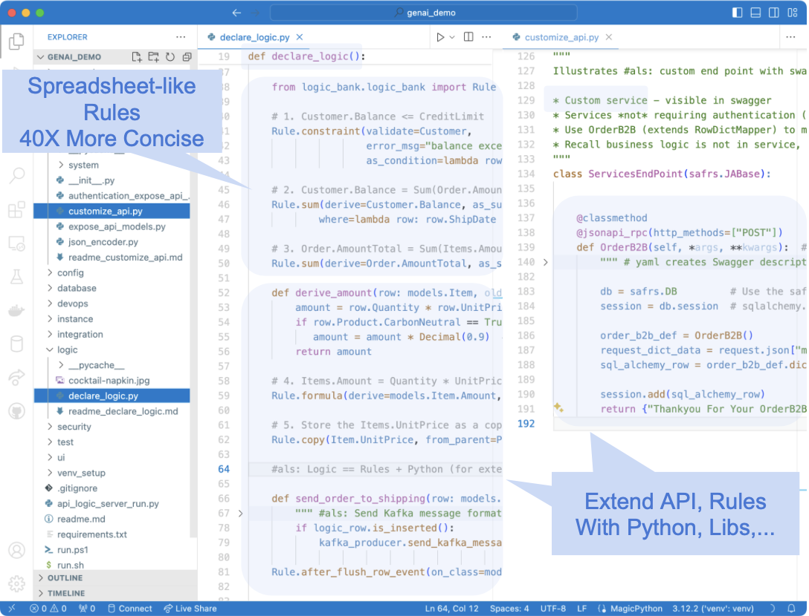
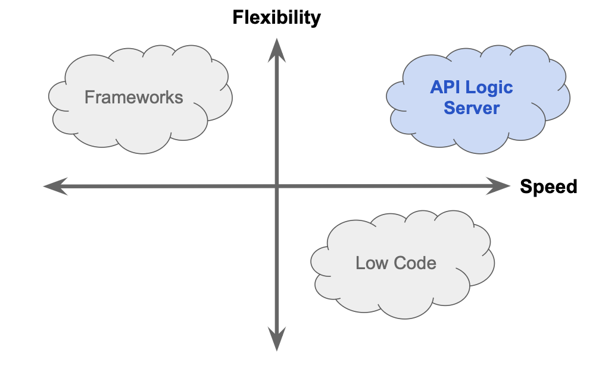

<style>
  .md-typeset h1,
  .md-content__button {
    display: none;
  }
</style>
[](https://pepy.tech/project/apilogicserver)
[](https://pypi.python.org/pypi/apilogicserver/)
[](https://pypi.python.org/pypi/apilogicserver/)


[](#install-and-verify "Click for Setup")

# API Logic Server - In Action

Create microservices instantly, as shown below.  **[Click here for documentation.](Doc-Home.md)**
&nbsp;

## 1. Simplicity of AI

To create system, **provide a prompt *in business terms:***

<details markdown>

<summary>Create an AI Prompt file named genai_demo.prompt</summary>

```bash title="Create an AI Prompt file named genai_demo.prompt"
Use SQLAlchemy to create a sqlite database named system/genai/temp/model.sqlite,
with customers, orders, items and product

Hints: use autonum keys, allow nulls, Decimal types, foreign keys, no check constraints.

Include a notes field for orders.

Create a few rows of only customer and product data.

Enforce the Check Credit requirement (do not generate check constraints):
1. Customer.balance <= credit_limit
2. Customer.balance = Sum(Order.amount_total where date_shipped is null)
3. Order.amount_total = Sum(Item.mount)
4. Item.amount = quantity * unit_price
5. Store the Item.unit_price as a copy from Product.unit_price
```
&nbsp;


That's all it takes to create a system.  Note:

* This is a ***high-level, business-oriented*** description of the system - not just the database, but the multi-table business logic too.
{: style="height:200px;width:280px"; align=right }
* It is not "techno-babble" of low-level framework details (routes...).  You don't need to provide. or even learn such details.  That would be a **failure to communicate.**
* The key take-way: ***Natural Language must be enhanced with logic automation*** to deliver real simplicity and speed.  API Logic Server provides this automation, with:
    * API and App Automation (see Step 2)
    * Logic Automation (step 3), enabling us to execute the check credit requirement above
</details>

&nbsp;

## 2. Speed of Low Code

Then, **1 command** creates the project (you can also create from an existing database):

```bash title="Create the project"
als genai --using=genai_demo.prompt
```


<details markdown>

<summary>App and API are ready to run</summary>

The system creates the database, and an executable project providing API and App Automation.  The microservice is ready to run, instantly:


</details>

&nbsp;

## 3. Flexibility of a Framework

You can then **customize the project with Python in your IDE.**  Create executable **spreadsheet-like rules** from our prompt - 40X more concise than code.  Use Python to extend the rules (e.g, to send a Kafka message), and use the framework to create a custom endpoint:

<details markdown>

<summary>Customize the Logic and API</summary>



</details>

&nbsp;

# Pick Up Where Others Leave Off

API Logic Server **differentiates** from traditional approaches:

* Unlike Frameworks, API Logic Server creates **complete microservices** (APIs and App in a customizable project), **including logic automation.**.  You're ready to run.  With frameworks, you're ready to code -- weeks-to-months of complex development.

* Unlike Low Code, API Logic Server provides **logic automation,** and preserves the **framework flexibility.**  With Low Code, you have to code your logic, quite likely in a non-standard IDE.

    * For systems providing update, logic automation is critical.  It's nearly half the effort.  The promise of Low Code *requires logic automation.* 

* Unlike basic GenAI, API Logic Server creates **complete microservices -- including logic automation.**  You have working software.  With GenAI, you have a database.

For more information, see [the FAQs](FAQ-Low-Code.md){:target="_blank" rel="noopener"}.

<details markdown>

<summary>Delivering on the Promises of Simplicity and Speed</summary>


| Technology Promises | But...   |  Deliver the Promise With API Logic Server  |
:-------|:-----------|:-------|
| Framework: Flexibility | No Automation - months of complex development | - Microservice Automation<br>- With Full framework access |
| Low Code: Speed | - No Logic Automation (nearly half the effort)<br>- Proprietary IDE, Framework | - Logic Automation<br>- Open IDE, Tools, Libraries |
| GenAI: Simplicity | Only Database Automation | - API Logic Server uses GenAI<br>- Microservice Automation |

</details>

<details markdown>

<summary>Comparing GenAI with GenAI Microservice Automation</summary>

First, GenAOI creates only the database.  It does not create the microservice, the project, the API, or the App.  And it certainly does not create the logic.  GenAI Microservice Automation does all of this.

As noted above, nearly half the effort in a system is the logic.  In most cases, AI responses simply ignore the logic requirement.  Attempts to address it fall in 3 categories: triggers, Logic Bank code with no context,  and Logic Bank code *with* context.

&nbsp;

**Triggers**

The trigger solution GenAI response typically looks something like this:

```sql
-- Note: The enforcement of the Check Credit requirement is complex and might be better handled in application logic.
-- However, you can create a stored procedure or use triggers to enforce these rules, keeping in mind the performance implications.

-- Example of a trigger to enforce Customer.balance <= credit_limit (simplified version)
DELIMITER //
CREATE TRIGGER CheckCreditBeforeCustomerUpdate
BEFORE UPDATE ON Customers
FOR EACH ROW
BEGIN
    IF NEW.Balance > NEW.Credit_Limit THEN
        SIGNAL SQLSTATE '45000' SET MESSAGE_TEXT = 'Customer balance exceeds credit limit.';
    END IF;
END;
//
DELIMITER ;
```

This is simply not a solution: it does not address the triggering event - some change to the order.  By contrast, our logic automates about a dozen Use Cases, including:

* The customer balance is adjusted (and credit is checked) when an order is inserted, deleted, shipped, or re-assigned to a different customer.  Importantly, the logic (and its overhead) is pruned on other changes, such as changing the shipping address.

* This dependency management chains: the *order* is adjusted when items are inserted, deleted, or updated with new quantities or different products.

Addressing this level of logic is why rules are 40X more concise than code.

&nbsp;

**Logic Bank Code, without context**

If we engineer our prompt to suggest using Logic Bank (a component of API Logic Server), we get a response like this if there is no project context:

```python
def declare_logic():
    LogicBank.activate(session=session, activator=logic_bank_util.register_rules)

    @LogicBank.rule("order", "before_flush")
    def order_amount_total(row: LogicRow):
        row.amount_total = sum([item.quantity * item.unit_price for item in row.items])

    @LogicBank.rule("customer", "before_flush")
    def customer_balance(row: LogicRow):
        row.balance = sum([order.amount_total for order in row.orders if order.date_shipped is None])

    @LogicBank.rule("item", "before_flush")
    def item_amount(row: LogicRow):
        row.amount = row.quantity * row.unit_price

    @LogicBank.rule("item", "before_flush")
    def copy_unit_price_from_product(row: LogicRow):
        row.unit_price = row.product.unit_price

    @LogicBank.rule("customer", "before_flush")
    def check_credit_limit(row: LogicRow):
        if row.balance > row.credit_limit:
            raise Exception(f"Customer {row.name}'s balance exceeds their credit limit.")
```

This code does not use Logic Bank APIs.  It does not even compile, much less run.  It is, as they say, an hallucination.

&nbsp;

**Logic Bank Code, *With Context***

Much better results are obtained when the prompt has available context.  Copilot turns our Natural Language requirements into Logic Bank code, requiring only minor adjustments.  

Of course, the Logic Bank engine (part of API Logic Server) is required for actual execution.  Watch it in the video below.

</details>

&nbsp;

# Video - 1 minute
    
[](https://www.youtube.com/watch?v=6wnPsI5S6NM "Microservice Automation"){:target="_blank" rel="noopener"}


&nbsp;

!!! pied-piper ":bulb: Instant Microservices, for Integration and App Backends"

    For Developers and their organizations seeking to **increase business agility,** API Logic Server provides 

    * ***AI Simplicity:*** create projects from a Natural Language business oriented prompts, or existing database, in seconds

    * ***Microservice Automation:*** create executable projects with *1 command*:
    
        1. ***API Automation:*** crud for each table, with pagination, optimistic locking, filtering and sorting, and
        2.  ***App Automation:*** a multi-page, multi-table Admin App.

    * **Standards-Based Customization:** use standard tools (your IDE, Python, Flask, SQLAlchemy, GitHub and Docker), with API Logic Server support for:

        3. ***Logic Automation:*** unique **rules - 40X** more concise multi-table derivations and constraints. :trophy:

        4. ***Deployment Automation:*** scripts created to containerize your system, and deploy to Azure. <br><br>

    API Logic Server **differentiates** from traditional approaches:
    
    * Unlike basic GenAI, API Logic Server creates systems from prompts **at the business level**, instead of low-level framework details.

    * Unlike frameworks, API Logic Servers preserves full flexibility and standard Dev Tools, with **automation** to eliminate weeks-to-months of complex development.

    * Unlike Low Code, API Logic Server provides **logic automation,** and preserves the **framework flexibility.**

---

&nbsp;

# Enterprise Perspective

<details markdown>

<summary>Simplicity of AI, Speed of Low Code, Flexibility of a Framework, Modern Software Architecture</summary>

We are aware you have many choices for delivering systems.  API Logic Server provides Enterprise-class features that provide developers the speed of Low Code, the flexibility of a Framework, in a standards-based architecture.



**Enterprise-class Architecture, Standards and Flexibility**

API Logic Server creates projects with a ***modern, service-based architecture***.  Systems are:
{: style="height:200px;width:200px"; align=right }

* API-enabled by default; self-serve means most new requests will not require custom api development

* *Shared logic enforced in the middle tier:*  unlike manually coded frameworks which may result in non-sharable logic on UI controllers, shared logic enables not only traditional forms, but also services, AI-driven bots, etc.

* Servers are stateless for scalability

* Scripts are provided to automate containterization

Developers appreciate a ***standards-based development*** approach.

* Projects are customized using standard IDEs, leveraging code completion for declaring logic. 

* Projects can utilize modern tooling, such as Git for source control, testing tools, etc.

Developers require the ***flexibility of a framework.*** In fact, 

* API Logic Server is based on Flask, so you can add new endpoints as required.  

* You have the full power of Python and its many libaries, enabling you to address requirements such as integration (e,g, with message-based integration with systems like Kafka)

&nbsp;

**Speed of Low Code - *including logic*** 

Unlike Low Code systems, API Logic Server:

{: style="height:150px;width:250px"; align=right }

* Provides *unique* :trophy: Logic Automation: for anything beyond trivial logic, missing backend logic automation means your project will simply not get moving.

* Automates modern, standard architectures

* Is IDE based, unlocking a wealth of tooling for customization

* Automates Instant Admin Apps, eliminating the need to use (and learn) a screen painter, and are executeable instantly

And, for systems requiring highly customized interfaces for Business Intelligence, API Logic Server works with Low Code. 

&nbsp;

**Simplicity of AI** 

Technology only becomes useful when it's simple enough for teams to be effective.  API Logic Server employs AI:

* Use Natural Language to create databases
* Use Natural Language to declare rules

</details>
---

&nbsp;

# Overview - Videos, Tour

API Logic Server is an open source Python project.  It is a **CLI** for project creation, and set of **runtimes** (SAFRS API, Flask, SQLAlchemy ORM, business logic engine) for project execution.

It runs as a standard pip install, or under Docker. For more on API Logic Server Architecture, [see here](Architecture-What-Is.md){:target="_blank" rel="noopener"}.

Explore it below.

<details markdown>

<summary>Video Tutorial (4 min)</summary>

&nbsp;

Click the image below for a video tutorial, showing complete project creation, execution, customization and debugging.  Or, see this article: [click here](Sample-Genai.md).

[](https://www.youtube.com/watch?v=LSh7mqGiT0k&t=5s "Microservice Automation"){:target="_blank" rel="noopener"}


</details>


<details markdown>

<summary>Quick Screenshot Tour of using API Logic Server: Create, Run, Customize, Deploy</summary>

{: style="height:150px;width:250px"; align=right }

**1. Create: *Microservice Automation***

Plug into your database, or database model: ***Microservice Automation*** means create projects instantly, with a single CLI command:

```bash
ApiLogicServer create --project_name=ApiLogicProject --db_url=nw
```

&nbsp;

**2. Run: *API Automation and App Automation***

Microservice Automation creates a project that is *executable,* with:

* ***API Automation*** means you have a running [**JSON:API**](API.md){:target="_blank" rel="noopener"}
* ***App Automation*** means you have a running [**Admin App**](Admin-Tour.md){:target="_blank" rel="noopener"}

> The API **unblocks UI Developers** from waiting on lengthy API development cycles.
<br>The Admin App can be used for **instant business user collaboration**.
<details markdown>

<summary>See JSON:API and Admin App</summary>

&nbsp;

You can run directly (`python api_logic_server_run.py`), or open it in your IDE and use the pre-created run configurations:


Unlike frameworks which require significant time and expertise, the create command builds a complete API for your database, with endpoints for each table, including swagger.  The Admin App provides a link to the Swagger:


</details>

&nbsp;

**3. Customize: Logic Automation, Python Flexibility**

Customize [created projects](Project-Structure.md){:target="_blank" rel="noopener"} in your IDE, with Python and standard libaries.  Significantly, Microservice Automation also includes:

* ***Logic Automation*** means you customize logic using **Rules and Python** in your IDE

> Rules are unique and confer **significant business agility** - [40X more concise than code](Logic-Why.md){:target="_blank" rel="noopener"}, <br>for security and multi-table derivations and constraints.


<details markdown>

<summary>See Logic With Rules and Python</summary>

&nbsp;

Rules are 40X more concise than code, and are extensible with Python:


For more on customization, [click here](IDE-Customize.md#customize){:target="_blank" rel="noopener"}.

</details>

&nbsp;

> Customization also provides **no-code ad hoc integrations**,<br>and enables **Instant Business Relationships.**

<details markdown>

<summary>See Integration: APIs and Messages</summary>

&nbsp;

The automatically created JSON:API provides **no-code ad hoc integrations**, enabling organizations to move beyond ETL.  For example, other applications might require a customer record, and their addresses.  The automatically created self-serve JSON:API requires no code, and reduces future custom API development:

1. Create the JSON:API
2. Declare [security](Security-Overview.md){:target="_blank" rel="noopener"}, to control access and row level authorization

Integrate with B2B Partners by creating **custom endpoints** using Python and Flask, with under 10 lines of code.  *Instant business relationships.*  Observe that:

1. Update logic is partitioned out of each service - or UI - into shared [Logic](Logic.md){:target="_blank" rel="noopener"}
2. Mapping between SQLAlchemy rows and requests is automated with the [RowDictMapper](Integration-Map.md){:target="_blank" rel="noopener"}


<br>

Integrate internal systems with **Kafka**, using business logic events:


For more on integration, explore running code in the [Application Integration Sample Tutorial](Sample-Integration.md){:target="_blank" rel="noopener"}.

</details>

&nbsp;

**4. Deploy: Deployment Automation**

The system [creates scripts](DevOps-Automation.md) to containerize your project, and deploy it to Azure.

<details markdown>

<summary>See Deployment Automation</summary>

&nbsp;

The `ApiLogicServer create` command builds scripts for containerizing your project, testing it locally, and deploying to Azure:


</details>

</details>

---

&nbsp;

# Scenarios

<details markdown>

<summary>Application Integration</summary>

As illustrated below, API Logic Server supports transactions from User Interfaces, and 3 alternatives for Application Integration:

1. **Ad Hoc Integration:** the automatically created JSON:API provides **no-code ad hoc integrations**, enabling organizations to move beyond ETL.  For example, other applications might require a customer record, and their addresses from an existing database.

    * *JSON:API* are a standard for self-serve APIs -- where clients can select the columns and the related data they require.

    * Analogous to GraphQL, self-serve APIs reduce the need for ongoing custom API development.

2. **B2B Partners:** you can use Python, Flask and SQLAlchemy to create Custom APIs, e.g. for B2B Partners.  These are simplified by automatic reuse of [Logic](Logic-Why.md){:target="_blank" rel="noopener"}, and [Integration Mapping](Integration-Map.md){:target="_blank" rel="noopener"}.

3. **Messages:** Application Integration support also provides automation for producing and consuming Kafka messages.  Here's an article: [click here](https://dzone.com/articles/instant-integrations-with-api-automation){:target="_blank" rel="noopener"}.  To see these services in a tutorial, [click here](Sample-Integration.md){:target="_blank" rel="noopener"}.


</details>


<details markdown>

<summary>Unblock Client App Dev</summary>

Framework-based API development is time-consuming and complex.  Since client App Dev depends on APIs, front-end dev is often blocked.  This serialized dev process reduces business agility, and increases pressure on the team.

API Logic server can change that.  

1. **API Automation** means client App Dev can start as soon as you have a database

2. **Logic Automation** means that

    1. Such logic - a substantial element of the system - is **automatically partitioned** out of each client into server-based logic.  This reduces client coding, and enables the logic to be shared between user interfaces and services.
    2. Logic development can proceed **in parallel** with client App Dev

Here's an [article, here](https://dzone.com/articles/instant-app-backends-with-api-and-logic-automation){:target="_blank" rel="noopener"}.  Or, the the [Tutorial, here](Tutorial.md){:target="_blank" rel="noopener"}.

</details>


<details markdown>

<summary>Instant Microservices with AI-Driven Schema Automation</summary>

API and Logic Automation begins with a database.  But what if it's a new project, and there is no database.

You can certainly use your SQL tools.  But we all know that SQL can be... tiresome.

AI provides a solution: ***Schema Automation***.  You can use Copilot to create the SQL DDL like this:

!!! pied-piper "Create database definitions from Copilot"

    Create a sqlite database for customers, orders, items and product
    
    Hints: use autonum keys, allow nulls, Decimal types, foreign keys, no check constraints.

    Include a notes field for orders.

    Create a few rows of only customer and product data.

    Enforce the Check Credit requirement:

    1. Customer.Balance <= CreditLimit
    2. Customer.Balance = Sum(Order.AmountTotal where date shipped is null)
    3. Order.AmountTotal = Sum(Items.Amount)
    4. Items.Amount = Quantity * UnitPrice
    5. Store the Items.UnitPrice as a copy from Product.UnitPrice

Then, employ API Logic Server API and Logic Automation, and use Python and standard frameworks to finish the job.

Here's a tutorial you can to explore this: [click here](Sample-AI.md){:target="_blank" rel="noopener"},or see [this article](https://dzone.com/articles/ai-and-rules-for-agile-microserves){:target="_blank" rel="noopener"}.

</details>

&nbsp;
For additional Use Cases, [click here](Product-Detail.md/#use-cases){:target="_blank" rel="noopener"}.

---

&nbsp;

# Start: Install, Samples, Training

<details markdown>

<summary>Install and Verify</summary>

## Install and Verify

If you have the correct Python (version 3.8-3.12), install is standard ([more detailed instructions here](Install-Express.md){:target="_blank" rel="noopener"}):

```bash title="Install API Logic Server in a Virtual Environment"
python3 -m venv venv                 # windows: python -m venv venv
source venv/bin/activate             # windows: venv\Scripts\activate
python -m pip install ApiLogicServer

ApiLogicServer start                 # optionally, start the project manager under VSCode
```

> Note: this requires you've activate VSCode `code` CLI

<br>Verification test - create and run the demo:

```bash title="Verify - Create and Run Demo"
als create --project-name=sample_ai --db-url=sqlite:///sample_ai.sqlite
code sample_ai
```

Then explore the *demos, samples and tutorials*, below.  For docs, [click here](Doc-Home.md){:target="_blank" rel="noopener"}.

</details>

<details markdown>

Type:

* Demo: Small Databases, Introduces Key Features
* Tutorial: Detailed Walk-throughs
* Samples: other databases (brief description)

> Recommendation: **start with the first 2 items**

<summary>Demos, Tutorials, Samples</summary>

| Project | Notes   |  Type  |
:-------|:-----------|:-------|
| [**AI Sample**](Sample-AI.md){:target="_blank" rel="noopener"} | 1. Use Copilot to create new databases from natural language<br>2. Illustrate a very rapid create / customize / iterate cycle<br>3. Introduce Integration | Demo |
| [**Tutorial**](Tutorial.md){:target="_blank" rel="noopener"}  | 1. How to Use the Key Features<br>2. Key code samples for adapting into your project | Tutorial |
| | | |
| [App Integration](Sample-Integration.md){:target="_blank" rel="noopener"} | Illustrates *running* Kafka messaging, self-serve and customized APIs, choreographed with rules and Python | Tutorial |
| [Deployment](Tutorial-Deployment.md){:target="_blank" rel="noopener"} | Containerize and deploy your applications | Tutorial |
| [Agile](Tech-Agile.md){:target="_blank" rel="noopener"} | Behavior Driven Design and testing, using Behave | Tutorial |
| [AI Drives Agile Vision](Tech-AI.md){:target="_blank" rel="noopener"} | Use Copilot to create new databases from natural language, to bootstrap an agile create / deploy and collaborate / iterate cycle | Demo |
| [Basic Demo](Sample-Basic-Demo.md){:target="_blank" rel="noopener"} | Focused use of API, Admin App and Rules on small customer/orders database | Demo |
| [Allocation](Logic-Allocation.md){:target="_blank" rel="noopener"} | *Power Rule* to allocate a payment to a set of outstanding orders | Sample |
| [MySQL Docker](Database-Connectivity.md){:target="_blank" rel="noopener"} | Create projects from sample databases: *chinook* (albums and artists), and *classicmodels* (customers and orders) | Sample |
| Sqlite databases | Create projects from pre-installed databases via [abbreviations](Data-Model-Examples.md){:target="_blank" rel="noopener"}:<br>- chinook, classicmodels, todo | Sample |
| [BudgetApp](Tech-Budget-App.md){:target="_blank" rel="noopener"} | illustrates automatic creation of parent rows for rollups | Sample |
| [Banking App](https://github.com/ApiLogicServer/banking){:target="_blank" rel="noopener"} | Illustrates more complex logic (Funds Transfer) | Sample - obtain via `git clone` |


Finally, try your own database.

</details>


<details markdown>

<summary> Training </summary>

After installing, you can optionally run the first demo, above.  The key training activities are:

1. Perform the [**Tutorial**](Tutorial.md){:target="_blank" rel="noopener"}
    * `ApiLogicServer create --project_name= --db_url=`
    * Keep this project installed; you can find code samples by searching `#als`
2. Perform [**Logic Training**](Logic.md){:target="_blank" rel="noopener"}
    * Spreadsheet-like rules and Python for integration, and multi-table derivations / constraints
3. **API Customization:** explore the code in `api/customize_api.py`
    * Note this is largely standard Flask, enhanced with logic

</details>

<details markdown>

<summary> Resources </summary>

You might find the following helpful in exploring the project:

* **Installed Sample Databases** -
Here are [some installed sample databases](Data-Model-Examples.md){:target="_blank" rel="noopener"} you can use with simplified abbreviations for `db_url`.

* **Dockerized Test Databases** - 
Then, you might like to try out some of our [dockerized test databases](https://valhuber.github.io/ApiLogicServer/Database-Connectivity.md){:target="_blank" rel="noopener"}.

* [auth](Security-Authentication-Provider.md#sqlite-auth-provider){:target="_blank" rel="noopener"} - sqlite authentication database (you can also use other DBMSs)

</details>

<details markdown>

<summary> Release Notes </summary>

04/16/2024 - 10.03.80: cli issues in create-and-run/run, Oracledb 2.1.12

04/05/2024 - 10.03.66: ApiLogicServer start, als create from-model (eg copilot) 

03/28/2024 - 10.03.46: Python 3.12, View support, CLI option-names, Keycloak preview

02/24/2024 - 10.03.04: Issue 45 (RowDictMapper joins), Issue 44 (defaulting), Issue 43 (rebuild no yaml), Tests

02/13/2024 - 10.02.04: kafka_producer.send_kafka_message, sample md fixes, docker ENV, pg authdb

02/07/2024 - 10.02.00: BugFix[38]: foreign-key/getter collision

01/31/2024 - 10.01.28: LogicBank fix, sample-ai, better rules example

01/15/2024 - 10.01.18: Cleanup, logic reminder, nw tutorial fixes

01/08/2024 - 10.01.07: Default Interpreter for VS Code, Allocation fix, F5 note fix, #als signposts

01/03/2024 - 10.01.00: Quoted col names, Default Interpreter for VS Code

12/21/2023 - 10.00.01: Fix < Python 3.11

12/19/2023 - 10.00.00: Kafka pub/sub, Data Type Fixes

12/06/2023 - 09.06.00: Oracle Thick Client, Safrs 3.1.1, Integration Sample, No rule sql logging, curl Post

11/19/2023 - 09.05.14: ApiLogicServer curl, optional project_name arg on add-auth, add-db, rebuild

11/12/2023 - 09.05.08: multi-db bug fix (24)

11/07/2023 - 09.05.07: Basic-demo: simplify customization process

11/05/2023 - 09.05.06: Basic-demo enhancements, bug fixes (22, 23)

10/31/2023 - 09.05.00: Enhanced Security (global filter, permissions), Logic (Insert Parent)

09/29/2023 - 09.04.00: Enhanced devops automation (sqlite, MySql, Postgres)

09/08/2023 - 09.03.04: AI Driven Automation (preview)

09/08/2023 - 09.03.00: Oracle support

09/08/2023 - 09.02.23: Fix Issue 16 - Incorrect admin.yml when table name <> class name

08/22/2023 - 09.02.18: Devops container/compose, Multi-arch dockers, add-auth with db_url, auth docker dbs

07/04/2023 - 09.01.00: SQLAlchemy 2 typed-relns/attrs, Docker: Python 3.11.4 & odbc18

06/22/2023 - 09.00.00: Optimistic Locking, safrs 310 / SQLAlchemy 2.0.15

05/07/2023 - 08.04.00: safrs 3.0.4, tutorial demo notes, rm cli/docs, move pythonanywhere

05/01/2023 - 08.03.06: allocation sample

04/29/2023 - 08.03.03: restore missing debug info for open database failures

04/26/2023 - 08.03.00: virt attrs (Issue 56), safrs 3.0.2, LogicBank 1.8.4, project readme updates

04/13/2023 - 08.02.00: integratedConsole, logic logging (66), table relns fix (65)

03/23/2023 - 08.01.15: table filters, cloud debug additions, issue 59, 62-4

02/15/2023 - 08.00.01: Declarative Authorization and Authentication

01/05/2023 - 07.00.00: Multi-db, sqlite test dbs, tests run, security prototype, env config

11/22/2022 - 06.03.06: Image, Chkbox, Dialects, run.sh, SQL/Server url change, stop endpoint, Chinook Sqlite

10/02/2022 - 06.02.00: Option infer_primary_key, Oct1 SRA (issue 49), cleanup db/api setup, restore postgres dvr

09/15/2022 - 06.01.00: Multi-app Projects

08/28/2022 - 06.00.01: Admin App show_when, cascade add. Simplify Codespaces swagger url & use default config

06/12/2022 - 05.02.22: No pyodbc by default, model customizations simplified, better logging

05/04/2022 - 05.02.03: alembic for database migrations, admin-merge.yaml

04/27/2022 - 05.01.02: copy_children, with support for nesting (children and grandchildren, etc.)

03/27/2022 - 05.00.06: Introducing [Behave test framework](https://apilogicserver.github.io/Docs/Logic-Tutorial/), LogicBank bugfix

12/26/2021 - 04.00.05: Introducing the Admin app, with Readme Tutorial

</details>

<details markdown>

<summary> Preview Version </summary>

&nbsp;

This pre-release includes:

* [logic and service discovery](IDE-Customize.md#discoverability-logic-services){:target="_blank" rel="noopener"}.

* tecnology preview of [Ontimize rich web app](App-Custom.md){:target="_blank" rel="noopener"}.

You can try it at (you may need to use `python3`):

```bash
python -m pip install --index-url https://test.pypi.org/simple/ --extra-index-url https://pypi.org/simple ApiLogicServer==10.04.11
```

Or use (neither available currently):

```bash
docker run -it --name api_logic_server --rm -p 5656:5656 -p 5002:5002 -v ~/dev/servers:/localhost apilogicserver/api_logic_server_x
```

Or, you can use [the beta version on codespaces](https://github.com/ApiLogicServer/beta){:target="_blank" rel="noopener"}.

</details>

---

&nbsp;

# Key Features

<details markdown>

<summary>API Features</summary>

| Feature | Notes   |
:-------|:-----------|
| API Automation | Unlike Frameworks, API created automatically |
| Logic | Update requests automatically enforce relevant logic |
| Security | Role-based result filtering |
| [Self-Serve JSON:API](API.md){:target="_blank" rel="noopener"} | UI Developers and Partners don't require API Dev |
| Standards-based | JSON:API |
| Optimistic Locking | Ensure User-1 does not overwrite changes from User-2 |
| Multi-table | Retrieve related data (e.g. customers, *with orders*) |
| Pagination | Performance - deliver large result sets a page at a time |
| Filtering | Injection-safe filtering |

</details>

<details markdown>

<summary>Logic Features</summary>

| Feature | Notes   |
:-------|:-----------|
| Conciseness | Rules reduce the backend half your system by 40X |
| Automatic Ordering | Simplifies Maintenance |
| Automatic Optimization | Reduce SQLs by pruning and adjustment-based aggregates |
| Automatic Invocation | Rules called automatically to help ensure quality |
| Multi-Field | Formulas and contraints can access parent data, with optional cascade |
| Multi-table | Sum / Count Rules can aggregate child data, with optional qualification |
| Extensible | Formulas, Constraints and Events can invoke Python |
| Debugging | Use IDE Debugger, and logic log to see which rules fire |

</details>

<details markdown>

<summary>Security Features</summary>

| Feature | Notes   |
:-------|:-----------|
| Authentication | Control login access |
| Authorization | Row level access based on roles, or user properties |
| Authorization | Global filters (e.g, multi-tenant) |
| Extensible | Use sql for authentication, or your own provider |

</details>

<details markdown>

<summary>Admin App Features</summary>

| Feature | Notes   |
:-------|:-----------|
| App Automation | Unlike frameworks, Multi-Page App is created automatically |
| Multi-Table - Parents | Automatic Joins (e.g., Items show Product Name, not Product Id) |
| Multi-Table - Children | Parent pages provide tab sheets for related child data (e,g, Customer / Order List) |
| Lookups | E.g., Item Page provides pick-lists for Product |
| Cascade Add | E.g., Add Order defaults the Customer Id |
| Declarative Hiding | Hide fields based on expression, or insert/update/delete state |
| Intelligent Layout | Names and join fields at the start, Ids at the end
| Simple Customization | Simple yaml file (not complex html, framework, JavaScript) |
| Images | Show image for fields containing URLs |
| Data Types | Define customfields for your data types |

</details>

<details markdown>

<summary>Other Features</summary>

| Feature | Notes   |
:-------|:-----------|
| Microservice Automation | One-command API / App Projects |
| [Application Integration](Sample-Integration.md){:target="_blank" rel="noopener"} | Automation with APIs and Kafka Messages |
| [AI-Driven Automation](Sample-AI.md){:target="_blank" rel="noopener"} | Use Copilot to automate database creation |
| [Multiple Databases](Data-Model-Multi.md){:target="_blank" rel="noopener"} | Application Integration |
| [Deployment Automation](Tutorial-Deployment.md){:target="_blank" rel="noopener"} | Automated Container Creation, Azure Deployment |

</details>

---

&nbsp;

# Works With

<details markdown>

<summary>API Logic Server works with key elements of your existing infrastructure</summary>

| Works With | Notes   |
:-------|:-----------|
| [AI](Tutorial-AI.md){:target="_blank" rel="noopener"} | Use Copilot to create databases, and use API Logic Server to turn these into projects |
| [Other Systems](Sample-Integration.md){:target="_blank" rel="noopener"} | APIs and Messages - with logic |
| [Databases](Database-Connectivity.md){:target="_blank" rel="noopener"} | Tested with MySQL, Sql/Server, Postgres, SQLite and Oracle |
| Client Frameworks | Creates instant APIs that factors out business logic, where it is automatically shared for User Interfaces, APIs, and Messages |
| [Your IDE](IDE-Customize.md){:target="_blank" rel="noopener"} | Creates standard projects you can customize in your IDE, such as VSCode and PyCharm |
| [Messaging](Sample-Integration.md){:target="_blank" rel="noopener"} | Produce and Consume Kafka Messages
| [Deployment](Tutorial-Deployment.md){:target="_blank" rel="noopener"} | Scripts to create container images, and deploy them to the cloud |
| [Agile and Test Methodologies](Logic-Tutorial.md){:target="_blank" rel="noopener"} | Use Behave to capture requirements, rapidly implement them with API Logic Server, collaborate with Business Users, and test with the Behave framework |

</details>

---

&nbsp;

# Contact Us

We'd love to hear from you:

1. Email: apilogicserver@gmail.com
2. Issues: [github](https://github.com/ApiLogicServer/ApiLogicServer-src/issues){:target="_blank" rel="noopener"}
3. Slack: contact us on apilogicserver.slack.com

---

&nbsp;

# More Information

For docs, [click here](Doc-Home.md){:target="_blank" rel="noopener"}.

<details markdown>

<summary>Acknowledgements</summary>

Many thanks to

- [Thomas Pollet](https://www.linkedin.com/in/pollet/), for SAFRS, SAFRS-react-admin, and invaluable design partnership
- Tyler Band, for leadership on security
- [dbvis](https://www.dbvis.com), for a complimentary license in support of this open source project
- [Marelab](https://marmelab.com/en/), for [react-admin](https://marmelab.com/react-admin/)
- Armin Ronacher, for Flask
- Mike Bayer, for SQLAlchemy
- Alex Grönholm, for Sqlacodegen
- Thomas Peters, for review and testing
- [Meera Datey](https://www.linkedin.com/in/meeradatey/), for React Admin prototyping
- Denny McKinney, for Tutorial review
- Achim Götz, for design collaboration and testing
- Max Tardiveau, for testing and help with Docker
- Michael Holleran, for design collaboration and testing
- Nishanth Shyamsundar, for review and testing
- Gloria Huber and Denny McKinney, for doc revie


</details>

<details markdown>

<summary>Articles</summary>

There are several articles that provide some orientation to API Logic Server:

* [Instant APIs With Copilot and API Logic Server](https://dzone.com/articles/instant-apis-with-copilot-and-api-logic-server)
* [Instant App Backends With API and Logic Automation](https://dzone.com/articles/instant-app-backends-with-api-and-logic-automation)
* [Instant Integrations With API and Logic Automation](https://dzone.com/articles/instant-integrations-with-api-automation)
* [AI and Rules for Agile Microservices in Minutes](https://dzone.com/articles/ai-and-rules-for-agile-microserves)

Also:

* [How Automation Activates Agile](https://modeling-languages.com/logic-model-automation/)
* [How Automation Activates Agile](https://dzone.com/articles/automation-activates-agile) - providing working software rapidly drives agile collaboration to define systems that meet actual needs, reducing requirements risk
* [How to create application systems in moments](https://dzone.com/articles/create-customizable-database-app-systems-with-1-command)
* [Stop coding database backends…Declare them with one command.](https://medium.com/@valjhuber/stop-coding-database-backends-declare-them-with-one-command-938cbd877f6d)
* [Instant Database Backends](https://dzone.com/articles/instant-api-backends)
* [Extensible Rules](https://dzone.com/articles/logic-bank-now-extensible-drive-95-automation-even) - defining new rule types, using Python
* [Declarative](https://dzone.com/articles/agile-design-automation-how-are-rules-different-fr) - exploring _multi-statement_ declarative technology
* [Automate Business Logic With Logic Bank](https://dzone.com/articles/automate-business-logic-with-logic-bank) - general introduction, discussions of extensibility, manageability and scalability
* [Agile Design Automation With Logic Bank](https://dzone.com/articles/logical-data-indendence) - focuses on automation, design flexibility and agile iterations
* [Instant Web Apps](https://dzone.com/articles/instant-db-web-apps)
</details>